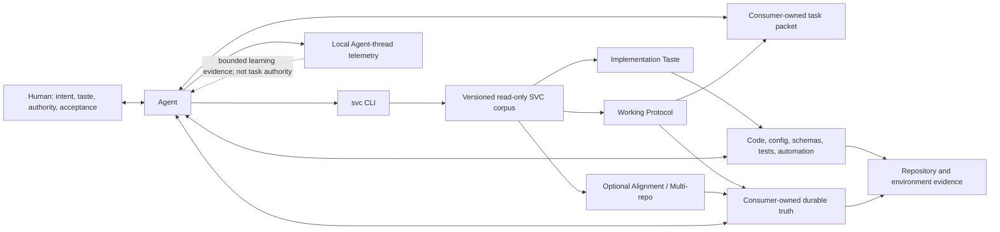
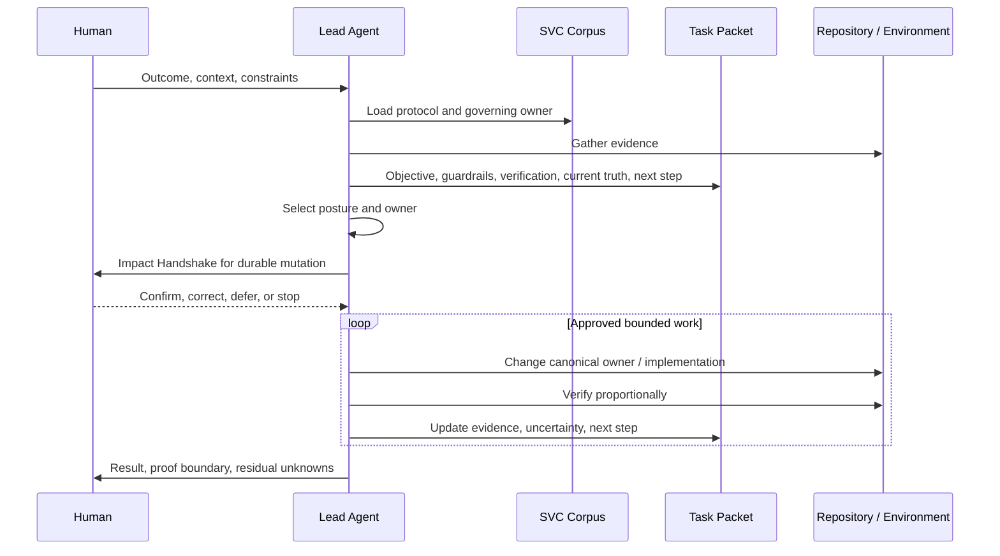

# Inquiry — Evidence Baseline and Reference Intake

## Role and Evidence Boundary

This is the stable Inquiry entry for the cross-capability evidence baseline. It
preserves the framework/runtime facts, bounded historical observations, source
provenance, freshness limits, and earlier working premises produced during
reference intake. It does not own Task routing, mutable design, accepted
decisions, implementation state, or verification disposition.

Claims use three levels:

- **Current fact**: directly supported by canonical source or runtime.
- **Historical observation**: supported by the bounded prior task corpus, with
  its selection and observation-window limits.
- **Working premise**: an accepted basis for further design, not yet a durable
  SVC contract.

Historical packets remain evidence rather than present authority. Agent-thread
association does not prove that a packet was current or used, and one thread
does not represent a project's complete lifecycle.

## Current Return and Freshness

- Reference intake is closed. Its integrated return is the target environment,
  current SVC footholds/gaps, bounded historical constraints, and provisional
  mechanisms available to the five capability Cells.
- Local canonical-source and packet observations were gathered during this
  Task and were structurally rechecked through 2026-08-07. External references
  retain the snapshots and limitations stated in their supporting dossiers.
- No source is assumed fresh enough for later durable landing merely because it
  appears here. A Cell reopens scoped Inquiry when a changed dependency,
  runtime, source contract, or disputed mechanism can change its return.
- There is no active root Inquiry question. Current work is Design owned by the
  Working Protocol Cell; this module remains a cross-Cell evidence input.

## Confirmed Target Environment

`D-001`, `D-002`, and `D-010` in [`decisions.md`](decisions.md) own the accepted
target decisions. This section is their evidence-baseline projection; the
decision register wins if wording ever diverges.

- The common collaboration unit is one Human plus Coding Agent(s).
- The upper ordinary Human team size is approximately three to five people,
  plus Coding Agents admitted according to task pressure and integration cost.
- “Large software” means large, complex, long-lived software systems operated
  by that small Human team. It does not mean that SVC is becoming an enterprise
  portfolio, staffing, or organization-management system.
- Relevant scale therefore comes from system topology, lifecycle duration,
  change breadth, concurrency, uncertainty, and verification horizons—not from
  a large Human hierarchy.
- SVC primarily serves Sir's personal development experience and may carry
  opinionated personal UI/UX, architecture, and implementation taste. This is
  a preference authority, not a claim of universal engineering truth.

Their consequences may be reopened only if the intended SVC consumer changes
materially.

## Current Topology

Four separations are already valuable:

1. The SVC corpus owns framework truth; the Consumer owns project truth and
   active task state.
2. Working posture changes the work but does not choose the durable owner.
3. A task packet externalizes volatile control state without becoming durable
   product or technical truth.
4. Telemetry observes a bounded trajectory but does not control the task,
   infer success, or write analysis back into project authority.

The CLI made this topology locally distributable and mechanically inspectable.
It did not, by itself, add a richer collaboration protocol.

## Current Work Sequence

The canonical sequence has no general answer for splitting a work graph,
granting sub-agent ownership, preventing shared-state collisions, integrating
returned evidence, checkpointing several active lanes, or resuming after
compaction and handoff. Host or project instructions may supply those
behaviors, but SVC does not currently own them.

## Existing Strengths

| Mechanism | Existing strength | Evidence |
| --- | --- | --- |
| Truth routing | One durable authority per claim; mechanical owners preferred | [`src/index.md`](../../src/index.md), [`implementation-taste.md`](../../src/sections/implementation-taste.md) |
| Work classification | Composable request lenses and recurring Explore/Solidify/Execute/Diagnose postures | [`working-protocol.md`](../../src/sections/working-protocol.md) |
| Human authority | Scope-specific mutation permission and an objective Impact Handshake | [`working-protocol.md`](../../src/sections/working-protocol.md) |
| Recoverable minimum | Human-readable Objective, Guardrails, Verification, Current Truth, and Next Step | [`task-packet.template.md`](../../src/assets/templates/task-packet.template.md) |
| Pressure-driven depth | Product, cross-unit, unit, deployment, alignment, and multi-repo surfaces have admission rules | [`src/index.md`](../../src/index.md) |
| Design judgment | Authority, provenance, data shape, naming, complexity return, and verification are explicit review lenses | [`implementation-taste.md`](../../src/sections/implementation-taste.md) |
| Honest observation | Telemetry preserves loss, partial, unavailable, and unknown rather than inventing conclusions | [`src/index.md`](../../src/index.md) |

The redesign should deepen these properties rather than replace them with a
generic project-management lifecycle.

## Pressure Map

| Pressure | Current asset | Material gap or tension | Claim status |
| --- | --- | --- | --- |
| Fine Human-Agent control | Mutation gate and Alignment request grammar | One mutation boundary does not explicitly distinguish intent/taste decisions, semantic trade-offs, delegated autonomy, evidence acceptance, interruption, and takeover | Design hypothesis |
| Product and technical taste | Product truth plus generic implementation taste | Sir's personal taste is now an accepted SVC target, but concrete architecture/UI/UX content and its apply/challenge route are absent; project truth must remain separately owned | Current fact + accepted target + design hypothesis |
| Long-task continuity | Five-field packet, progressive loading, Current Truth, Next Step | Free-form state may not expose multiple work lanes, dependencies, supersession, evidence horizon, or safe resumption | One historical misread; experiment required |
| Recovery | Diagnose posture, verification, explicit unknowns | Recovery occurs in practice but is not represented as a first-class task transition or checkpoint | Recurring historical observation; intervention unproven |
| Sub-agent work | Host-level agent tools and telemetry lane projection | No SVC contract for delegation input, owned objects, workspace authority, return evidence, cancellation, or lead-agent integration | Current fact |
| Parallelism | Narrow owner boundaries and shared-worktree caution | More agents can increase duplicate discovery, collision, stale conclusions, and merge cost; concurrency metadata may be unavailable | Historical observations + current telemetry limit |
| Analysis and metacognition | Request lenses, postures, diagnostics, implementation taste | No general trigger set for reframing, assumption audit, alternative search, pre-mortem, system modeling, or reflection after repeated failure | Current fact; scope unresolved |
| Large-system coherence | Product TDD, Unit TDD, Deployment, Multi-repo | No core longitudinal model for contract evolution, dependency impact, multi-slice migration, or lifecycle-spanning decisions; a mandatory global graph would conflict with SVC's minimal design | Current fact + design tension |
| Engineering feedback | Lookup, init/status/adopt, dev capability, telemetry analysis | Runtime can distribute, scaffold, observe, and verify, but task semantics are not stable enough to mechanize | Current fact |

## Historical Evidence That Constrains the Design

The selected eight-case audit supports these boundaries:

1. A completion marker, attempted execution, local check, external observation,
   Human acceptance, and an unresolved terminal action carry different proof.
2. Human constraint setting, narrow mutation scope, explicit stop/reopen, and
   recovery recur around material work. The corpus does not prove these controls
   caused better outcomes or are required for low-risk tasks.
3. One long case contains a concrete planned-versus-completed status misread
   that a Human caught and the Agent repaired. It supports an experiment, not a
   universal state machine.
4. Local, integration, client-visible, deployed, and external evidence form a
   ladder. A lower horizon cannot silently satisfy a higher one.
5. Bounded delegation and explicit workspace ownership appear useful, while the
   normalized telemetry could not recover authoritative concurrency lanes in
   the eight-case aggregate.
6. Packet attachment or mention cannot prove currentness, use, authority, or
   causality. A future runtime projection must not make that inference.

Sources:

- [`cross-case-synthesis.md`](../v10/70-agent-thread-audit/cross-case-synthesis.md)
- [`coding-protocol.md`](../v10/70-agent-thread-audit/coding-protocol.md)
- [`pilot-retrospective.md`](../v10/70-agent-thread-audit/pilot-retrospective.md)
- [`observability verification.md`](../v10/80-agent-observability-analysis/verification.md)

## Reference-Intake Hypotheses After Sir's Correction

The first exploration produced six useful but uneven hypotheses. This section
is retained as provenance rather than the active synthesis. Sir initially
accepted the foundation as directionally sound, then corrected the way three of
them were elevated into outcome definitions.

Still useful as bounded hypotheses:

1. CLI distribution and observability are enabling substrates, not the
   collaboration mechanism itself.
2. Multi-Agent value must account for duplicate discovery, shared-state risk,
   review, and lead-agent integration cost.
3. Tooling should enforce accepted invariants rather than encode prose
   preferences or infer task truth.

Useful only as contributing explanations, not outcome definitions:

1. State preservation and decision continuity may help an Agent complete long
   work, but “long-task recoverability” does not define better long-task
   performance.
2. Control resolution and fewer low-information interruptions may improve
   Human-Agent collaboration, but “Human authority continuity” does not define
   collaboration efficiency or taste alignment.
3. Topology-over-time and coherence may reduce lifecycle failures, but they do
   not define the desired low total cost of changing a large system.

The corrected outcome interpretation is maintained in
[`design/00-foundation-review.md`](design/00-foundation-review.md) for Sir's
review. None of these hypotheses pre-approves packet fields, state semantics,
delegation rules, reasoning methods, system models, or CLI behavior.

## Adjacent Finding Kept Out of Scope

CLI exploration found that stable runtime, telemetry, packaging, and release
behavior is extensively described in [`src/index.md`](../../src/index.md) and
mechanical code/tests while [`deployment.md`](../../src/sections/deployment.md)
remains a generic admission rule. Whether this is correct owner placement or a
documentation gap deserves a separate owner audit. It should not hijack the
core collaboration design.
