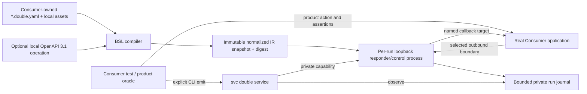

# `svc double` MVP Replacement Design

Status: final review candidate based on accepted research, completed no-source
spikes, and [`final-review.md`](final-review.md). This replaces the superseded
[`design.md`](design.md). It is not source authorization.

## Product Slice

`svc double` is a local **managed boundary interaction harness**. One
`*.double.yaml` module declares one claim-scoped HTTP boundary scenario:

- strict outbound request matching and explicit responses;
- independently emitted inbound callbacks/events;
- examples, matchers, captures, derived values, and generators as separate
  boundary roles;
- bounded interaction evidence and explicit fidelity/provenance claims.

The Consumer test remains the product oracle. The CLI compiles, runs, observes,
and stops the boundary harness; it does not run the Consumer test or issue a
combined verdict. Product assertions are outside BSL, and a product-assertion
field is invalid. There is no `svc double check` in the MVP.

## User Workflow

```text
svc double validate test/payment.double.yaml
svc double start test/payment.double.yaml --seed 123 \
  --clock 2026-08-10T02:00:00Z \
  --target consumer.payment-events=http://127.0.0.1:9010

# The Consumer/test reads the start receipt and routes only the selected
# provider base URL to the returned loopback responder URL.

svc double emit RUN_ID payment.succeeded
svc double observe RUN_ID --json
svc double stop RUN_ID
```

The v0 command grammar is exact at the capability level:

```text
svc double validate MODULE
svc double start MODULE [--seed UINT64] [--clock RFC3339-UTC]
  [--target NAME=ORIGIN]... [--allow-remote-target NAME]...
svc double emit RUN_ID EVENT
svc double observe RUN_ID
svc double stop RUN_ID
```

`--target` and `--allow-remote-target` are repeatable. Missing declared target
bindings and unused supplied names both fail so a typo cannot silently change
delivery. There is no list, latest-run lookup, force stop, payload override, or
implicit module discovery in v0.

- `validate` parses, type-checks, resolves local assets/contracts, validates
  managed material, and prints fidelity/non-fidelity facts. It never starts a
  server, calls a Consumer, or executes an external materializer.
- `start` snapshots a compiled IR, starts one isolated loopback responder, and
  returns a run ID, responder endpoint, scenario and run-context digests, replay
  context, and declared non-claims. It returns only after authenticated control
  readiness.
- `emit` explicitly materializes and sends one named event to its start-time
  target binding. It is never triggered automatically by a response.
- `observe` returns the bounded redacted journal and current run facts. It is
  evidence, not an assertion result.
- `stop` asks the private run control endpoint to settle and records its final
  state. Historical PID data is never kill authority.

The module path is explicit in v0. `svc.json` remains schema v3 and gains no
top-level `double` configuration. Catalog/discovery can be justified later
from repeated use; it is not needed to prove the capability.

The module's resolved location selects its workspace. Relative assets resolve
from the module directory but cannot escape that workspace. Later commands use
the exact UUIDv4 run ID and the run record's bound workspace identity; they do
not reinterpret the run from the caller's current directory. This keeps the
shown CI workflow stable without adding project configuration.

All five subcommands support Human/Agent text, `--json`, and packaged
`--json-schema` output. Exit `0` means that command's objective was met; `2` is
CLI grammar misuse; `3` is a resolved boundary result such as an invalid module,
missing binding, non-acknowledged event, unavailable control, or unavailable
optional runtime; `4` is storage, launch, protocol-infrastructure, or internal
failure. Machine success/resolved results use stdout; structured errors use
stderr, matching existing CLI delivery rules.

## Lifecycle Decision

Score: `1` poor, `3` workable, `5` strong. Total is
`sum(weight * score / 5)`.

| Criterion | Weight | Foreground `serve` | Detached `start/stop` | `double run -- test` | Reuse `dev` target |
| --- | ---: | ---: | ---: | ---: | ---: |
| CI ergonomics | 20 | 3 | 5 | 5 | 3 |
| Development ergonomics | 15 | 4 | 5 | 3 | 4 |
| Isolation and cleanup | 20 | 4 | 4 | 5 | 2 |
| Does not own Consumer test orchestration | 15 | 5 | 5 | 1 | 5 |
| Implementation containment | 15 | 5 | 3 | 2 | 4 |
| Machine-observable control | 15 | 3 | 5 | 5 | 3 |
| **Weighted total / 100** | **100** | **79** | **90** | **73** | **68** |

Detached `start/stop` wins because it gives dev and CI a clean machine receipt
without making SVC own the test command. Its extra lifecycle cost is bounded by
a private control endpoint and run record; SVC must not compensate with PID
guessing, daemon-wide state, or implicit stale-run replacement.

Every successful `start` creates a fresh run; equal module intent does not
converge or reuse a prior responder. `stop` is idempotent for an already sealed
run, while `emit` against a stopped run is a resolved non-success.

## System Topology and Authority



Authority is deliberately singular:

| Truth | Authority | Projection/reference |
| --- | --- | --- |
| Authored scenario | Consumer module and assets | Parsed surface model |
| Executed behavior for one run | Immutable normalized IR snapshot and digest | Start receipt |
| Active bindings, match counts, and journal | Per-run runtime process | Unsealed `observe` projection |
| Gracefully stopped facts and journal | Carrier-sealed final snapshot | Post-stop `observe` response |
| Replay context | Run record: generator IDs/versions, seed, fixed clock, scenario digest | Report text/JSON |
| Product pass/fail | Consumer test | Double journal is evidence only |
| Provider currentness | Optional provider-backed probe/capture authority | Scenario provenance claim |

Editing the source module or its managed assets/contracts never mutates active
BSL-owned behavior. A new `start` compiles a new digest. Consumer-owned external
materializer code remains the explicit exception described below.

## BSL v0 Semantic Profile

The working product name remains BSL. YAML is one concrete surface; the IR is
normative. [`bsl-v0-contract.md`](bsl-v0-contract.md) fixes the concrete v0
candidate used by implementation fixtures; this section records its semantic
boundary.

### Host grammar

One v0 module contains:

```text
Module := Language Scenario
Scenario := Name Claim Boundary Policy? Interaction+ Event*
Boundary := Name Protocol Contract?
Interaction := Name Provenance Request Response
Event := Name Provenance Target Request
Request/Response := Method Path Query Headers Body
Body := Structured | Raw
RequestValue := Literal | Managed | Match | Capture
OutputValue := Literal | Example | Derived | Generated | Managed
```

V0 supports one HTTP boundary and one scenario per module. It has no loop,
user-defined function, provider entity model, automatic transition, timer,
background callback, global store, inheritance, YAML merge, or implicit
response sequence.

### Concrete YAML structure

The accepted structural direction is a local typed node. The final candidate
admits `language: svc.double/v0` and reserves `$bsl` as the exact typed-node key:

```yaml
externalId:
  $bsl:
    kind: capture
    name: external_id
    example: 00000000-0000-4000-8000-000000000001
    match:
      kind: semantic
      semantic: rfc.uuid
      using: svc.rfc-uuid/v1

paymentId:
  $bsl:
    kind: generated
    semantic: opaque-token
    using: svc.opaque-token/v1
    options:
      alphabet: lower-alphanumeric
      length: 24
    bind: payment_id
    validate:
      kind: regex
      pattern: '^[a-z0-9]{24}$'
```

Request positions admit `match` and `capture`; response/event positions admit
`example`, `derived`, `generated`, and `managed`. Ordinary scalars, objects, and
arrays are exact request literals or constant output values according to their
phase. `match` is a request predicate; `validate` is a post-materialization
constraint; neither is a Consumer product assertion. Optional inline examples
aid authoring and are validated but never become matchers. `capture.name` and
output `bind` publish immutable, typed `bindings.NAME` values; phase checking
rejects unavailable references. A literal provider object whose only key is
`$bsl` uses `kind: literal` plus `value` as an explicit escape.

The closed v0 node kinds are therefore `literal`, `match`, `capture`, `example`,
`derived`, `generated`, and `managed`. Project/provider generator identifiers
are not valid v0 registry entries. Domain values use managed examples/captures
or a whole-envelope materializer; the language does not imply a plugin.
Compilation projects typed nodes to path-indexed IR facts so executors never
interpret YAML.

YAML v0 rejects duplicate keys, custom tags, anchors, aliases, merge keys,
unknown fields, multiple documents, and recursive structures. Scalar behavior
is pinned and conformance-tested; ISO-looking timestamps remain strings unless
a typed BSL value says otherwise. The parser has byte, node, and depth bounds
and preserves source locations through compilation.

### Value and phase rules

```text
parse -> compile/type-check -> snapshot managed values and arrange generators
-> match exactly one interaction -> bind immutable request captures
-> derive/materialize/validate response -> respond
-> explicitly emit named event -> observe
```

- Examples are materialization aids, never matchers or product assertions.
- Generated values require semantic intent, exact generator identity/version,
  replay context, and post-validation.
- Captures bind once. A repeated request may reuse an equal capture; a
  conflicting value fails instead of mutating scenario state.
- Derived values can read only declared immutable bindings, fixed run facts,
  and scenario parameters available in that phase.
- Missing capture, ambiguous match, invalid generated output, unsupported
  matcher, or undeclared effect is a visible runtime/compiler failure.
- Generated named values are arranged once per run. Retry never advances a
  random stream or cycles a response. Determinism is defined by the complete
  replay tuple: IR digest, runtime/generator versions, seed, fixed clock, target
  bindings, and scenario parameters. If seed or clock is omitted, `start`
  selects it once, returns it, and prints the exact replay arguments.

### Provenance and fidelity

Fidelity is not an arbitrary self-asserted string list. The compiler accepts a
closed vocabulary and reports three columns: SVC-verified mechanics,
Consumer-declared semantics with their provenance reference, and explicit
non-claims. Local provenance assets are snapshotted with hashes. Provider URLs
are references only and are never fetched or treated as currentness proof.

### CEL profile

BSL uses official CEL semantics only for derived values. The v0
environment:

- declares typed `request`, `bindings`, `run`, and `scenario` objects as
  required by phase;
- loads no extension library or project function;
- excludes iterative macros `map`, `filter`, `all`, `exists`, and
  `exists_one`;
- exposes no environment, filesystem, network, process, secret, clock, or
  randomness function;
- bounds expression length and all bound input values before evaluation.

The full CEL standard environment is not BSL. CEL/RE2 regex semantics also own
the v0 regex matcher so Python or Java regex behavior cannot leak into the IR.

### Generator registry

V0 has a closed runtime registry. SVC may own only portable semantics whose
authority is stable and testable, initially:

- RFC UUID v4;
- explicitly opaque token with declared alphabet/length;
- bounded integer;
- enum choice;
- RFC 3339 value derived from the fixed run clock.

These do not claim provider-domain meaning. Vehicle registrations, addresses,
payment instruments, and similar domain values are not inferred from field
names and are not generated by a generic string/Faker helper. V0 represents
them as managed documented/captured examples or through the narrow external
materializer. The registry IR deliberately leaves room for later pinned domain
adapters, but MVP does not build a plugin discovery platform.

### Managed assets and materializer escape

Managed raw bodies, large JSON examples, and captured events are local assets
with logical name, content hash, provenance, sanitization, and validation
facts. Paths resolve from the module directory but remain inside its selected
workspace; remote retrieval and workspace escape are absent.

A conditional external materializer is an explicit command that receives one
bounded normalized JSON context on stdin and returns one response/event
envelope on stdout. It has a timeout, output limit, exact argv/cwd, and an
explicit minimal environment; stdout must be only the envelope. It is suitable
for provider-specific signing, encryption, or canonicalization.

The materializer runs only while materializing an already matched response or
an explicitly emitted event; `validate` never invokes it. It cannot select an
event target. The materializer is Consumer-owned arbitrary code. SVC does not
claim it is sandboxed, deterministic, network-free, or provider-faithful; those
are reported non-claims. Its strict output envelope cannot register SVC routes,
select event targets, mutate BSL state, or extend CEL. SVC cannot prevent the
arbitrary command from using its own external state or side effects. A broad
code-backed service remains a separate future driver, not a BSL construct.

The immutable snapshot promise covers BSL, managed assets, and local contract
bytes. Arbitrary materializer code and its transitive dependencies cannot be
snapshotted or made immutable by SVC; the report records its command boundary
and this explicit non-claim.

## HTTP and Contract Profile

### Responder

The native MVP responder is loopback-only HTTP with bounded request line,
headers, and body. It supports:

- exact method and path;
- explicit query/header presence, exact, enum, and RE2 regex matching;
- structured JSON body matching or exact managed raw bytes;
- explicit response status, headers, and either structured JSON or raw bytes;
- exactly one selected interaction, with `404` for no match and a visible
  non-success `ambiguous-match` response for multiple matches;
- a bounded journal and mismatch tree;
- no TLS termination, proxy, remote fallback, chunked request decoding,
  multipart language, WebSocket, gRPC, or non-HTTP protocol in v0.

Header names follow HTTP case-insensitive semantics while values remain exact
unless a matcher says otherwise. Structured JSON rejects duplicate keys and
non-finite values and matches object keys strictly by default. Malformed input,
size limits, request-contract failure, capture conflict, ambiguity, and
response/materializer failure are separate journal/error facts rather than one
generic near miss.

The Consumer routes its selected provider base URL to the returned loopback
URL. Transport limitations are explicit fidelity non-claims.

### OpenAPI 3.1 profile

An optional local contract binding selects one operation by exact method and a
static OpenAPI path. Path-template matching is deferred. V0 supports OpenAPI
3.1 Schema Objects using a pinned JSON Schema 2020-12 validator profile:

- local references only; no network retrieval;
- snapshot the selected document and all admitted local references;
- validate the matched structured request and materialized structured response;
- reject unsupported custom dialects;
- report `selected-operation-schema` fidelity;
- report that full OpenAPI-document conformance and provider behavior are not
  claimed.

`format` is annotation unless BSL explicitly admits that named format as an
asserting matcher/validator. OpenAPI examples remain examples. OpenAPI 3.0 is
an explicit v0 non-capability rather than silently reinterpreted through 3.1.
JSON Schema regex/keyword validation is reported as the pinned contract
validator's fact; it is not relabeled as a BSL semantic matcher.

### Callback/event delivery

Event targets are symbolic in the module and resolved at `start` to origins
only: scheme, host, and port, with no userinfo, query, or fragment. The event
owns the exact path/query. Numeric loopback origins are the default. A remote
target requires both an explicit scenario policy and an explicit CLI opt-in,
and the resolved origin is reported before any emit. Delivery follows no
redirect and never falls back to another target.

Body modes are mutually exclusive:

- `raw`: exact managed bytes with provenance/hash, no typed in-place derivation;
- `structured`: typed values plus a declared serializer identity, initially
  deterministic compact UTF-8 JSON.

Derived signed/canonicalized bytes use the external materializer. `emit`
records resolved target, request hash/redacted envelope, acknowledgement, and
transport failure. It does not retry unless a future bounded delivery policy is
separately admitted. Any `2xx` is the fixed v0 acknowledgement condition;
redirect and non-`2xx` responses are recorded resolved non-successes.

## Runtime and Safety Boundary

Each `start` creates a private user-runtime directory containing the normalized
IR snapshot, snapshotted local assets/contracts, run record, logs, and a random
control capability. The carrier binds responder and control listeners to
loopback. Only the carrier owns active
bindings and journal state; files are receipts/snapshots, not a second mutable
authority.

Lifecycle is:

```text
compiling -> bootstrapping -> ready -> stopping -> stopped/sealed
                 |           |             |
                 +--------> failed <-------+
```

`emit`, `observe`, and `stop` verify workspace/run identity and authenticate to
the private control endpoint. Stop asks that endpoint to settle; if authority
is unavailable, the CLI reports `control-unavailable`, preserves the last
unsealed snapshot, and does not mutate run state or kill a historical PID.
Startup failure cleans only the exact not-yet-ready process that the starter
still owns. Missing or malformed run state fails closed.

While active, carrier memory is authoritative and carrier-written files are
unsealed projections. Graceful stop first closes the responder, atomically
seals final facts and journal, and only then exits; that sealed snapshot becomes
the post-stop observation authority. An unsealed snapshot never proves a live
or stopped carrier.

Default observation redacts authorization/cookie headers, bounds body excerpts,
and retains hashes and matcher diagnostics. A bounded journal reports total,
retained, and omitted counts and never hides truncation. Runtime files follow
SVC's existing same-user local trust boundary; they are volatile evidence, not
archival storage or hostile-same-user protection.

### Critical egress non-claim

The responder never proxies or falls through, and the built-in event injector
can call only an explicitly bound target. BSL evaluation, managed assets, and
built-in generators perform no network I/O. This proves the **SVC-owned
runtime** egress boundary.

An external materializer is declared Consumer code and is not sandboxed; when
present, reports state `materializer-egress: not-enforced`. Safe CI must remove
real credentials and isolate that command externally when needed. Calling it a
bounded envelope does not imply a bounded process.

Because SVC does not launch or sandbox the Consumer test, the MVP cannot prove
that the Consumer process has no second route to the real provider. Safe CI
must also remove real write credentials and use Consumer/CI network isolation
where required. Start/observe reports this as `consumer-egress: not-enforced`.
Claiming global egress denial would require SVC to own a network namespace,
proxy enforcement, or test orchestration, all outside this MVP.

## Implementation Shape

The proposed code boundary is small and source-first:

```text
svc_cli.double.model
  strict surface/IR/run/result types

svc_cli.double.compiler
  YAML source map, typed-node compilation, OpenAPI operation binding,
  CEL profile compilation, provenance/fidelity validation

svc_cli.double.materialization
  closed matchers/generators, managed assets, replay, external materializer

svc_cli.double.runtime
  loopback responder/control server, event delivery, bindings, journal

svc_cli.double.carrier
  private detached-process bootstrap and authenticated readiness/settlement

svc_cli.double.service
  validate/start/emit/observe/stop, workspace/run authority and receipts
```

`cli.py` owns only argument grammar and delivery. `cli_output/double.py` owns
Human/Agent and compact JSON projection. No engine adapter, provider SDK,
plugin platform, general service framework, or project-config migration is
added.

The existing private execution mechanism may gain `double` as a mechanical
domain solely to launch, capture, prove readiness, and release the isolated
carrier. Its execution record remains launch evidence; the double runtime and
private control capability own active semantic state. `run`, `dev`, and
`double` do not gain a shared public lifecycle or interchangeable identity.

Parser, JSON Schema, and CEL libraries remain behind compiler/materialization
interfaces; CommentedMap, validator, and CEL runtime objects never cross into
the normalized IR. The native responder uses the Python standard library for
loopback HTTP and the already-present `urllib3` for event delivery unless
implementation evidence shows a concrete protocol defect.

Candidate double-runtime dependencies, subject to source authorization and lock
verification, are installed through a `double` optional dependency extra rather
than imposed on the base SVC installation:

- `ruamel.yaml>=0.19.1,<0.20` for YAML 1.2-oriented parsing/source locations;
- `jsonschema>=4.26,<5` for selected JSON Schema 2020-12 validation;
- `cel-expr-python==0.1.3` initially, because its language/runtime semantics and
  platform wheels are version-sensitive.

Faker and WireMock are not product dependencies.

The base CLI still exposes `svc double` grammar. Without the extra, a double
operation returns one precise `double-runtime-unavailable` continuation; core
commands and base installability remain unchanged. CLI grammar, output models,
and `--json-schema` discovery cannot import a double-only library; the service
loads the optional runtime only after selecting a double operation.

## MVP Verification Matrix

| Area | Required proof |
| --- | --- |
| Parser | duplicate/tag/alias/merge/unknown/multi-doc rejection; scalar/source-location corpus; size/depth/node bounds |
| BSL roles | request/output phase legality; example is not matcher; generator without semantic/version/validator fails; unsupported project generator fails; product assertion field is impossible |
| CEL | accepted derivations; static source diagnostics; undeclared functions and all iterative macros fail; bounded inputs |
| Generator | seed replay; version identity; second seed challenge; semantic incompatibility fails at compile or post-validation |
| OpenAPI | local 3.1 static operation and snapshotted refs; valid request/response; structural failure; format annotation non-assertion; remote ref/path template rejected |
| Responder | valid, near miss, unknown, ambiguous, malformed, oversized, retry-stable, concurrent, clean shutdown |
| Captures | bind once; equal retry allowed; conflicting capture rejected; phase-unavailable capture rejected |
| Events | explicit-only emit; origin/path separation; no redirects; missing capture; raw exact bytes; structured serializer identity; acknowledgement/failure; remote double opt-in |
| Materializer | exact stdin/out envelope; timeout/output/malformed exit; minimal env; non-sandbox/non-fidelity report |
| Lifecycle | ready start receipt; per-run isolation; two parallel runs; observe auth/scope; carrier-only mutation; sealed stop; control-unavailable; no PID fallback |
| Safety | no proxy/fallthrough; no remote contract/asset fetch; built-in target-only egress; materializer and Consumer egress non-claims visible; default redaction |
| CLI | Human/Agent text, JSON schemas, exit codes, base-install extra hint, extra-installed wheel smoke, Python 3.11 and 3.14 Linux CI |
| Consumer acceptance | one real black-box Consumer outbound flow and one callback flow, with Consumer-owned product assertions |

## Deferred Capabilities

- `svc double check` or Consumer test orchestration;
- OpenAPI 3.0, full OpenAPI document validation, remote refs, contract refresh;
- automatic behavior generation from OpenAPI;
- state machines, entity stores, timers, retries, duplicates, order/races;
- domain-generator plugin discovery and bundled Faker/provider SDKs;
- TLS, multipart, WebSocket, gRPC, message brokers, non-HTTP protocols;
- global Consumer egress enforcement;
- WireMock/default foreign engine, code-backed service driver, provider probes;
- scenario catalog in `svc.json`, IDE/LSP, code builder, or non-YAML surface.

Deferral is explicit scope, not a claim that these needs do not exist.
