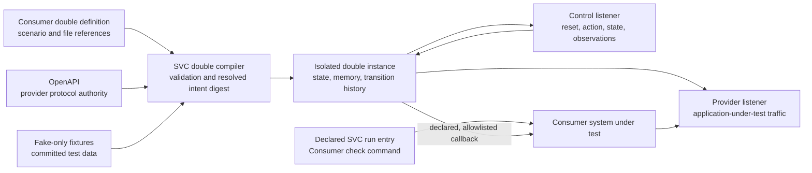
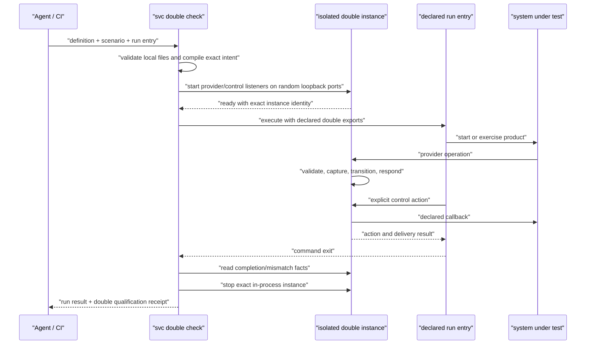

# Scenario Double Product Model Proposal

Status: superseded; no source mutation is authorized. This design inherited
requirements from rejected Anana pressure cases. Sir confirmed the broad
scenario-double positioning and removed `svc double check`, but nothing below
is an implementation contract. A replacement can be designed only after
[`application-practice-research.md`](application-practice-research.md) establishes the real
capability and ownership boundary.

## Product Nucleus

A double is an executable, deliberately partial claim about the external-system
behavior needed to verify one Consumer product scenario. It is not a generated
production server, a miniature copy of the provider, or a promise that schema
validity equals behavioral fidelity.

The first useful release should let a project combine an OpenAPI contract with
one small scenario declaration, run a deterministic provider-facing HTTP
service, control its state explicitly, observe the interactions that matter,
and execute one existing SVC run entry against a fresh isolated instance.

## Model Selection

| Model | Authoring cost | Stateful writes/callbacks | Retry/poll tolerance | Result |
| --- | ---: | ---: | ---: | --- |
| OpenAPI example mock | Low | No coherent provider state | Poor | Useful lower tier, but does not meet the motivating promise |
| Ordered interaction tape | Low-medium | One exact path | Poor; benign polling or retry shifts the tape | Useful fixture technique, not the product nucleus |
| Explicit scenario state graph | Medium | Yes, through request/action transitions | Good within one isolated scenario instance | Recommended first slice |
| Generated/Consumer provider code | High | Arbitrary | Arbitrary | Escape hatch for provider-specific algorithms; preserves too much current cost as the default |

The recommended graph is intentionally smaller than a provider data model. One
runtime instance owns:

- one current scenario state;
- a bounded map of captured values;
- one ordered transition/effect history;
- one unmatched/invalid request summary;
- synchronous callback delivery results.

It does not initially own a general entity database. Parallel tests get separate
instances. A scenario needing several business entities must either declare a
bounded flow explicitly or wait for evidence that an entity-store abstraction
earns its complexity.

## Authority Topology



Authority remains singular:

- OpenAPI owns HTTP operation, request, response, and callback shape.
- The double definition owns only test scenario behavior: state, transitions,
  captures, selected examples, effects, and completion expectations.
- Fake fixture files own unmistakably fake values. Real provider credentials
  are outside the ordinary input contract.
- One runtime instance owns only its ephemeral current state and observations.
- The Consumer run command owns the test program and its exit result.
- A double-check receipt owns orchestration and declared-double qualification
  facts; it is not a general product-acceptance verdict.

## Consumer Artifact Shape

The first slice should not expand `svc.json`. A definition is selected
explicitly:

```text
svc double validate tests/doubles/payment.double.yaml
svc double serve tests/doubles/payment.double.yaml --scenario success
svc double check tests/doubles/payment.double.yaml --scenario success --run system-check
```

This makes the double definition a Consumer test artifact like OpenAPI, not a
second SVC project-integration configuration. It also avoids a mandatory config
schema migration for projects that do not use doubles.

A project may keep the concern in two or three files:

```text
tests/doubles/payment/provider.openapi.yaml
tests/doubles/payment/payment.double.yaml
tests/doubles/payment/fixtures.json        # optional
```

The illustrative declaration below shows semantics, not final field grammar:

```yaml
double: 1
name: payment
openapi: ./provider.openapi.yaml
fixtures: ./fixtures.json

scenarios:
  success:
    initial: awaiting-create
    completion:
      states: [succeeded]
      unmatchedRequests: 0
    transitions:
      - id: create
        from: awaiting-create
        on:
          request: createPayment
        capture:
          outTradeNo: $request.body#/out_trade_no
          notifyUrl: $request.body#/notify_url
        respond:
          status: 200
          example: payment-pending
          patches:
            - path: /out_trade_no
              valueFrom: $memory.outTradeNo
        to: pending

      - id: succeed
        from: pending
        on:
          action: succeed
        callback:
          operation: paymentNotification
          urlFrom: $memory.notifyUrl
          example: payment-succeeded
          patches:
            - path: /out_trade_no
              valueFrom: $memory.outTradeNo
        to: succeeded

      - id: query-succeeded
        from: succeeded
        on:
          request: queryPayment
        respond:
          status: 200
          example: payment-succeeded
        to: succeeded

exports:
  PAYMENT_PROVIDER_URL: $runtime.providerUrl
  PAYMENT_DOUBLE_CONTROL_URL: $runtime.controlUrl
```

Design constraints for the eventual grammar:

- Reference OpenAPI operations by stable `operationId`; reject missing or
  duplicate IDs used by the scenario.
- Use deterministic named examples. Do not synthesize random responses by
  default.
- Keep expression support closed: selected request values, captured memory,
  fixture values, and runtime URLs through JSON Pointer-like references.
- Apply only explicit response/callback patches. Do not embed a general template
  language or arbitrary script evaluator.
- In one state, one request operation or control action must select at most one
  transition. Ambiguity is a declaration error, not first-match behavior.
- Validate resolved dynamic responses and callbacks against OpenAPI before
  exposing the instance as ready.

## Two Interface Planes

The provider and control surfaces use separate loopback listeners.

Provider plane:

- exposes only the selected OpenAPI operations;
- validates requests before a transition;
- validates the resolved response before sending it;
- returns a deterministic double diagnostic for unknown, invalid, or
  state-incompatible requests and records the mismatch;
- never exposes reset/action/state operations under a provider path.

Control plane:

- `GET /health` reports exact instance/declaration/scenario identity;
- `GET /state` reports state, declared captures, transition counts, mismatches,
  and callback results without dumping all raw traffic;
- `POST /reset` returns to the declared initial state and clears observations;
- `POST /actions/{action}` executes one valid explicit action transition and
  returns its callback/effect result;
- remains loopback-only in the first slice.

Tests receive the control URL through an explicitly declared export. Local
Humans may use the same API directly or through later thin CLI wrappers. The
separate listener keeps test authority out of the provider protocol and allows
callback egress policy to remain independent of test control.

## CI Check Sequence



`svc double check` should:

1. resolve an existing committed `run` entry without changing `svc run`'s
   public convergence semantics;
2. start a fresh in-process double on random loopback ports;
3. apply declared runtime exports to the child environment after ordinary run
   resolution, list export names but never values in receipts, and make the
   override explicit in the double definition;
4. execute the Consumer command as a distinct double-check attempt rather than
   joining a concurrent ordinary `svc run` execution;
5. stop the double on success, failure, interruption, or start error;
6. pass through a nonzero Consumer command result; otherwise fail when declared
   double completion expectations are unmet or mismatches occurred.

The qualification proves only the double contract: for example, the scenario
reached `succeeded`, no unmatched provider request occurred, and the declared
callback was acknowledged. It cannot decide that the whole product requirement
is correct.

## Development Sequence

The first slice can remain foreground and explicit:

```text
svc double serve <definition> --scenario <name> \
  --provider-port <port-or-0> --control-port <port-or-0>
```

It prints the provider/control origins and exact instance identity, remains
attached, and shuts down on interruption. Fixed ports support stable local
application configuration; port `0` supports isolated ad-hoc use. This is
usable with existing project tools and avoids prematurely adding another
background-process authority.

Shared `ensure/status/stop` behavior may follow after foreground dogfood proves
the declaration/runtime boundary. If added, readiness must prove exact
definition/scenario/instance identity, and stop must use the control capability
rather than a stale PID.

## Real-flow Pressure Tests

### Payment

The recommended graph can express:

```text
create -> capture external id and notify URL -> pending
explicit succeed/fail action -> signed-or-plain callback effect -> terminal
query -> coherent terminal response
```

The first slice can prove a state-changing payment protocol with plain JSON or
form data. It cannot truthfully reproduce WeChat Pay's RSA message
canonicalization and AES-GCM notification encryption without an additional
provider-transform boundary.

### Ride hailing

The graph can express the high-value lost-response case without an entity
database:

```text
initial create -> capture external id -> commit created -> disconnect
retry in created state with same external id -> return same provider id
explicit advance action -> commit phase -> callback -> report delivery
query in each state -> read-only coherent response
```

Separate isolated instances handle parallel tests. This deliberately proves
idempotency/retry behavior while avoiding a general multi-order simulator.

## First-slice Protocol Boundary

Included:

- local JSON or YAML double definitions;
- local OpenAPI 3.1/3.2 input with deterministic operation/example selection;
- JSON and `application/x-www-form-urlencoded` request bodies;
- named scenario states, request/action transitions, captures, response
  patches, reset, and completion expectations;
- normal declared HTTP responses plus one deterministic
  "commit then disconnect" transport fault;
- synchronous HTTP callbacks whose target resolves from declared/captured data
  and is restricted to an HTTP loopback origin;
- bounded semantic observations rather than an unrestricted raw request dump;
- foreground development serving and isolated execution of one existing run
  entry for CI;
- built-wheel fixture acceptance on supported desktop platforms.

Excluded until evidence justifies separate contracts:

- arbitrary scripts, embedded Python/JavaScript, or a general expression
  language;
- custom provider cryptography, signature canonicalization, encryption, binary
  codecs, or route-planning algorithms;
- proxy/record/replay against real providers;
- remote OpenAPI/fixture references or automatic network fetches;
- non-loopback serving by default, production use, TLS termination, or an
  authentication/security-boundary claim;
- AsyncAPI/message brokers, time travel, random latency, fuzzing, and chaos;
- general entity storage, concurrent sessions inside one instance, or durable
  provider state;
- multi-double groups and automatic orchestration of several external systems;
- shared background `ensure/status/stop` lifecycle.

These exclusions keep the first slice honest. A later provider-transform
interface should be admitted only after the scenario core removes enough real
Anana code to prove that the remaining cryptographic/algorithmic seam is small,
stable, and worth a distinct extension contract.

## Implementation Direction to Validate After Approval

- Use a mature OpenAPI validator rather than reproduce Anana's partial parser.
  The isolated `openapi-core==0.23.1` prototype proved OpenAPI 3.1/3.2
  request/body/path handling, response validation, local references, JSON, and
  form bodies through its official Werkzeug adapters. Dependency admission
  remains conditional on built-wheel verification because its transitive
  footprint is material.
- Use Werkzeug's loopback-only threaded WSGI server, explicitly outside
  production use. Do not add Flask, an ASGI framework, or another server layer
  unless a verified correctness boundary forces a new handshake.
- Reuse existing Pydantic strict models, JSON Patch dependency, urllib3 callback
  transport, run-entry resolution, execution records, and CLI projection
  conventions where their authority remains valid.
- Keep the scenario compiler pure and immutable. Runtime state should be one
  lock-protected instance object whose transitions are atomic before callback
  delivery; a failed callback reports failure and does not roll back provider
  state.
- Do not add `doubles` to `svc.json` or alter root status in the first slice.
  Revisit named project integration only after explicit-path usage is proven.

## Proposed Durable Owners

If approved:

- `src/sections/prd.md` owns the observable scenario-double promise and scope.
- `src/sections/product-tdd.md` owns cross-unit authority between definition,
  runtime, control plane, and declared run execution.
- `src/sections/deployment.md` owns loopback runtime, state lifetime, callback
  egress, interruption, and cleanup.
- CLI help and packaged output schemas own exact command grammar/results.
- Strict definition models, compiler checks, runtime assertions, and fixture
  tests own mechanically enforceable truth.
- This packet retains comparison evidence and provisional reasoning, then is
  deleted when verified durable truth has moved to those owners.
