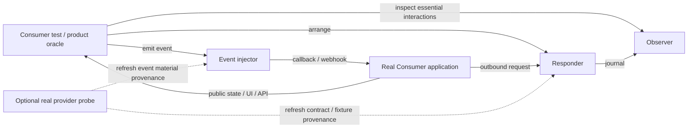
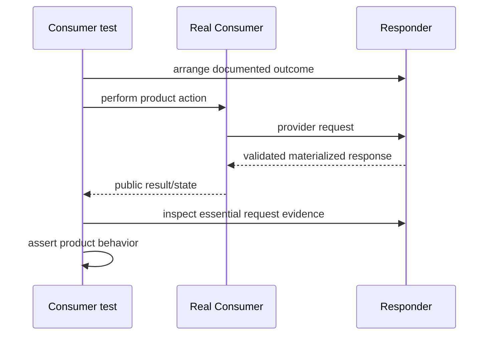
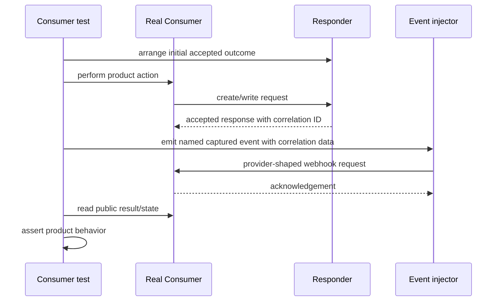

# External-System Double Requirement Model, V2

Status: research recommendation, not an implementation contract. Derived from
[`application-practice-research.md`](application-practice-research.md), without
using the Anana fake servers as requirement evidence.

## Product Definition

An SVC double should be a **claim-scoped boundary harness**:

> It replaces or stimulates only the external interactions needed to verify a
> named Consumer-observable product claim, under deterministic and explicitly
> limited conditions.

It is not a miniature external system. “Scenario” remains useful only if it
means a named set of boundary conditions and stimuli. It must not imply an
internally realistic provider lifecycle.

## Verification Topology

The mature application pattern separates four roles that may be composed but
must not be forced into one fake service:

- **Responder**: substitutes for requests the Consumer sends outward.
- **Event injector**: sends provider-shaped inbound events to the Consumer.
- **Observer**: records only enough interaction evidence for the Consumer-owned
  boundary contract.
- **Provider probe**: separately checks drift against an official sandbox, test
  instance, provider tool, or captured real traffic when one safely exists.
- **Consumer test**: owns the product oracle and completion verdict.

The responder and event injector may share a correlation value when a test
claim needs it. They do not share an invented provider domain model by default.

### Synchronous interaction

### Asynchronous callback interaction

The second sequence deliberately makes callback timing a test action. Automatic
scheduling is an optional temporal capability, not the default definition of a
callback-capable double.

## Fidelity Contract

Every double/scenario must make its fidelity vector explicit. The dimensions
are independently claimed:

| Dimension | Example evidence | Explicit non-claim example |
| --- | --- | --- |
| Transport | OpenAPI operation, captured raw HTTP, provider signing docs | Does not reproduce connection reset timing |
| Schema | Provider OpenAPI/JSON Schema/versioned example | Validates types, not all provider business validation |
| Selected semantics | Provider documentation, observed sandbox result, Consumer-owned contract | Does not model provider account state |
| Temporal behavior | Documented retry policy or a specific resilience test | No general ordering or concurrency guarantee |
| Provenance/currentness | Source URL, capture timestamp, provider version, content hash, scheduled probe | Fixture is deterministic but may be stale |

“Faithful,” “realistic,” and “high fidelity” are invalid unqualified claims.

## Provenance Classes

Each nontrivial response, event, matching rule, transform, or temporal effect
must use one of these labels:

1. **contract** — derived mechanically from a named provider specification;
2. **captured** — sanitized real/test-provider interaction with capture metadata;
3. **documented** — manually encoded from a cited provider behavior;
4. **consumer-contract** — behavior the Consumer explicitly relies on and can
   check separately against the provider;
5. **synthetic-resilience** — an intentionally artificial fault such as delay,
   disconnect, duplicate delivery, or malformed response.

The fifth class can verify Consumer resilience, but cannot be presented as
provider compatibility. A behavior with no class is invalid configuration.

## Universal Requirements

These apply to every admitted SVC double, regardless of runtime.

| ID | Requirement | Rationale / verification |
| --- | --- | --- |
| R1 | A scenario names the Consumer-visible claim it enables and the external boundary it controls. | Prevents provider-surface completeness from becoming the objective. |
| R2 | Fidelity dimensions, unsupported behavior, and provenance are machine-readable. | Makes the meaning of a green test reviewable by Humans and Agents. |
| R3 | Unmatched requests fail closed. The responder never proxies/falls through, and the built-in event injector calls only an explicitly resolved target. | Prevents permissive runtime defaults and accidental writes by SVC-owned components. Consumer-process and arbitrary materializer egress are separate boundaries. |
| R4 | Matching, response selection, and event selection are deterministic. Any sequence, retry, delay, duplicate, or race policy is explicit. | Prevents hidden behavior changes caused by background retries or concurrency. |
| R5 | Every run has isolated identity and an explicit reset or ephemeral lifecycle. Residual routes, observations, timers, and state are detectable. | Supports parallel CI and repeatable retries. |
| R6 | The Consumer test remains the owner of product assertions and completion. | The double must not grade the product behavior it helped create. |
| R7 | Boundary observations are machine-readable and limited to essential contract evidence. | Supports debugging and contract assertions without forcing implementation-coupled exact call scripts. |
| R8 | Fixture and specification inputs have stable identity: source, version or capture time, sanitization status, and content hash where practical. | Enables review and drift management. |
| R9 | Ordinary double execution requires no real write credential and cannot silently fall through to a real provider. Because SVC does not sandbox the Consumer test or external materializer, reports must state whether each process's egress is externally enforced. | Preserves an honest safety boundary without claiming a network sandbox. |
| R10 | Runtime version and semantics are pinned. A runtime change requires conformance tests plus at least one Consumer acceptance fixture. | GOV.UK Pay shows engine “compatibility” is not enough. |
| R11 | Examples, matchers, generators, captures, and derived values are distinct boundary-language roles; product assertions remain outside the language under the Consumer test's authority. | Prevents one literal fixture from silently becoming contract, stimulus, and answer. |
| R12 | Generated fields declare semantic intent, generator/version, replay context, and post-generation matcher/validator. | Prevents type-correct but meaningless values such as a random string used as a vehicle registration. |

## MVP Capability Requirements

### C1. Strict outbound responder

The harness can expose a local over-wire endpoint, match a declared operation or
request predicate, and return an explicit status, headers, and materialized body.

- OpenAPI may generate/validate transport and schema mechanics.
- OpenAPI examples may seed managed examples but never imply business semantics.
- Response leaves distinguish exact constants, examples, captures, derived
  values, semantic generators, and intentional synthetic values.
- Generated output is checked against structural and semantic matchers before
  it is served.
- Essential request values can be captured for observation or later event
  materialization.
- No route, default body, or success status is invented.

### C2. Explicit inbound event injector

The harness can send a named HTTP callback/webhook event to a configured
Consumer endpoint and record the acknowledgement.

- The event material controls method, path, query, headers, and either exact raw
  bytes or a typed structured body with a declared serializer. These modes are
  mutually exclusive.
- Static captured signatures are allowed when the whole signed request remains
  valid for the claim.
- Dynamic signing, encryption, clock, or nonce generation is conditional. It
  may be supplied by a narrow Consumer-owned materializer command rather than
  expanding a universal DSL.
- “Emit after N seconds,” retry, duplicate, reordering, and callback-on-request
  are not implicit MVP semantics.

### C3. Boundary observation

The harness records:

- matched and unmatched outbound requests;
- selected response/outcome identity;
- emitted event identity and resolved target;
- delivery acknowledgement or transport failure;
- run/test identity and timestamps suitable for diagnostics.

The journal is evidence, not the product oracle. Secrets and sensitive payloads
need explicit redaction rules.

### C4. Deterministic scenario arrangement

A test can select one named outcome or materialization plan without mutating a shared
provider world. Per-request input, per-test arrangement, or an isolated run
descriptor are all valid control shapes. A mutable global control plane is not
universal.

### C5. Local and CI lifecycle parity

The same pinned definition and runtime semantics work locally and in CI. SVC
may own start/readiness/stop and report endpoints, but it does not own the
Consumer test command or completion verdict.

## Conditional Capabilities

These are admitted only when a named test claim and provenance justify them:

| Capability | Admission condition | Preferred boundary |
| --- | --- | --- |
| Cross-request correlation | An inbound event must reuse a value created by an earlier outbound request | Capture plus explicit template binding |
| Stateful resource lookup | The Consumer must query a resource it created and product behavior depends on convergence | Small keyed fixture state with declared transitions, or Consumer code |
| Idempotency behavior | Consumer retry correctness is a product requirement and provider semantics are documented | One explicit operation rule with contract evidence |
| Dynamic cryptography | Consumer verifies a signature/encrypted payload whose values include clocks/nonces | Provider-owned helper or narrow Consumer materializer |
| Delay, disconnect, malformed response | A resilience claim requires it | Label as `synthetic-resilience` |
| Retry/duplicate/order | Consumer behavior differs under documented delivery policy | Explicit event plan with bounded counts and observable execution |
| Arbitrary computation | Data/templates cannot express a required, sourced transform honestly | Consumer-owned program behind a narrow adapter |
| Real provider probe | Safe official test instance/tool exists and drift matters | Separate, opt-in lane with its own credentials and cadence |

Conditional capability is not permission to grow a shared domain simulation.
If a stateful rule requires provider-internal entities that the Consumer does
not observe, the design must first prove why those entities are needed.

## Anti-Requirements

The MVP must not:

- infer provider business behavior from OpenAPI;
- aim for provider feature completeness;
- require a universal provider state machine or entity model;
- automatically couple an outbound response to a later callback;
- treat a permissive default response as convenience;
- cycle through response arrays or advance state implicitly;
- make external interaction logs the sole product assertion;
- embed a general Python/JavaScript/Groovy runtime in SVC;
- claim current provider compatibility without a separate provider-backed check;
- route unmatched traffic to the Internet;
- require the Consumer to adopt an SVC application framework;
- own test-process orchestration, environment-wide completion, or a combined
  `double check` verdict.

## Boundary Between Data and Code

The boundary follows evidence, not a “no code” aspiration:

| Material | Default representation | Reason |
| --- | --- | --- |
| Request matching and static response | Declarative data | Small, reviewable, deterministic |
| Provider payloads | Contract-validated generation, managed examples, or managed captured fixtures | Avoids test-local answer payloads while preserving honest captures |
| Callback request envelope | Declarative event plus generated/derived/managed material | Supports direct event injection |
| Essential captures/derived values | Typed, bounded expression sublanguage | Enables correlation without arbitrary project code |
| Faults | Enumerated transport effects | Makes synthetic semantics explicit |
| Dynamic signing or specialized transform | Consumer command/tool with a narrow input/output contract | Reuses project language and avoids an SVC script runtime |
| Broad domain lifecycle | Outside the default harness; code-backed service only if independently justified | Prevents the data format from becoming a backend DSL |

“User code is allowed” therefore does not mean `*.double.yaml` becomes an
embedded application platform. The descriptor can refer to a narrow producer
or an independently owned code-backed service. SVC owns its boundary contract,
not the service language.

## MVP Acceptance Evidence

Before any source change is admitted, a no-source prototype should demonstrate:

1. an HTTP Consumer flow with a strict matched response and failing unmatched
   request;
2. an asynchronous callback flow where a captured value is explicitly bound
   into named event material and injected into the real Consumer endpoint;
3. repeat and parallel runs with no observation or scenario leakage;
4. a schema-derived response whose output clearly reports “schema fidelity,
   behavioral fidelity not claimed”;
5. the same artifact authored/revised by an Agent and reviewed by a Human,
   compared with an existing mock-runtime configuration;
6. no real provider endpoint or write credential in the acceptance fixture;
   the double proves no proxy/fallthrough and reports Consumer/materializer
   egress as externally enforced or explicitly unenforced;
7. a semantically typed field generated with pinned generator/version,
   applicable locale, seed, and validator; a generic random-string replacement
   must fail review or compilation.

These acceptance cases test the boundary model. They do not need either Anana
fake server, and those servers must not be used as the scoring oracle.

The detailed data roles and language decision are in
[`mock-data-governance.md`](mock-data-governance.md) and
[`language-decision.md`](language-decision.md).

The authoring/runtime/OpenAPI spike now proves items 1–4 and 7 at the language
boundary, plus two-process parallel isolation and explicit egress non-claims;
see [`spikes/bsl-authoring-conformance/result.md`](spikes/bsl-authoring-conformance/result.md).
Item 5 completes only when Sir reviews the replacement design. Managed-asset
provenance and a simulated hash/drift update remain required implementation
acceptance fixtures. Synthetic timeout/duplicate behavior is deferred from the
v0 MVP and must not be smuggled into implementation merely to satisfy an older
prototype list.
