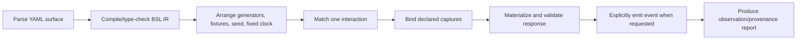

# Boundary Scenario Language Decision

Status: Sir accepted the composite BSL architecture as the current research
direction on 2026-08-10. This is not a final grammar or source authorization.
“Boundary Scenario Language” (`BSL`) is a working technical name, not an
admitted product name.

## Correction: Descriptor Is an Artifact Role, Not a Language

`boundary scenario descriptor` answers **what the artifact represents**.
`YAML` answers only **how one concrete syntax serializes a document**. Neither
specifies the language by itself.

A real language needs at least:

1. an abstract syntax and vocabulary;
2. a type and value model;
3. matching and generation semantics;
4. expression evaluation rules;
5. effects and phase ordering;
6. composition, versioning, and error behavior;
7. a runtime conformance suite.

The earlier V2 work decided the boundary topology but stopped before this
language layer. That gap is now explicit.

## Language Requirements

| ID | Requirement |
| --- | --- |
| L1 | Express synchronous request/response and explicit inbound event injection without a provider domain model. |
| L2 | Separate exact constants, examples, matchers, generators, captures, derived values, and product assertions. |
| L3 | Give generated fields semantic types, generator identity/version, constraints, locale, seed, and reference clock. |
| L4 | Compile/type-check all expressions and generator/matcher combinations before serving. |
| L5 | Be deterministic, mutation-free within one evaluation, bounded, and incapable of network/filesystem/subprocess effects. |
| L6 | Make unmatched, ambiguous, invalid, and unsupported constructs hard errors. |
| L7 | Support reusable modules/assets without inheritance-order or hidden override semantics. |
| L8 | Preserve a normalized runtime-independent representation and versioned semantics. |
| L9 | Be authorable and reviewable by Humans and Agents with useful source locations and diagnostics. |
| L10 | Permit narrow external materializers without embedding arbitrary code into the language. |

## Mature Language Precedents

### Pact: interaction, matcher, and generator algebra

[Pact V4](https://github.com/pact-foundation/pact-specification/blob/version-4/README.md)
has a versioned JSON model for synchronous HTTP, asynchronous messages, matching
rules, and generators. Its
[matching guide](https://docs.pact.io/getting_started/matching) demonstrates the
important separation between a concrete example and the rule applied during
provider verification.

This is the closest mature semantic precedent for BSL's value algebra. It is
not a complete adoption target:

- Pact is a consumer/provider contract and verification ecosystem, while SVC
  must also address local lifecycle, egress safety, explicit webhook delivery,
  provenance, and provider absence;
- Pact files are generally generated interchange artifacts rather than the best
  human authoring surface;
- Pact's format permits ignoring unknown attributes with a warning, while SVC's
  deterministic test control needs strict rejection;
- generic `RandomString` and regex generators do not solve field semantics.

Recommendation: reuse the conceptual separation and evaluate reuse of Pact
matcher conformance cases, but do not make Pact JSON the entire BSL.

### Spring Cloud Contract: two-sided dynamic values

[Spring Cloud Contract](https://docs.spring.io/spring-cloud-contract/reference/project-features-contract/dsl-dynamic-properties.html)
separates Consumer/stub and producer/test values and supports dynamic matchers
in both coded and YAML forms. It proves that one contract can distinguish a
materialized example from verification semantics. Its JVM/test-generation
model and coded escape calls are too framework-specific for SVC.

### CEL: bounded expression sublanguage

[Common Expression Language](https://cel.dev/overview/cel-overview) is designed
to be embedded, typed, portable, mutation-free, safe, and non-Turing-complete.
It can evaluate conditions and construct objects. These properties fit request
guards and derived values substantially better than Handlebars helpers,
JavaScript, Python, or an SVC-invented expression syntax.

CEL is not a scenario language or template format. It is a candidate expression
sublanguage. The official CEL API now lists a Python stack, but it is young
(`v0.1.3` in the 2026-07 reference), so dependency, conformance, wheel/platform,
and diagnostic quality require a no-source spike
([API reference](https://cel.dev/reference/api-reference)).

### CUE: constraints and composition

[CUE](https://cuelang.org/docs/introduction/) is a real declarative data
validation/configuration language. Its unification model, order-independent
composition, and constraint/value integration are attractive for managing
schemas and reusable data. It does not define HTTP matching, event delivery,
scenario phases, or semantic generators, and would add a separate runtime and
authoring language. It remains an instructive alternative, not the current
host-language recommendation.

### Handlebars/mock-runtime templates

[WireMock](https://wiremock.org/docs/response-templating/) and
[Mockoon](https://mockoon.com/docs/latest/templating/overview/) demonstrate a
mature combination of Handlebars, JSONPath, request helpers, and random/Faker
generators. They are operationally useful but string-template helpers tend to
mix extraction, control flow, rendering, random generation, and extension code.
Their engine-specific helper semantics should not become BSL's normative
language.

## Alternatives and Hard Gates

| ID | Alternative | Result |
| --- | --- | --- |
| A | YAML plus JSON Schema only | Content model, not an executable language; fails L2–L5 |
| B | Fully custom SVC DSL and expression syntax | Coherent but maximizes invention, tooling cost, and Agent unfamiliarity |
| C | CUE as the whole authoring language | Strong constraints/composition; conditional on adding an interaction/effect host and CUE runtime |
| D | Pact V4 document as the language | Strong matcher/generator semantics; conditional on provider-centric assumptions, authoring ergonomics, callbacks, and strictness |
| E | Existing engine language (WireMock/Mockoon/etc.) | Useful executor, but makes engine helpers and runtime its semantic authority |
| F | Composite BSL: small SVC host grammar + Pact-inspired value algebra + CEL expressions + semantic generator registry | Passes all semantic gates; current recommendation |
| G | Consumer code as the language | Expressive and familiar, but fails bounded/deterministic language and makes review/conformance runtime-specific |

Hard gates:

| Gate | A | B | C | D | E | F | G |
| --- | :---: | :---: | :---: | :---: | :---: | :---: | :---: |
| Specifies syntax plus executable semantics | **Fail** | Pass | Conditional | Pass | Pass | Pass | Pass |
| Separates examples, matchers, generators, and oracle | **Fail** | Pass | Conditional | Pass | Conditional | Pass | Conditional |
| Supports semantic field generation and validation | **Fail** | Pass | Conditional | Conditional | Conditional | Pass | Conditional |
| Bounded, deterministic, side-effect-free evaluation | Pass | Conditional | Pass | Pass | **Fail** | Pass | **Fail** |
| Models HTTP responder plus explicit callback injection | **Fail** | Pass | Conditional | Conditional | Conditional | Pass | Pass |
| Runtime-independent normalized representation | Pass | Pass | Conditional | Pass | **Fail** | Pass | **Fail** |

## Weighted Decision Table

Score meaning: `1` poor, `3` workable with material cost, `5` strong. Total is
`sum(weight * score / 5)`, out of 100.

| Criterion | Weight |
| --- | ---: |
| Complete language/semantic model | 12 |
| Matcher/example/generator separation | 14 |
| Semantic field generation | 16 |
| Safe deterministic evaluation | 12 |
| HTTP and callback interaction model | 12 |
| Composition, versioning, tooling | 10 |
| Human/Agent authoring and review | 10 |
| Runtime portability and maturity | 8 |
| Containment of SVC scope/lock-in | 6 |

| Alternative | Model 12 | Separation 14 | Semantics 16 | Safety 12 | Effects 12 | Tooling 10 | Author 10 | Runtime 8 | Scope 6 | Total |
| --- | ---: | ---: | ---: | ---: | ---: | ---: | ---: | ---: | ---: | ---: |
| A. YAML/schema only | 1 | 2 | 2 | 5 | 3 | 3 | 5 | 5 | 5 | **63.6** |
| B. Fully custom DSL | 5 | 4 | 4 | 4 | 5 | 3 | 3 | 3 | 1 | **75.6** |
| C. CUE host | 5 | 3 | 3 | 5 | 3 | 5 | 3 | 2 | 3 | **72.0** |
| D. Pact V4 direct | 5 | 5 | 2 | 5 | 4 | 5 | 3 | 4 | 4 | **81.2** |
| E. Existing-engine language | 4 | 3 | 4 | 2 | 5 | 3 | 4 | 2 | 3 | **68.4** |
| F. Composite BSL | 5 | 5 | 5 | 5 | 5 | 4 | 4 | 3 | 3 | **90.4** |
| G. Consumer code | 5 | 5 | 5 | 1 | 5 | 5 | 5 | 5 | 1 | **85.6** |

`G`'s raw score demonstrates why code remains a useful escape boundary; its
hard failure is why it is not the ordinary descriptor language. `D` is the
strongest existing semantic base but cannot directly express the whole SVC
topology. `F` wins by composing mature, narrow semantics rather than inventing
one monolithic language.

## Recommended Language Architecture

The working recommendation is a composite **Boundary Scenario Language** with
six normative layers:

```text
BSL
├── domain grammar: module, scenario, boundary, interaction, event, policy
├── value algebra: constant, example, captured, derived, generated, synthetic
├── matcher algebra: exact, type, format, regex, range, enum, semantic validator
├── expression language: typed CEL subset/environment
├── effect semantics: respond, emit, reject/fault, observe
└── module/runtime contract: imports, versions, phases, isolation, diagnostics
```

YAML 1.2 can be the first surface syntax. The runtime compiles it into a
versioned normalized BSL intermediate representation. A future JSON, code
builder, or generated authoring tool must produce the same IR and pass the same
conformance suite.

### Abstract grammar

This grammar is semantic, not final concrete syntax:

```text
Module      := Version Imports* GeneratorDecl* Scenario+
Scenario    := Claim Boundary Policy Interaction* Event*
Interaction := Operation Match Guard? Capture* Respond
Event       := EventName Target Materialize DeliveryPolicy
Match       := Matcher+
Respond     := Status Headers Value
Value       := Constant | Example | Captured | Derived | Generated | Composite
Generated   := SemanticType Generator Matcher ReplayContext
Derived     := CELExpression Matcher
Effect      := Respond | Emit | ExplicitFault
```

Not present: loop, user-defined function, general mutation, background job,
filesystem, network access from expressions, subprocess, or arbitrary clock and
random access. The BSL CEL profile excludes the standard iterative macros
`map`, `filter`, `all`, `exists`, and `exists_one`; the host also bounds
expression and input size. This is a normative profile, not the default CEL
environment.

### Type model

Values carry both storage type and optional semantic type:

```text
Value<T>
Semantic<T, semantic-id>
Matched<T, matcher>
Generated<T, generator, replay-context>
```

Compilation rejects mismatches such as:

- string generator assigned to numeric schema;
- `vehicle-registration` intent paired only with generic alphanumeric output;
- locale-sensitive generator without locale;
- dynamic timestamp without a fixed reference clock;
- generator without matcher/validator;
- capture reference unavailable in the current phase.

### CEL environment

CEL is restricted to pure derived values and guards. The host supplies a small,
typed environment such as:

- `request`: parsed boundary request;
- `captures`: values produced earlier in the same isolated run;
- `run`: immutable run identity, seed, and fixed clock;
- `scenario`: immutable declared parameters.

CEL receives no I/O, process, environment-variable, secret, random, or mutable
state functions. Generation remains a separate auditable algebra rather than a
hidden CEL extension.

### Evaluation phases



Ambiguous matches, missing captures, invalid generated output, undeclared
effects, and unmatched traffic fail. There is no implicit transition between
phases.

## Illustrative YAML Surface

This is an illustration of how YAML could encode BSL nodes; it is not a syntax
proposal or approval candidate:

```yaml
language: svc.boundary/v0
scenario:
  name: ride-created
  claim: interpretation
  boundary: mobility-provider

  interactions:
    - on: createRide
      match:
        body.externalId: { capture: external_id, match: rfc.uuid }
      respond:
        status: 200
        body:
          rideId:
            generate:
              semantic: opaque.provider-token
              using: svc.opaque-token/v1
              match: { regex: "ride_[A-Za-z0-9]{16}" }
          vehiclePlate:
            generate:
              semantic: uk.dvla.current-registration-mark.syntax
              using: project.uk-dvla-current-style/v1
              locale: en_GB
              match:
                semantic: uk.dvla.current-registration-mark.syntax
                using: project.uk-dvla-current-style-validator/v1

  events:
    - name: rideAccepted
      body:
        externalId: { derive: "captures.external_id" }
```

The example intentionally makes a license plate's semantic claim, generator,
locale, version, and validator visible. Replacing it with `randomString(8)`
would be rejected rather than silently producing a type-correct fiction.

## No-Source Feasibility Result

On 2026-08-10, a disposable virtual environment proved two mechanics without
changing SVC source or project dependencies:

- official `cel-expr-python==0.1.3` compiled and evaluated a typed expression
  deriving `order-42-123` from capture and immutable run inputs;
- `Faker==40.1.0` with locale `en_GB` and seed `123` generated the same
  `license_plate()` value after reseeding.

The temporary environment was moved to Trash. This is intentionally weak
evidence: it proves the local macOS/Python execution path and seed replay only.
It does not prove CEL behavior across SVC's platform matrix, diagnostic quality,
or that Faker's generated plate is valid for any target provider. The latter
still requires an independent semantic matcher/validator, demonstrating why a
semantic generator name alone is insufficient.

A second authoring/conformance spike is recorded under
[`spikes/bsl-authoring-conformance/`](spikes/bsl-authoring-conformance/). It
changed several conclusions from merely plausible to mechanically supported:

- a local typed YAML node compiled into executor-independent normalized facts;
- YAML tags and adjacent matcher/generator path maps were less robust authoring
  surfaces, although the latter remains suitable for normalized interchange;
- Faker `40.1.0`'s `en_GB license_plate()` failed an independently sourced DVLA
  syntax validator at seed `123`, while a pinned spike adapter replayed and
  passed the deliberately narrow syntax claim;
- official `cel-expr-python==0.1.3` supported typed derivation and source
  diagnostics, and its official `exclude_macros` environment configuration
  successfully enforced a non-iterative BSL profile;
- native and WireMock responders consumed the same materialized IR, and a
  separately triggered callback preserved the declared emitted bytes;
- unquoted timestamp resolution differed from the intended YAML 1.2 surface,
  proving parser scalar semantics must be part of conformance.

This spike does not admit the illustrative `$bsl` key or any dependency.

## Open Decisions Before Grammar Admission

1. What exact platforms does SVC promise? Official `cel-expr-python` wheels
   cover CPython 3.11–3.14 on common macOS, manylinux, and Windows targets and
   local diagnostics were useful, but there is no inspected source
   distribution and the installed wheel does not carry the upstream
   conformance corpus. A focused BSL-profile platform matrix remains required.
2. Which subset of Pact V4 matcher/generator conformance cases can be reused
   without adopting Pact provider-state semantics?
3. What exact reserved key and literal-escape spelling should encode the now
   preferred local typed node, and which YAML 1.2 parser preserves strict
   source locations and duplicate-key rejection with acceptable dependency
   cost?
4. What is the minimal built-in semantic generator set, and how are external
   generator adapters discovered and pinned without creating a plugin platform
   in the MVP?
5. What is the exact asset/reference syntax for the decided callback body
   split: opaque `raw` bytes versus typed `structured` materialization? Derived
   provider signing/canonicalization belongs to an external materializer.
6. What lints can identify suspicious generic string generation without
   treating field-name heuristics as authority?

## Decision

- Sir accepts the composite-language middle path: reuse mature semantics while
  adding only the missing boundary-scenario host grammar.
- Admit that YAML is only the initial surface syntax.
- Use a small SVC-owned host grammar/IR for boundary scenarios.
- Reuse Pact's example/matcher/generator separation as semantic precedent and
  potential conformance material, not as the entire artifact.
- Use an explicit BSL profile of CEL as the preferred expression sublanguage:
  declared typed variables, no extensions, no iterative macros, and bounded
  source/input sizes. The semantic fit is admitted; a repository dependency is
  still conditional on focused cross-platform conformance and source design.
- Use a versioned semantic generator registry with post-generation validation;
  do not expose generic randomness as sufficient domain semantics.
- Prefer local typed nodes in the authoring surface and compile them to a
  path-indexed normalized IR. Do not admit the `$bsl` spelling yet.
- Treat callback `raw` and `structured` bodies as mutually exclusive semantic
  modes; use an external materializer for derived signed/canonicalized bytes.
- Keep arbitrary computation behind the existing external materializer/service
  boundary.

No concrete grammar, dependency, or runtime is authorized by this research
decision.
