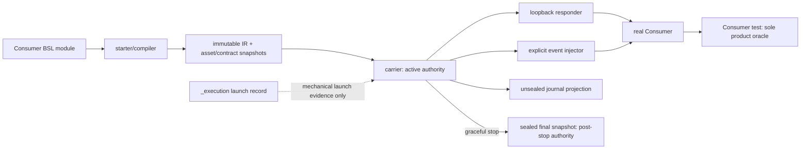
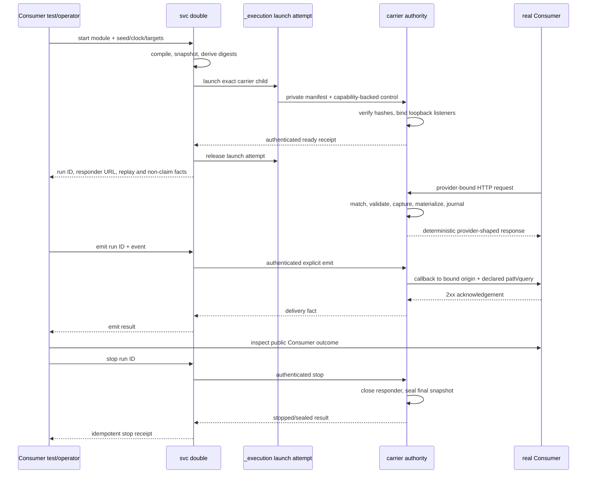

# `svc double` MVP Preflight Rehearsal

Status: completed task-packet rehearsal on 2026-08-10. No SVC source,
dependency declaration, lockfile, workflow, or generated artifact was changed.

## Rehearsal Method

The rehearsal followed one happy path and the material failure branches through
the current repository seams before implementation:

```text
product claim / BSL module
  -> base CLI grammar and optional-runtime gate
  -> strict compile and immutable snapshots
  -> owned carrier launch and authenticated readiness
  -> carrier-owned responder / bindings / journal
  -> explicit event injection
  -> active observation or graceful seal
  -> Consumer-owned black-box assertion
```

Evidence inspected included the current CLI import/dispatch path, output model
and schema registry, workspace identity, `_execution` record and detached
launch behavior, CLI error mapping, PDM package/workspace configuration, CI and
publish wheel smokes, V2 design, concrete BSL contract, and the spike results.

## Authority Topology Simulated



The topology rejects three tempting duplicate authorities: the CLI client may
not mark an unreachable run terminal, `_execution` may not own double
semantics, and the Consumer-facing assertion may not move into BSL.

## Happy-Path Sequence Simulated



## Repository Facts and Early Obstacles

| Observed fact | Failure if ignored | Pre-emptive resolution / earliest proof |
| --- | --- | --- |
| `svc_cli.cli` imports command services and output models at module import time. None of the three double-only libraries is installed in the current base environment. | Adding an ordinary top-level double runtime import would break `svc --help` and every unrelated command in the base install. | Keep parser/output models on base dependencies and lazy-load the optional service only after selecting a double operation. Prove with an early base-wheel smoke in Slice 0 and again in Slice 2. |
| `svc_cli.output_schema` eagerly imports every registered output model. | A double schema model that imports compiler/runtime types would also break base schema discovery. | Make `cli_output.double` a pure Pydantic projection with no `svc_cli.double` or optional-library import. Add an import-isolation test. |
| The current broad CLI fallback labels leaked `OSError`, `ValueError`, `KeyError`, and JSON errors as `invalid-release`. | A compiler/runtime defect could be misreported as a release problem and receive the wrong exit semantics. | Convert expected double failures to explicit service results/`SvcError` codes; add double infrastructure codes to the exit map; test that no double branch reaches `invalid-release`. |
| `_execution.ExecutionDomain` and record validation admit only `run` and `dev`; capture policy and `released` legality are domain-specific in several locations. | Adding only the type literal would create unreadable records or change `run`/`dev` lifecycle validation. | Amend every serialization/validation branch coherently: double uses merged launch capture and may be released after readiness. Re-run the complete execution/dev/run regression set in Slice 4. |
| `release_owned` intentionally leaves a detached isolated child alive and records `released`. | Treating that record as active run truth would make owner-loss/recovery contradict the carrier authority. | Use it only after authenticated readiness. Store double semantic state and control capability in a separate run store; never reconcile it through `_execution`. |
| Workspace identity resolves from a directory, while `emit/observe/stop` accept only a run ID. | Re-resolving from current cwd would make a valid run disappear or select the wrong worktree. | Start derives workspace from the module location; later operations locate a global private run record by canonical UUIDv4 and verify its embedded identity/digests. No cwd authority. |
| Existing CI installs test/quality groups but has no `double` extra selection; current wheel smoke installs only the base wheel. | Editable tests could accidentally use undeclared tools, and publication could ship an unusable extra. | Explicitly select the member extra for double tests and keep separate base/extra installed-wheel smokes. Validate the exact PDM and pip commands before relying on them. |
| PDM 2.28 reports that `pdm install -p svc_cli ...` cannot install from a workspace member; installation must be driven from the workspace root. | A workflow copied from a single-project repository would fail before tests. | Resolve/lock and install from the workspace root. The exact root `-G double` selection remains a Slice 0 red gate after the optional group exists. |
| `pdm add -p svc_cli -G double ... --dry-run --no-sync` resolved the reviewed three dependencies successfully without changing the repository. | Version constraints could have been internally unsatisfiable before implementation began. | Dependency solving is provisionally clear; target wheel coverage and install selection still require the real lock/base-extra smoke. |
| New output-schema keys are additive; the compatibility tool only compares keys that existed at the base ref. | Accidentally changing an existing model would require a CLI major-release fact and widen the feature. | Generate five new schemas and byte-compare every existing schema. Any old-schema change stops the slice. |
| The proposed responder uses Python's standard HTTP server, whose defaults are not the BSL contract. | Default logging, unbounded reads, permissive transfer behavior, or implementation headers could leak data or accept unsupported traffic. | Wrap only a bounded loopback handler: explicit line/header/body limits, content-length policy, chunked rejection, deterministic response headers, disabled default logs, and fail-closed methods. Test raw socket malformed/oversized cases before detachment. |
| Active observations need live binding/journal facts, while post-stop observations need persistent facts. | Reading mutable files in both phases creates two authorities and races with requests or stop. | Query the carrier while active; treat files as `sealed: false` projections. Stop closes response intake and atomically writes `sealed: true`; only that final snapshot is authoritative later. |
| Event emission needs active captures and must append to the same journal. | A client-side injector would copy stale bindings and create concurrent writers. | `emit` is an authenticated carrier operation. The client never materializes/delivers the event itself. |
| A materializer command is arbitrary Consumer code even though its envelope is narrow. | Calling it network-free or immutable would make a false CI safety promise. | Snapshot only BSL-owned assets/contracts; never run materializers during validate; report code identity/determinism/egress/fidelity as unenforced and remove real credentials externally. |

## Failure-Branch Walkthrough

| Branch | Simulated terminal behavior | Required proof |
| --- | --- | --- |
| Base install invokes `validate` | Grammar and JSON error model load; optional gate returns `double-runtime-unavailable`, exit 3, with exact install continuation. | Base wheel venv contains none of ruamel, jsonschema, or CEL and still passes help/schema/error checks. |
| Invalid or unsupported module | Compiler returns stable diagnostics and source positions; no run directory, process, materializer, port, or network access occurs. | Invalid corpus plus side-effect sentinel tests. |
| Snapshot/reference escapes workspace | Compile rejects the path before reading outside the selected workspace. Symlink resolution is checked, not lexical prefix alone. | Real-path containment fixtures, including symlink escape where supported. |
| Carrier exits before ready | Starter still owns the exact process handle, records launch failure, removes/marks only the incomplete run, and returns exit 4. | Early-exit and readiness-timeout process tests with no surviving listener. |
| Start succeeds | Launch attempt is released; the returned run ID, responder URL, digests, seed/clock, target origins, and egress non-claims are complete. The control capability is absent. | Receipt/schema/redaction assertions and process-argument/log inspection. |
| No interaction matches | Responder returns a fail-closed non-success response and journals a bounded mismatch tree; it never proxies or returns an empty success. | Near-miss, unknown-route, and no-network sentinel cases. |
| More than one interaction matches | No authoring-order tie break; request fails as `ambiguous-match` and no response capture/materialization commits. | Two-matcher ambiguity fixture and journal assertion. |
| Retry repeats a captured value | Existing immutable binding is reused and the same named generated output remains stable. | Two identical requests compare response bytes and binding journal. |
| Retry conflicts with a capture | Request fails visibly; the first binding remains authoritative. | Conflict case plus subsequent observe. |
| Materializer times out/exits/malforms output | Matched operation fails before network emission; bounded stderr/diagnostics are journaled, no route/target/state extension is admitted. | Timeout, nonzero, oversized, duplicate-key, non-finite, base64, and envelope mismatch cases. |
| Event target is missing or remote without both opt-ins | `emit` is a resolved non-success, exit 3; no connection is attempted. | Socket/network sentinel and target-policy matrix. |
| Consumer callback returns redirect/non-2xx/transport failure | One delivery attempt is journaled; no redirect or retry; `emit` exits 3. | Redirect trap, 4xx, refused-port, and single-attempt counts. |
| Two runs execute concurrently | Each owns separate ports, replay tuple, bindings, snapshots, journal, capability, and stop lifecycle. | Parallel acceptance with cross-run value/ID assertions. |
| Control is unreachable while snapshot is unsealed | Client returns `control-unavailable`, exit 3, includes only labeled last projection, writes nothing, and never signals the recorded PID. | Byte-compare run files before/after plus a decoy PID test. |
| First stop succeeds | Responder closes before final seal; final counts/facts are atomically `sealed: true`; carrier exits after returning the receipt. | Connection refusal after stop and final snapshot validation. |
| Stop repeats | Client reads the sealed authority and returns the same stopped outcome without needing a process/control endpoint. | Repeated stop byte-stability and exit-0 test. |
| Consumer product assertion fails | SVC may have correctly served/delivered the declared boundary; the Consumer test fails independently. SVC does not rewrite that into a double verdict. | Acceptance fixture deliberately challenges a wrong Consumer outcome. |

## Remaining Red Gates

These cannot be honestly closed until source implementation is authorized and
the real package artifacts exist:

1. PDM workspace-root selection of the new member optional group and frozen
   lock behavior.
2. CEL wheel availability in the actual Python 3.11/3.14 Linux CI jobs and the
   final restricted-AST enforcement against the installed API.
3. Base and `double`-extra installation syntax against the built wheel and
   offline wheelhouse.
4. Windows detached carrier/control behavior; local rehearsal is macOS, while
   current required CI is Linux. No Windows product claim may be added without
   evidence.
5. Native HTTP behavior under raw malformed traffic and concurrent shutdown.

Each red gate is placed at the earliest slice where it can be tested. A failure
stops that slice and invokes the review triggers in
[`implementation-plan.md`](implementation-plan.md); it is not deferred to the
final acceptance run.

## Rehearsal Verdict

The MVP has a coherent implementation path, but it is conditionally ready, not
pre-proven. The main preventable integration faults—optional dependency leakage,
schema-registry eager imports, `_execution` authority confusion, workspace
selection by cwd, generic `invalid-release` error leakage, mutable observation
files, and client-side event mutation—now have explicit implementation order
and early tests. The remaining red gates require real source/package evidence
and are bounded enough to stop without expanding the accepted product.
