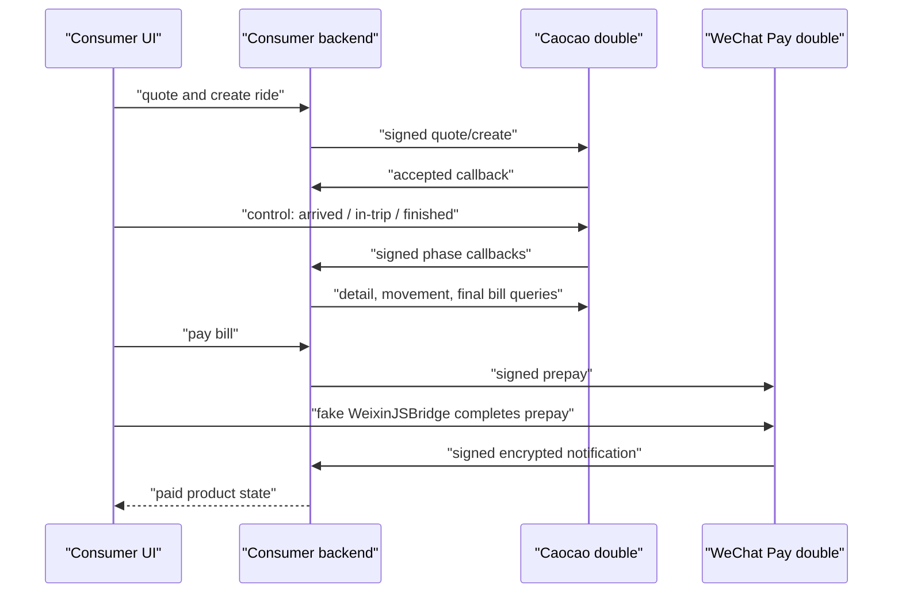

# Real Double Requirement Model

Status: superseded, not an implementation contract. This model generalized
from the complexity of the Anana fake servers and is no longer an admitted
requirements basis. Use [`double-requirements-v2.md`](double-requirements-v2.md).
Observed 2026-08-09.

## Executive Finding

A useful external-system double is a **role in a verification topology**, not a
particular implementation technique and not necessarily a small program.

The evidence separates three claims that the earlier design conflated:

1. Many doubles can be produced cheaply from examples and rules.
2. Some valuable end-to-end tests need a programmable domain simulation.
3. SVC can standardize how either kind is declared, started, isolated,
   discovered, controlled, and observed without owning all of its behavior.

The first claim does not imply that every double should fit one data DSL. The
Caocao and WeChat Pay cases directly falsify that stronger claim.

## Anana Case Audit

The source was inspected read-only at Anana commit
`e8c14ff9b7428588aef9a9f97af8ce81588c00be`.

### Scale and public surfaces

| Dimension | Caocao | WeChat Pay |
| --- | ---: | ---: |
| Package lines across implementation, tests, contracts, and fixtures | 6,678 | 1,281 |
| Provider HTTP handlers | 10 plus one callback contract | 6 |
| HTTP control/observation handlers | 11 | 9 |
| Principal entity collections | estimates, orders, route plans, fee confirmations | transactions, refunds |
| Additional interaction surface | optional Tencent route planner | browser `WeixinJSBridge` substitute |
| Provider contract | OpenAPI 3.1 plus custom validator | Zod and code; no OpenAPI |
| Control contract | separate OpenAPI 3.1 | code only |

Raw line count is not a quality or effort score. The distribution shows that
server startup and route matching are a minority of the semantic work.

### Responsibility matrix

| Responsibility | Caocao evidence | WeChat Pay evidence | Expressiveness needed |
| --- | --- | --- | --- |
| Protocol validation | Signed form/query requests, provider envelopes, OpenAPI request/response validation | API v3 request signature verification, signed responses, encrypted certificate payload | Provider-specific computation, not examples alone |
| Entity state | Multiple orders, mutable estimates, cached routes, fee confirmations | Transactions and refunds correlated by provider and Consumer identifiers | Entity-keyed store and lookup |
| Idempotency/correlation | Repeated `ext_order_id` returns the existing provider order | Repeated trade/refund identifiers return existing entities | Conditional mutation with uniqueness rules |
| Derived business values | Quote components, final bill, cancellation fee, driver/status projections | Transaction/refund resource projections and generated provider identifiers | General arithmetic and structured computation |
| State invariants | Phase changes synchronize several timestamps, reset movement ticks, and constrain retreat | Success creates transaction ids; state controls query convergence | Atomic multi-field updates |
| Test arrangement | Availability and quote changes; arm next failure or accepted-write/lost-response | Choose payment/refund success, failure, or close | Explicit control operations |
| Test action | Advance, retreat, or set one named/latest order phase | Complete a prepay from the fake browser bridge or control API | Addressable entity action, not one global state |
| Callback | Resolve callback routing, build signed form, parse Consumer acknowledgement, report delivery failure | Build AES-GCM resource notification, sign it, post to captured `notify_url` | Outbound I/O plus transforms and delivery observation |
| Fault semantics | Provider failure; write accepted but response lost; callback rejection | Payment/refund outcome failure; notification fetch failure | Fault at a precise commit point |
| Time/randomness | Domain timestamps; phase-dependent movement derived from query count; callback timestamp | timestamps, UUIDs, nonces, RSA signatures, AES-GCM nonces | Controllable clock/random source for strict determinism |
| Auxiliary dependency | Optional real route planner, cached result, deterministic geometric fallback | Browser SDK substitute | Adapter/fallback or an additional double surface |
| Observation | HTTP state snapshot, provider create count, callback delivery body/status | HTTP snapshot and direct in-process state object | Semantic state plus interaction evidence |

### Important sequences

Caocao exposes both a normal success flow and the ambiguity that makes a
state-changing external system difficult to test:

```mermaid
sequenceDiagram
  participant Test as "Black-box test"
  participant SUT as "Consumer product"
  participant Double as "Caocao double"

  Test->>Double: "arm accepted-write / lost-response"
  Test->>SUT: "create ride order"
  SUT->>Double: "signed orderCarV2"
  Double->>Double: "commit idempotent provider order"
  Double--xSUT: "503 / response lost"
  SUT-->>Test: "outcome remains processing"
  Test->>Double: "inspect order and create count = 1"
  Test->>SUT: "retry same Consumer command"
  SUT-->>Test: "same attempt; no second provider write"
```

The normal fulfillment flow crosses provider, control, callback, UI polling,
and payment boundaries:



### What black-box tests actually consume

The tests do not merely ask for schema-valid responses. They rely on:

- the number and identities of created provider entities;
- coherent query results after mutations;
- availability and quote changes made before or between Consumer actions;
- per-entity phase progression and callbacks;
- provider failure and accepted-write/lost-response boundaries;
- retry/idempotency evidence through exact provider call counts;
- payment attempt replacement, stale success, and later query convergence;
- browser-SDK behavior that completes payment outside the provider HTTP API;
- fresh ephemeral servers in some suites, but shared suite servers plus reset in
  others;
- stable fake certificates and stable routed origins for long-lived local
  development.

Some in-process tests also access the returned `state` object directly. A
language-neutral product cannot assume HTTP is the only useful control client,
but an HTTP control contract is the portable common denominator.

### Maintenance history is behavioral evidence

The Caocao package began as a smaller hand-written provider and repeatedly grew
with Consumer-visible product behavior:

| Date | Change | Double responsibility added or corrected |
| --- | --- | --- |
| 2026-06-21 | preflight price change | mutable estimate behavior |
| 2026-06-23 | phase controls and live geometry | explicit test actions, movement computation |
| 2026-06-24 | live order-detail mocks | route planning, geometry, richer projections |
| 2026-06-28 | callback routing by token | Consumer-specific callback addressing |
| 2026-06-30 | official OpenAPI alignment | contract validation without eliminating behavior code |
| 2026-06-30 | cancellation/bill/candidate fixes | domain calculations and multi-candidate truth |
| 2026-07-01 | order-detail alignment | provider response semantics and UI-visible details |

The largest contract-alignment commit added both OpenAPI material and roughly a
thousand added `routes.ts` lines. Contract adoption improved drift detection but
did not replace domain behavior. The later movement feature alone added route
planning, geometry, state, and extensive executable tests. This is strong
evidence that a useful double evolves with the Consumer's verification claims.

## Wider Sample

The following primary-source sample stresses capabilities not unique to Anana.

| System/tool | Relevant evidence | Requirement pressure |
| --- | --- | --- |
| [Stripe testing](https://docs.stripe.com/testing) and [test clocks](https://docs.stripe.com/billing/testing/test-clocks/simulate-subscriptions) | Provider-defined magic values choose declines, disputes, authentication, and other outcomes; clocks advance related domain objects and emit events | Outcome controls, correlated entity lifecycle, virtual time, provider-specific truth |
| [Stripe webhooks](https://docs.stripe.com/webhooks) | Local forwarding, test event triggers, signing secrets, delivery status and retry diagnostics | Callback delivery is a controlled and observable subsystem |
| [Microcks stateful mocks](https://microcks.io/documentation/guides/usage/stateful-mocks/) | Its own guidance says automatic stateful generation is impossible in general and uses script dispatchers, a store, request context, and templates | Contract-first products still need arbitrary behavior code |
| [Microcks OpenAPI callbacks](https://microcks.io/documentation/guides/usage/openapi-callbacks/) | Captures request context and emits ordered delayed callbacks; notes that OpenAPI itself cannot express callback order | Callback contract and callback schedule/control are distinct authorities |
| [MSW](https://mswjs.io/) | Network handlers are ordinary JavaScript using Fetch API objects and can be overridden per test | Code-first authoring is a successful alternative to service DSLs, though runtime scope is JS/browser/Node |
| [Mountebank injection](https://www.mbtest.dev/docs/api/injection) and [behaviors](https://www.mbtest.dev/docs/api/behaviors) | JavaScript injection and arbitrary-language shell transforms exist for cases built-ins cannot express and require an explicit `allowInjection` mode | Escape hatches inevitably become arbitrary-code execution surfaces |
| [Hoverfly middleware](https://docs.hoverfly.io/en/latest/pages/keyconcepts/middleware.html) | Runs a local executable in any language or calls HTTP middleware; warns that remotely enabling its admin API can execute arbitrary host code | Process/HTTP protocols are language-neutral; management APIs need a trust boundary |
| [WireMock record/playback](https://wiremock.org/docs/record-playback/) and [Hoverfly capture](https://docs.hoverfly.io/en/stable/pages/keyconcepts/modes/capture.html) | Convert observed real traffic into replay material, including stateful sequences | Some double material is learned, sanitized, and replayed rather than designed |
| [DynamoDB Local](https://docs.aws.amazon.com/amazondynamodb/latest/developerguide/DynamoDBLocal.UsageNotes.html) | Official self-contained emulator implements substantial storage semantics while documenting unsupported and divergent behavior | High fidelity can require a specialized backend; limitations must be explicit |
| [Pub/Sub emulator](https://docs.cloud.google.com/pubsub/docs/emulator) | Maintains resources/messages for an instance lifetime; supports push/pull, ordering, replay, dead letters and retry policies, with known limitations | Non-HTTP protocol, delivery, ordering, retry, and lifecycle state |
| [Firebase Emulator Suite](https://firebase.google.com/docs/emulator-suite/install_and_configure) | Coordinates several product emulators, imports/exports baseline data, and offers an `exec`-shaped CI lifecycle | Multi-service emulation, seed data, persistence policy, and orchestration |
| [Pact provider states](https://docs.pact.io/getting_started/provider_states) | Uses code to arrange isolated preconditions and deliberately avoids dependent test interactions | Arrangement and contract proof are valuable but are not end-to-end provider simulation |
| [Testcontainers](https://testcontainers.com/guides/introducing-testcontainers/) | Starts isolated real services when containerized production-compatible software exists | “Use the real implementation locally” is a distinct and often superior driver |

The sample supports a continuum, not one universal language:

```text
examples/rules -> stateful simulation -> programmable double
-> provider emulator -> provider sandbox / real local service
```

## Derived Requirement Taxonomy

### Universal management contract

Every SVC-managed double needs these properties regardless of behavior engine:

| ID | Requirement | Why it is universal |
| --- | --- | --- |
| U1 | Named external boundary and provider endpoint discovery | The Consumer must be redirected to the substitute intentionally |
| U2 | Exact readiness identity | A listener alone does not prove the intended definition/version is ready |
| U3 | Isolation or deterministic reset | Shared unknown state destroys reproducibility and parallel safety |
| U4 | Explicit control-capability discovery, including declared absence | Tests need a supported place to arrange/act without corrupting provider protocol, or proof that a fresh static instance needs none |
| U5 | Semantic observation | At minimum, mismatches, interactions/effects, and callback outcomes must be inspectable |
| U6 | Bounded lifecycle and cleanup | Development reuse and CI disposal need explicit, different policies |
| U7 | Fake-only configuration and trust declaration | A double must not silently use real write credentials or untrusted executable input |
| U8 | Fidelity statement and known gaps | Passing against a double is only evidence for the behavior it deliberately claims |
| U9 | Reproducible runtime identity | Engine/code version, contract digest, fixture baseline, and instance identity must be attributable |

OpenAPI is not universal because a double may expose browser SDK, gRPC, queue,
or raw TCP behavior. Where OpenAPI exists, it should own HTTP shape rather than
being copied into another artifact.

### Conditional behavior capabilities

These are admitted only when a Consumer verification claim requires them:

| ID | Capability | Data-only ceiling | Evidence |
| --- | --- | --- | --- |
| C1 | Request/response selection and projection | Usually expressible with rules/templates | All mock engines |
| C2 | Entity store, correlation, uniqueness, idempotency | Simple CRUD is declarative; arbitrary invariants are not | Both Anana cases; DynamoDB/Firebase |
| C3 | General derived computation | Not honestly bounded by a small expression set | Caocao prices/geometry; WeChat crypto |
| C4 | Callback/event emission, ordering, retry, acknowledgement | Shapes are declarative; timing and delivery policy often are not | Both Anana cases; Stripe/Microcks/Pub/Sub |
| C5 | Fault injection at semantic commit points | Transport faults are easy; accepted-write/lost-response needs behavior integration | Caocao |
| C6 | Virtual time and controlled randomness | Requires runtime primitives or injected sources | Stripe clocks; WeChat nonces/timestamps |
| C7 | Concurrency and atomicity | Sequence files cannot prove race behavior | Caocao idempotency/race tests; data emulators |
| C8 | Persistence/import/export baseline | Declarative data is possible; lifecycle and migration semantics vary | Firebase and DynamoDB Local |
| C9 | Downstream dependency adapters/fallback | Requires proxying or arbitrary I/O | Caocao route planner; record/replay tools |
| C10 | Non-HTTP/client-runtime surfaces | Outside an HTTP-only server DSL | WeixinJSBridge; Pub/Sub; Microcks multi-protocol |
| C11 | Record, sanitize, parameterize, and replay | Needs safe real-access workflow and secret handling | WireMock, Hoverfly, Mountebank |

No double needs every conditional capability. A product that exposes them all
through one custom language is designing a backend programming language.

## Fidelity Tiers

| Tier | Behavior owner | Best fit | Honest ceiling |
| --- | --- | --- | --- |
| Contract responder | examples, rules, templates | schema, client mapping, static error paths | no coherent domain lifecycle |
| Scenario simulation | declarative state/store/actions | bounded workflows and callback examples | complexity grows sharply with invariants and entities |
| Programmable double | Consumer code behind a stable double contract | provider-specific computation and end-to-end behavior | only behaviors explicitly implemented/tested |
| Provider emulator | provider/tool-maintained specialized runtime | databases, queues, identity, cloud services | documented divergence from production |
| Sandbox/real service | provider-owned remote behavior | highest provider semantic fidelity | cost, availability, safety, isolation, and determinism constraints |

The tiers are alternatives per dependency and test claim. “Higher” is not
always better: a small deterministic responder is preferable when it proves the
required behavior, while a home-grown emulator is risky when the real service
can be run safely in a disposable container.

## Requirement Consequences

1. A behavior DSL cannot be the universal product nucleus.
2. Arbitrary computation is a normal conditional need, not evidence that a
   double has failed to remain a double.
3. The stable SVC opportunity is the management and conformance contract shared
   across tiers.
4. Contract authority, behavior authority, control authority, and runtime
   authority must stay separable.
5. SVC must describe what passing against a double proves; it cannot infer
   semantic fidelity from OpenAPI validity or process readiness.
6. Declarative authoring remains valuable as one driver for low-complexity
   cases, but it must have a clean exit to a programmable driver rather than an
   ever-growing embedded language.
