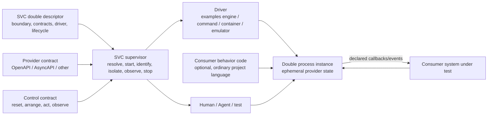

# Service and Scripting Boundary

Status: superseded, not an implementation contract. Its code-backed-service
recommendation optimized for rejected pressure cases. The active code boundary
is in [`double-requirements-v2.md`](double-requirements-v2.md) and
[`runtime-decision-v2.md`](runtime-decision-v2.md).

## First-Principles Boundary

The proposed distinction “allow scripts, but prevent a complete backend” cannot
be enforced through language expressiveness.

A script that can inspect a request, retain state, perform I/O, and construct a
response already has the computational power needed to implement a backend.
Removing any one of those powers also removes behavior directly required by the
Anana cases. A sandbox changes security and portability properties, but does not
create a semantic definition of “not a backend.”

The useful distinction is therefore ownership:

```text
SVC must not become a general backend implementation platform.

The Consumer may provide an arbitrarily capable test-only service,
while SVC owns only its double conformance and lifecycle boundary.
```

An official emulator such as DynamoDB Local is internally a backend. It remains
a double in the test topology because it substitutes one named external
dependency under a non-production fidelity contract.

## Four Different Meanings of “Script Support”

| Shape | Runtime owner | Security meaning | Product consequence |
| --- | --- | --- | --- |
| Closed expressions/templates | SVC or selected engine | Data evaluation with a bounded function set | Good for simple projection; not general behavior |
| Inline JavaScript/Python/Groovy in YAML | SVC or selected engine | Executable content hidden inside a data artifact | SVC inherits interpreter, API, debugging, and possibly sandbox obligations |
| Per-request executable/HTTP middleware | Consumer process plus an engine protocol | Trusted project code invoked through a narrow transport | Language-neutral, but latency/state/lifecycle need care |
| Consumer-authored double service | Consumer | Ordinary trusted test code with normal tooling | Highest fidelity; SVC must standardize conformance rather than implementation |

Mountebank's injection flag and Hoverfly's warning around middleware management
are practical evidence that inline/remote script configuration is not an
innocent data feature. Once admitted, it is arbitrary code execution.

## Recommended Trust Model

Treat programmable double code exactly like Consumer test/build code:

- it is trusted project-local executable code;
- running it requires an explicit `serve`/test action;
- it is reviewed, dependency-managed, and tested in the Consumer repository;
- SVC makes no sandbox claim for it;
- remote contracts/configuration cannot introduce executable code implicitly;
- inline executable strings are not the default extension mechanism;
- a stronger untrusted-code sandbox would be a separate product with a separate
  threat model, not a quiet implementation detail.

This is safer and clearer than claiming that Python/JavaScript embedded in a
YAML file is declarative.

## Role Definition

A service qualifies as an SVC double when all of these are true:

1. It substitutes a named external-system boundary used by a Consumer.
2. Its supported behavior is justified by explicit development or test claims.
3. It is disposable or deterministically resettable.
4. It exposes exact readiness and a supported control/observation boundary.
5. It uses fake-only identity/credentials and declares any outbound effects.
6. It has no production-fidelity or production-deployment claim.
7. Its runtime, contract, fixtures, and behavior revision are attributable.

Lines of code, use of a database, or Turing completeness do not decide the
role. A double stops being appropriately scoped when it accumulates behavior
that no Consumer test or development claim consumes, or when it becomes an
independent production authority.

## Authority Topology



The descriptor is configuration, not the implementation of the service.

### SVC owns

- descriptor validation and stable resolved identity;
- driver selection and version attribution;
- lifecycle coordination, readiness, discovery, shutdown, and instance scope;
- the portable control/observation conformance contract;
- provider-contract attachment and, where feasible, gateway validation;
- safe projection of endpoint and fake-fixture names to the caller;
- semantic logs/observations that the selected driver can supply;
- explicit claims and gaps in what SVC itself verifies.

### Consumer owns

- domain behavior and provider-specific fidelity choices;
- program language, framework, dependencies, builds, and source tests;
- entity schema, algorithms, cryptography, timers, callbacks, and auxiliary
  dependencies needed by its claims;
- the truth of any fake fixtures and declared behavior claims;
- maintenance as Consumer product scenarios evolve.

### Engine/provider owns

- behavior implemented by an existing mock engine, official emulator, or real
  local service;
- its versioned runtime semantics and documented production differences.

SVC may adapt those semantics, but must not silently claim them as SVC truth.

## Conformance Instead of Implementation

The portable common denominator should be a service contract, not an SDK in one
language. Its exact wire format is deferred, but the requirement categories are:

- exact health/identity;
- provider endpoint discovery;
- control endpoint discovery;
- reset or fresh-instance guarantee;
- arrange/action capability discovery;
- bounded semantic state and interaction observations;
- callback/event delivery observations where supported;
- fixture/export metadata containing names and non-secret fake values only;
- graceful shutdown and terminal diagnostics.

A language SDK may help implement this contract, but cannot be the sole
authority. An HTTP/JSON control contract is portable to ordinary services,
containers, and existing engines.

## Enforcement Reality

| Concern | Descriptor/process supervision can enforce | Requires sandbox/container/proxy mediation |
| --- | --- | --- |
| Exact launched command and version digest | Yes | No |
| Loopback listener/readiness | Yes | No |
| Instance directory and supplied environment | Yes | No |
| Clean shutdown attempt and process result | Yes | No |
| Declared callback destinations | Validate/audit only | Yes, for strong egress enforcement |
| Filesystem and subprocess access | No | Yes |
| Access to inherited host credentials | Reduce environment, not prove absence | Yes |
| CPU/memory/process limits | Limited and platform-specific | Usually |
| No production deployment | Product policy and packaging boundary | Not a local runtime property |
| Semantic similarity to the real provider | No; only executable conformance claims | Provider tests/sandbox evidence |

An SVC command-backed driver should therefore say “trusted Consumer code,” not
“safe script.” If strict egress or filesystem isolation becomes a requirement,
container/OS sandboxing is a separately admitted driver with observable limits.

## Preventing SVC From Becoming a Backend Framework

SVC should not provide these facilities merely to host doubles:

- a general database/query language or migration system;
- a general scheduler, durable queue, actor system, or workflow engine;
- production ingress, deployment, scaling, availability, or durability;
- a multi-language package manager or build system;
- a custom general-purpose expression/script language;
- a promise to sandbox arbitrary project code;
- provider-specific business libraries maintained in SVC core.

If a double needs those facilities, it uses Consumer dependencies or an
existing emulator/container. SVC supervises the resulting test service.

Scope is controlled by a verification rule: every modeled behavior needs a
named Consumer-observable claim and executable proof. Unused realism is not an
SVC requirement.

## Product Consequence

`*.double.yaml`, if retained, should be understood first as a **double
descriptor**. It may select a declarative driver for simple cases or a
command/container/emulator driver for complex cases. It should not be required
to encode every service behavior.

This preserves the original low-authoring-cost goal where it is achievable
without making low authoring cost a false promise for cryptographic, stateful,
concurrent, or event-driven provider behavior.
