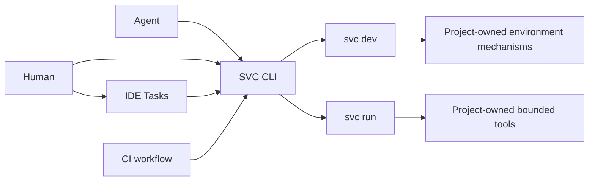

# SVC CLI Integrated Development Design Map

## Consumer and Carrier Topology

**Status**: the consumer/carrier topology was accepted by Sir on 2026-08-04;
the separate `dev` / `run` domain split was accepted on 2026-08-05.



The arrows represent invocation, not replacement or authority transfer:

- An Agent calls SVC CLI directly through its local tool surface.
- A Human may call SVC CLI directly from a terminal.
- A Human may choose an IDE Task that invokes SVC CLI.
- A CI workflow may invoke SVC CLI non-interactively.
- SVC CLI does not replace IDE Tasks; an Agent does not need IDE Tasks to use
  the CLI.
- `svc run` is a separate public interaction domain. A shared caller does not
  merge its discovery, declaration, lifecycle, or results with `svc dev`.
- Project-owned tools remain the authorities for their environment, check,
  test, build, and diagnostic semantics.

CI is an invocation carrier in this topology, not a peer Human/Agent consumer
or a transfer of CI-platform ownership to SVC CLI.

## Discussion Areas

### A. Agent-Friendly Output

Deferred by Sir to a separate unit after `svc run`. The current task defines
only the new run command's required public output projection; it does not audit
or redesign existing SVC command output.

Deferred dossier: [`design/01-agent-friendly-output.md`](design/01-agent-friendly-output.md)

### B. Separate Dev and Run Domains

Preserve the existing long-lived `dev` domain and the admitted independent
acceptance-oriented `run` domain; keep their declaration, discovery, invocation,
terminal result, and failure boundaries separate.

Active dossier: [`design/02-integrated-development-infrastructure.md`](design/02-integrated-development-infrastructure.md)

Admission dossier: [`design/03-run-product-admission.md`](design/03-run-product-admission.md)

Configuration-resolution dossier:
[`design/08-run-configuration.md`](design/08-run-configuration.md)

Private dev/run execution-reuse dossier:
[`design/09-dev-execution-reuse.md`](design/09-dev-execution-reuse.md)

Run projection and process-policy dossier:
[`design/10-run-public-projection-and-process.md`](design/10-run-public-projection-and-process.md)

### C. Invocation Projections

Determine what the direct terminal experience requires and what an optional IDE
Task projection adds for a Human. Keep IDE integration downstream of the CLI
contract rather than using editor constraints to define the core model. Define
the corresponding non-interactive CI projection without allowing CI-specific
workflow syntax to define that model either.

### D. Landing and Compatibility

Only after B–C are coherent, identify canonical product and technical owners,
configuration changes, command compatibility, installed Skill effects,
documentation, tests, and Behavioral SemVer.

## Solidified Product Contract

The `dev` / `run` split and the minimum bounded-run contract are accepted;
`dev` is not generalized:

```text
project-owned acceptance tool
-> direct invocation baseline
-> svc run shared execution identity and bounded receipt
-> Agent next action and Human handoff/review
-> compare duplicate execution, outcome, ambiguity, rework, and maintenance cost
```

No additional product review is needed before implementation scoping. Public
grammar, storage, locking, capture, retention, and rendering should be resolved
as implementation judgments against this contract and real CLI tests. Friction
observation remains a possible later extension: hogli is evidence that a shared
CLI creates an observable control surface, not a requirement to copy its
telemetry design. SVC CLI remains the delivery and distribution runtime for the
SVC Corpus.
