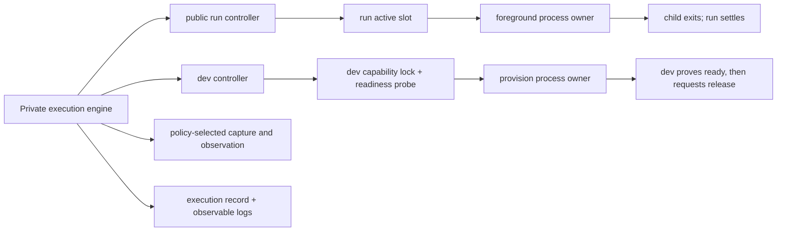
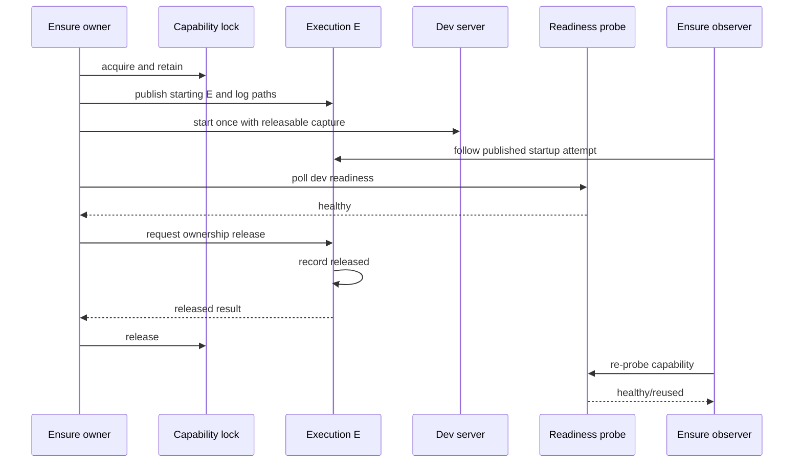

# Implementation Plan and Preflight — Declared Runs

## Status

This is a pre-implementation plan, not mutation approval. It maps the
solidified `svc run` product contract onto the current repository, resolves the
minimum technical shape, and simulates failure paths before canonical or code
changes begin.

## Minimum Public Slice

The first implementation adds one committed, profile-free `run` namespace to
schema-v2 `svc.json`:

```json
{"schema_version":2,"svc_version":"11.0.0","run":{"core-full":{"argv":["cargo","test","--manifest-path","core/Cargo.toml"],"cwd":".","env_files":[]}}}
```

A local execution context may sparsely override the launch specification of
that committed entry:

```json
{"run":{"core-full":{"cwd":"/Volumes/WorkSSD/Development/beluna","env_files":[".env"],"env":{"CARGO_TARGET_DIR":"/Volumes/WorkSSD/Caches/beluna-target"}}}}
```

- A run entry has one required non-empty string-array `argv` whose executable is
  non-empty and whose members are NUL-free, an optional non-empty `cwd`
  defaulting to `.`, an optional ordered array of non-empty NUL-free
  `env_files` defaulting to empty, and an optional string-to-string `env` map
  defaulting to empty. Empty later argv members remain valid exact arguments.
- It has no shell string, caller arguments, timeout, dependency list, steps,
  artifacts, cache, retry, or acceptance semantics.
- The run-entry name and a complete default launch specification are committed.
  `svc.local.json` may sparsely override `argv`, `cwd`, `env_files`, and `env`
  on an existing run entry, but cannot add an entry. Arrays replace, scalars
  replace, and objects merge under the existing overlay model. The name is the
  stable cross-carrier project interface; the effective launch specification
  binds it to the current local execution context.
- A relative `cwd` resolves from the workspace root. An absolute value is an
  explicit valid binding, and the resolved directory must exist at invocation
  time. Caller shell position never changes the result.
- Env-file paths resolve from the workspace root, not `cwd`; every listed file
  is required. The child environment resolves as owner ambient, then env files
  in order, then inline env. Each env file is read once as UTF-8 and strictly
  parsed from that snapshot with python-dotenv's binding parser; malformed,
  invalid, or valueless entries fail before execution publication. The same
  parsed snapshot supplies digest and child values, with interpolation disabled
  and no mutation of SVC's environment.
- Effective `argv`, resolved `cwd`, ordered resolved env-file inputs, and
  declared environment participate in the canonical run-entry digest and
  therefore in convergence. Env values are never copied into the execution
  receipt, command display, or SVC metadata. Ambient environment outside the
  declaration is neither fingerprinted nor claimed equivalent.
- The rationale and exact resolution contract are recorded in
  [`08-run-configuration.md`](08-run-configuration.md). The important boundary
  is shared entry identity versus local realization, not a growing field
  allowlist.
- Adding the optional namespace extends schema v2 without rewriting existing
  projects. It is a backward-compatible SVC capability and therefore a MINOR
  release change, not a mandatory configuration migration.

The CLI shape is:

```text
svc run <entry> [--repo <repo>] [--json]
svc run --follow <execution-id> [--repo <repo>] [--json]
svc run --inspect <execution-id> [--repo <repo>] [--json]
```

`svc run <entry>` starts a new execution only when it wins the entry's local
active slot. A caller that finds the slot owned joins and follows the published
execution. `--follow` replays and follows native output by execution ID;
`--inspect` returns the current execution facts without replaying output.
There is no list command because `svc.json` and ordinary JSON tools already own
declaration discovery.

Text execution prints a short attributed header, resolved command, native
output, and one terminal line. `--json` emits one compact run result and no live
native output. Exact fields, caller-local follower detachment, domain rejection,
channel ownership, and exit projection are frozen in
[`10-run-public-projection-and-process.md`](10-run-public-projection-and-process.md).

## Authority and Runtime Topology



Authorities are deliberately narrow:

- `svc.json` owns each domain's declaration. `dev` never references a run entry
  and does not invoke the public `svc run` command.
- The run domain derives the convergence key from local execution namespace,
  worktree identity, run-entry name, and canonical run-entry digest.
- The dev domain retains capability identity, scope, HTTP/TCP/exec readiness,
  polling, conflict, reuse, and its capability lock. A current ensure-attempt
  pointer exposes the concrete execution ID to another ensure caller.
- One OS-backed file lock is held for the complete active lifetime. It is both
  the active-slot exclusion authority and the mechanical owner-liveness proof;
  a second owner lock or daemon is unnecessary.
- A compact execution record owns mechanical attempt identity, ownership, and
  process facts. Run receipts and dev capability results remain domain
  projections.
- Foreground run uses two append-only byte logs for native stdout and stderr.
  Dev retains its established merged output log. Their meaning remains
  project-owned; the execution record derives their locations.
- The slot pointer names the latest execution for the convergence key. A
  terminal pointer is not cache reuse: the next invocation that acquires the
  free slot always creates a new execution ID.

Runtime state remains outside the consumer repository under the existing
`platformdirs.user_runtime_dir("svc")` authority:

```text
<svc-runtime>/
├── execution/<execution-id>/
│   ├── execution.json
│   └── stdout.log + stderr.log  (foreground run)
│       or output.log            (dev attempt)
├── run/
│   ├── locks/<convergence-key>.lock
│   └── slots/<convergence-key>.json
└── dev/
    ├── locks/<capability-key>.lock
    └── attempts/<capability-key>.json
```

`execution.json` is written atomically and validated strictly. Its minimum facts
are internal schema version 1, execution ID, owning domain and opaque subject,
workspace identity, resolved argv/cwd and env-file paths, owner and child PID
when known, start/finish time, duration, and one lifecycle state:

```text
starting -> running -> exited | interrupted | start-failed | capture-failed
                    -> owner-lost | released
```

`released` means only that the owning controller deliberately relinquished
process authority while the child remained alive. `dev` requests it after its
own readiness probe succeeds. The public bounded-run controller never requests
release. Non-zero child exit is still `exited`; SVC does not translate it into
test or task acceptance.
`caller_role` (`owner`, `follower`, or `inspector`) is a CLI projection and is
not written into the shared execution authority.

Execution IDs are canonical lowercase UUIDv4 values and are strictly parsed
before path derivation. Public timestamps are UTC RFC 3339; duration comes from
a monotonic clock. PID fields are observations only: lock ownership, never PID
reuse or existence alone, proves the current process authority.

The runtime directory is local and OS-managed, not durable archival storage.
The first slice neither promises survival across reboot/system cleanup nor adds
an arbitrary retention policy. It also does not auto-delete settled evidence;
capture or storage failure is reported honestly rather than silently dropping
output. A later bounded cleanup policy requires measured runtime growth, not a
speculative product setting.

New execution directories and state/log files request user-only permissions
where the platform supports them, including the filelock mode. This reduces
accidental cross-user disclosure but does not expand SVC beyond its established
same-user local trust boundary or claim defense against same-account path
replacement.

## File-Level Change Plan

### Canonical and release owners

1. `src/sections/prd.md`
   - Add the observable shared-declared-run promise and its Human-Agent/large-
     project outcome.
2. `src/sections/product-tdd.md`
   - Own the cross-unit convergence, execution identity, active-slot, record,
     native-output, and authority contract.
3. `src/sections/deployment.md`
   - Own runtime location, atomic record recovery, owner-loss behavior, local
     trust, and non-durable retention boundary.
4. `src/index.md`
   - Add the public config/CLI/output/exit-code contract and update root status
     declaration behavior.
5. `README.md`
   - Project the public quick-start and examples without duplicating internal
     state design.
6. `changes/unreleased/shared-declared-runs.yaml`
   - Record one MINOR backward-compatible capability.

No template, generated `build/monolith.md`, IDE integration generator, GitHub
workflow, or consumer repository changes belong to this slice.

### Executable owners

1. `svc_cli/workspace.py` (new)
   - Move the existing `WorkspaceIdentity` and workspace resolution authority
     out of the `dev` domain so `dev` and `run` can depend on it without either
     public domain owning the other.
2. `svc_cli/config.py`
   - Add strict `RunEntry` and direct run-entry mapping; permit local sparse
     overrides of `argv`, `cwd`, `env_files`, and `env` only under committed
     run-entry names; expose the validated effective declaration to the run
     controller. Do not add run-only env-file configuration to `dev` or read
     environment files in generic config loading.
3. `svc_cli/_execution.py` (new neutral private deep module)
   - Own already-resolved launch inputs, execution IDs, strict atomic attempt
     records, domain-selected log addresses, follow/inspect/wait,
     owner-liveness reconciliation, owned interruption, child exit, explicit
     release, and attributed stdout/stderr fan-out to logs and live observers.
   - Accept explicit launch/input/capture/release policy. Foreground run uses
     same-group pipe teeing for complete recoverable output; dev `run` uses an
     isolated process and inherited merged log handles so it can continue after
     the CLI exits; dev `activate` uses isolated merged logging but must settle;
     a manual provisioner bypasses the engine. Post-release log completeness is
     not claimed.
4. `svc_cli/dev/identity.py`, `svc_cli/dev/readiness.py` (new),
   `svc_cli/dev/runtime.py`
   - Keep capability identity, interpolation, scope, HTTP/TCP/exec evaluation,
     polling, conflict, and reuse in `dev`; isolate readiness from orchestration
     without moving it into run; replace opaque lock waiting with a published
     execution attempt that another ensure caller can observe. Preserve
     `mode=run`, `mode=activate`, `kind=manual`, public `log_path` and
     `process_id`, and the current no-later-PID-authority rule.
5. `svc_cli/run/__init__.py`, `svc_cli/run/runtime.py` (new)
   - Own entry selection, cwd/env-file resolution, strict dotenv snapshot
     parsing and precedence, private effective-entry digest, run convergence
     key, lifetime slot lock, owner/follower behavior, and run-specific receipt
     and exit projection; consume the private execution engine rather than
     owning generic process state.
6. `svc_cli/cli.py`
   - Add the minimal grammar and semantic text/compact-JSON emitters. Print the
     resolved command like pnpm, keep wrapper lines attributed, and avoid routing
     native output through the existing generic result renderer.
7. `svc_cli/project.py`
   - Add declaration-only run-entry names to root `svc status`; never execute or
     inspect runtime state there.
8. `pyproject.toml`, `pdm.lock`
   - Include the workspace, private execution, run, and every modified dev
     module in static type checking; add maintained `python-dotenv` and
     `urllib3` dependencies rather than implementing a partial dotenv grammar
     or custom HTTP connection classes. Add an import-linter contract proving
     the neutral workspace/execution modules do not depend on either public
     domain controller.

### Library-first implementation rule

Prefer a maintained library or the Python standard library when it already owns
the protocol, format, or operating-system primitive. Keep SVC-written code for
SVC-specific authority and composition only:

- Pydantic continues to own strict configuration models and validation.
- platformdirs continues to own user runtime placement.
- filelock continues to own cross-process file locking.
- python-dotenv owns dotenv tokenization through `parse_stream`; SVC rejects
  every binding marked malformed and every valueless result. One pre-read UTF-8
  snapshot supplies both private identity and launch environment, with
  interpolation absent and platform environment constraints validated before
  publication.
- urllib3 owns HTTP request framing, response handling, TLS, SNI, and hostname
  verification for dev readiness. SVC retains only URL policy, explicit DNS
  resolution, loopback/remote-scope validation, address pinning,
  accepted-status policy, and observation projection. A direct connection pool
  avoids ambient proxies and supports pinned-IP connections with the original
  Host/SNI identity. Every readiness attempt disables retries and redirects,
  does not preload the body, and closes the response after observing status.
  Address fallback recalculates from one monotonic attempt deadline so multiple
  DNS answers cannot multiply the configured HTTP timeout.
- `subprocess`, `signal`, `socket`, `ssl`, `tempfile`, and `os.replace` remain
  the mature standard-library owners for process, TCP, TLS context, and atomic
  local-file mechanics.

Do not add a wrapper dependency when it merely renames a bounded loop or an
atomic replace. Do not retain custom protocol parsing merely to avoid one small,
maintained runtime dependency. Every admitted dependency is version-bounded,
locked, covered by the wheel smoke fixture, and included in the release impact.

### Verification owners

1. `tests/test_config.py`
   - Strict argv/cwd/env-file/name validation,
     replace/replace/replace/merge overlay behavior and rejection of local-only
     run entries.
2. `tests/test_workspace.py` plus adjusted dev identity tests
   - Preserve existing Git/non-Git/worktree identity behavior through the owner
     move.
3. `tests/test_execution.py` (new)
   - Record/domain state, foreground and dev capture policies,
     follow/inspect/wait, attributed stream fan-out, display-sink failure,
     release, and owner loss.
4. `tests/test_run_runtime.py` (new)
   - State/lock authority, process lifecycle, byte capture, joining, following,
     owner loss, signals, and deliberate rerun; env-file precedence/privacy,
     one-snapshot malformed/value/encoding failure, and stable effective-entry
     digest.
5. `tests/test_dev_runtime.py`
   - Preserve HTTP/TCP/exec readiness, polling, cleanup, status, and reuse;
     prove two separate ensure callers see one provisioning execution; release
     remains probe-gated and never grants later PID-kill authority. Cover
     run-mode, activate-mode, and manual-provision compatibility and HTTP
     requests with no retry, redirect following, or body preload.
6. `tests/test_cli.py`
   - Grammar, command display, compact JSON, stdout/stderr separation, and exit
     projection; reject dev-domain execution IDs from run follow/inspect.
7. `tests/test_project.py`
   - Root status lists run entries as declarations only and preserves absent-run
     behavior.

## Coherent Implementation Batches

1. **Canonical contract and resolved declaration foundation**
   - Update the canonical product/cross-unit/deployment/index owners first, then
     add dependencies, the run schema/overlay, neutral workspace owner, static
     typing/import boundaries, and focused config/workspace tests.
   - Gate: document validation, config/workspace tests, typecheck, and import
     contracts.
2. **Neutral execution mechanics**
   - Add `_execution.py` with strict records, locks, concrete launch policies,
     capture/follow/inspect/wait, lazy owner-loss reconciliation, release, and
     focused separate-process/PTY tests.
   - Gate: the execution tests pass without a public run command or dev
     migration depending on unfinished behavior.
3. **Public run projection**
   - Add run resolution/controller, CLI grammar and run-only rendering, root
     declaration status, and CLI/runtime tests including domain isolation.
   - Gate: the complete bounded-run matrix passes, including native-byte,
     compact-JSON, signal, display-close, and deliberate-rerun cases.
4. **Dev migration onto the proven mechanics**
   - Extract dev readiness, replace custom HTTP connection code with urllib3,
     and adapt run/activate provisioners while manual provisioning bypasses the
     engine.
   - Gate: all existing and new dev tests pass, including two-process ensure,
     merged-log/result compatibility, readiness-gated release, and bounded HTTP
     behavior.
5. **Release projection and distribution proof**
   - Update README and the Changie fragment, build the canonical projection and
     wheel, then exercise an installed consumer fixture.
   - Gate: the full verification commands and package smoke listed below pass.

If a gate invalidates a frozen authority or process-policy assumption, stop the
later batches and return to the task packet; do not patch around the contract.

## Preflight Sequence Simulation

### Normal owner and follower

```mermaid
sequenceDiagram
  participant A as Caller A
  participant L as Active-slot lock
  participant X as Execution E
  participant P as Project command
  participant B as Caller B
  A->>L: acquire and retain
  A->>X: publish starting E and empty logs
  A->>P: spawn once
  A->>X: running
  B->>L: non-blocking acquire loses
  B->>X: read latest E; replay/follow logs
  P-->>X: stdout/stderr bytes
  P-->>A: exit
  A->>X: atomically settle receipt
  A->>L: release
  X-->>A: same receipt E
  X-->>B: same receipt E
```

There is no duplicate-start window: the winner holds the slot before publishing
E and keeps it until after the terminal record is durable. It creates E's
directory, starting record, and empty logs, atomically replaces the slot pointer
with E, and only then spawns the command.

A contender binds only when the pointer resolves to an active record. If no
pointer exists, or if the pointer still names the previous terminal execution
while the lock is held, the contender waits for the pointer to change or the
lock to become free. This closes the publication race in which a new owner has
won the slot but has not yet replaced the previous terminal pointer. If the
winner dies before publication, the lock becomes free and another caller may
claim the slot; no project command has started at that point.

### Dev readiness and deliberate release



`released` is atomically written by the private engine before it relinquishes the
process handle and before the capability lock is released, so an observer
cannot mistake a publication gap for permission to provision a second server.
The dev controller owns the probe and requests release only after the capability
is healthy. If the record transition fails, the controller still owns and
cleans up the process instead of reporting a release that was never observable.

If an ensure owner disappears before release, the next lock holder reconciles
the attempt as `owner-lost` and probes/waits for the capability without starting
a replacement in that invocation. If the orphan becomes ready, dev may
return `reused` based on the probe while retaining owner-loss as attempt
history. If it does not, the caller reports owner loss; only a later explicit
ensure may launch again. SVC does not kill or take over an abandoned PID.

### Deliberate rerun after settlement

The previous owner writes terminal state before releasing the slot. A later
invocation acquires the now-free slot, observes that the latest execution is
terminal, creates a new ID, and replaces only the slot pointer. It never returns
the previous receipt as fresh execution truth. The old execution remains
addressable by its ID while runtime storage survives.

### Follower interruption

Follower `Ctrl+C` stops its log readers and returns the conventional interrupted
CLI code. It never owns the slot or child handle, writes no terminal state, and
sends no signal to the owner or project command. Other participants continue.

### Owner interruption and shell job control

On POSIX the foreground run child remains in the owner's terminal session and
foreground process group. Terminal `Ctrl+C` therefore reaches both owner and
child directly; the owner records the request and keeps draining and waiting
instead of forwarding a duplicate signal when launch-time terminal facts prove
foreground-group delivery. Without that proof, targeted `SIGINT` and `SIGTERM`
are best-effort forwarded to the direct child. `Ctrl+Z`, `bg`, and `fg` are not
intercepted, so the shell retains ordinary job-control behavior for the group.

The child inherits owner stdin; followers are read-only. stdout/stderr use pipes
because recoverable evidence requires capture. No PTY emulation is added, and
SVC makes no interactive-TUI fidelity promise for bounded acceptance commands.

### Unexpected owner loss

An uncatchable owner exit releases the OS-backed lifetime slot lock while
leaving an active execution record. The first caller that acquires that slot
re-reads the record under the lock, settles it as `owner-lost`, and returns that
receipt **without starting a replacement command in the same invocation**.

This lazy reconciliation applies to entry, follow, and inspect callers. Inspect
may record the already-proved lifecycle fact without executing a command and
still returns its inspection-success code. Caller roles remain projections; a
reconciler does not retroactively become the lost process owner.

This avoids hiding the lost evidence horizon and avoids an automatic duplicate
when SVC cannot prove that the orphaned child process is gone. A subsequent
explicit `svc run <entry>` is a new deliberate invocation and may create the
next execution. SVC does not kill a PID it no longer owns or introduce a worker
solely to survive the starter.

### Start and capture failure

- If process creation fails, the owner writes `start-failed`, releases the slot,
  and returns an SVC failure. Followers receive the same receipt.
- stdout and stderr are drained concurrently to avoid pipe deadlock. Each byte
  stream is appended before being forwarded. The owner settles only after both
  readers reach EOF, so followers can drain complete stored output after seeing
  terminal state.
- A log write failure stops the owned command and settles `capture-failed`; SVC
  never claims recoverable native evidence after silently losing it. If the
  runtime volume cannot even accept the small terminal record, the CLI reports
  the storage failure directly and later callers fail closed on the incomplete
  state; no implementation can truthfully promise a durable receipt after the
  authority volume itself stops accepting writes.
- Closing or interrupting an owner or follower display sink disables only that
  best-effort sink. It does not become `capture-failed`, damage authoritative
  logs, relinquish process ownership, or backpressure the project command.

### State corruption and partial publication

All JSON state and slot writes use same-directory temporary files plus atomic
replacement. Strict schema/ID validation rejects malformed or mismatched state.
When a slot points to unreadable state, SVC fails closed and does not start a
possibly duplicate command. The error reports the exact local runtime path for
manual diagnosis; the first slice adds no broad `reset` command.

### Output and ordering

Native stdout and stderr remain separate byte streams and therefore make no
invented total-order claim across file descriptors. Owner and followers may see
different interleaving at chunk boundaries, but each stream's byte order is
preserved. Introducing a timestamped event protocol or PTY merely to reconstruct
a total order is rejected until a real consumer requires it.

Commands that intentionally emit machine data on stdout remain composable in
text mode because SVC headers, command display, and terminal lines use stderr.
In `--json` mode native display is suppressed, so stdout contains exactly one
compact SVC receipt rather than mixed command bytes or JSONL.

## Verification Matrix

| Contract | Required proof |
|---|---|
| One active execution | Two separate CLI processes invoke one sleeping counter command; counter increments once and both report one execution ID |
| Publication cannot join stale evidence | Pause the winner after lock acquisition; a contender ignores the previous terminal pointer and binds only after the new active ID is published |
| Settled results are not reused | A later invocation produces a different ID and increments the counter again |
| Different intent does not converge | Different entry digest, worktree, or namespace produces distinct slot keys |
| Local realization is explicit | Local argv/cwd/env-files/env overrides use replace/replace/replace/merge semantics; each changes effective identity when its resolved launch input changes; local-only entries and receipt env values are rejected |
| Env files are deterministic and private | Workspace-root path resolution, one UTF-8 snapshot, strict malformed-binding rejection, listed-order precedence, inline override, environment validation before publication, disabled interpolation, and absence of raw values in records/output |
| Follower is observation-only | Interrupt a follower; owner command remains active and a later follower receives its terminal receipt |
| Owner interrupt is authoritative | Use a POSIX PTY to send foreground-group Ctrl+C; child receives it without process-group isolation, terminal record is interrupted, and lock becomes acquirable |
| Owner loss is honest | Kill owner uncatchably; first recovery reports owner-lost without starting, second explicit invocation may start anew |
| Output is recoverable | Mixed non-UTF-8 stdout/stderr bytes survive owner and settled follow without receipt embedding |
| Output horizon is honest | A descendant retaining an inherited capture descriptor keeps the attempt active until EOF; SVC does not settle early or add a hidden drain timeout |
| JSON remains framed | Run/follow/inspect with `--json` emits one compact stdout value; pre-publication structured errors emit one compact stderr value; follower detach remains caller-local |
| Public domains remain separate | Run follow/inspect rejects a dev execution ID while the dev controller can observe its own attempt |
| Published evidence is self-contained | Follow/inspect still use the stored run record after current configuration or env files change, while a new entry execution resolves the new effective intent |
| No shell/workflow expansion | Schema rejects string commands, empty argv, unknown fields, steps, dependencies, artifacts, and caller arguments |
| Root status is non-executing | Status lists sorted run names while the fixture command counter remains unchanged |
| Dev reuses process mechanics | Two separate ensure callers observe one provisioning attempt; dev readiness gates the engine's `released`; `activate` settles before probes; manual bypasses launch; startup failure/interrupt cleans up; later status/reuse remains capability-owned |
| Existing dev behavior survives | Current dev identity/runtime/setup tests remain green after workspace/private-execution extraction; merged log, `log_path`, and `process_id` stay compatible |
| HTTP readiness is bounded | Pinned-IP Host/SNI behavior remains correct while redirects, retries, and body preload are disabled, responses are closed, and multiple resolved addresses share one attempt deadline |
| Distribution is complete | `pdm run test`, `pdm run typecheck`, `pdm run lint-tests`, `pdm run lint-imports`, `pdm run check-documents`, `pdm build`, and installed-wheel CLI smoke/consumer fixtures pass |

Cross-process tests use isolated temporary runtime roots and bounded child
timeouts. They must reap every process they start, retain diagnostics on
failure, and never depend on the developer's real user runtime directory.

## Measured Preflight Evidence

The plan was checked against this repository and small local process/network
experiments on 2026-08-06:

- Current code confirms the non-uniform dev launch cases: executable provision
  has `mode=run|activate`, manual provision is a different discriminated kind,
  run/activate currently use null stdin, a new session/process group, and one
  merged log; activate waits for exit, while successful run exposes `log_path`
  and `process_id` before disowning after readiness.
- A POSIX subprocess experiment showed a default child sharing the owner's
  session and process group, while `start_new_session=True` created both a new
  session and process group. Foreground run and releasable dev therefore cannot
  share one implicit launch default.
- The `filelock` descriptor was non-inheritable. An owner-SIGKILL experiment
  then proved both facts that shape recovery: another process could reacquire
  the lifetime lock while the orphaned child remained alive. This rules out
  automatic replacement in the first recovery invocation.
- python-dotenv's binding parser exposes malformed lines through
  `Binding.error`; the convenient values API warns and skips them. Strict run
  configuration must therefore inspect bindings from one pre-read snapshot.
- A local urllib3 2.7 prototype using a pinned connection, original Host, no
  retry, no redirect, and no preload observed the server's 302 directly,
  preserved the requested Host, and did not consume the response body. This
  validates the intended library boundary without copying the current custom
  connection subclasses.
- The unchanged repository baseline passes 131 tests, mypy over its current 15
  source files, Ruff test lint, import contracts, and canonical document
  validation. New modules and modified dev modules are intentionally added to
  those gates by the plan rather than relying on this baseline.

## Explicitly Deferred

- IDE/npm setup generation for run entries
- a common public declaration or command spanning `dev` and `run`
- shell commands, caller arguments, ambient-environment fingerprinting,
  environment interpolation, timeouts, retries, dependencies, DAGs, cache,
  affected selection, artifacts, or result parsing
- public pattern/hook commands, output-regex diagnostics, background/readiness
  fields on run entries, and public references between dev targets and run
  entries
- cross-command Agent-friendly output redesign; it is a separate unit after
  `svc run`
- PTY/TUI emulation, remote execution, cross-host following, a daemon, MCP, or
  telemetry/friction collection
- automatic retention, pruning, archival, upload, or stable log-file paths

## Impact Handshake

- **Address and Object**: canonical claims in `src/sections/prd.md`,
  `src/sections/product-tdd.md`, `src/sections/deployment.md`, and `src/index.md`;
  public projection in `README.md` and one Changie fragment; configuration,
  workspace identity, neutral private execution engine, adapted dev provisioning,
  new run runtime, CLI dispatch/rendering, root status, dependency lock, type
  checking, and the exact tests listed above.
- **State Diff**: from a strict schema-v2 project runtime with only optional
  long-lived `dev` declarations and no addressable bounded execution, to an
  additive committed `run` namespace whose concurrent local callers converge
  on one foreground-owned execution and recoverable receipt, while existing dev
  provisioning gains an addressable startup attempt without changing its
  readiness-based public lifecycle.
- **Blast Radius**: accepted `svc.json` input, root status payload/text, CLI help
  and exit behavior for the new command, per-user runtime files, packaged docs,
  wheel contents, and local/IDE/CI callers that opt into run entries. Existing
  projects without `run` and every existing command remain behaviorally
  unchanged. Existing dev runtime paths and internal attempt observation
  change, but its CLI outcomes stay compatible.
- **Invariants**: `dev` and `run` stay separate public domains; project tools
  own command and result semantics; settled evidence is not freshness/cache;
  local run overlays resolve only committed entries and may alter their complete
  launch specification; the private execution engine owns no dev readiness,
  capability identity, scope, reuse, or convergence semantics; no project
  runtime state, daemon, shell, workflow graph, artifact inference, Human
  authorization, context acquisition, or public generic coordinator is added.
- **Verification**: the matrix above, the complete current suite and static
  checks, monolith consistency, source and wheel builds, installed-wheel smoke,
  and an isolated consumer fixture prove the blast radius.

## Readiness Result

The plan has no known implementation blocker. Its highest-risk seams are
cross-process process/state cleanup and deliberate dev ownership release. They
are bounded by lifetime domain locks, atomic records, fail-closed corruption,
an explicit owner-loss horizon, probe-gated release, no later PID authority,
and separate-process tests above. Sir accepted the corrected run configuration,
library-first ownership, and neutral private dev/run execution boundary on
2026-08-06.
The plan is ready to implement, but canonical and code mutation still require
Sir's explicit start instruction.
