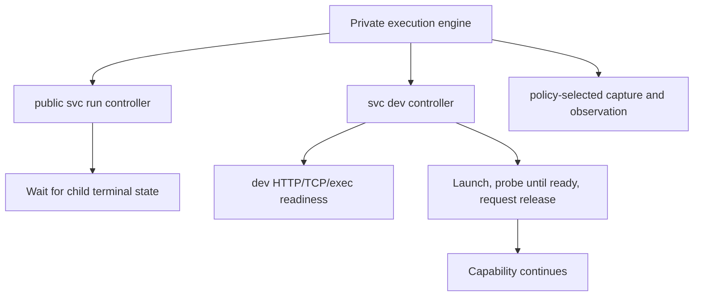

# Design Dossier — Dev Reuse of Private Execution Mechanics

## Status

Sir accepted this implementation boundary on 2026-08-06; it is not
authorization to mutate canonical source or code. HTTP, TCP, and exec readiness
evaluate a long-lived capability before, during, and after one provisioning
attempt, so they remain owned by `svc dev`. The neutral private execution
engine provides attributed stream fan-out in the first slice. A future proven
consumer may add output observations, but the engine does not assign them the
domain meaning `ready`.

## Observed Current Behavior

Current `svc dev ensure` already:

1. probes the target before deciding whether to provision;
2. coordinates callers with a capability-derived lock;
3. starts an executable provisioner in a new process group/session;
4. writes its output to a runtime log;
5. polls the declared HTTP, TCP, or exec readiness probe;
6. kills only its owned launch on failure or interruption; and
7. deliberately disowns the process after readiness succeeds.

The same probe also supports later `dev status`, conflict detection, and reuse
after the initiating process attempt is no longer owned or even addressable.
That makes readiness a capability observation rather than a process-execution
state.

The implementation is currently concentrated in `svc_cli/dev/runtime.py`. The
useful extraction is process-attempt mechanics and observation, not the
capability probe evaluator itself.

## Correct Topology



`svc dev` does not invoke the public `svc run` command or reference a run entry.
It uses the neutral private engine to launch and observe a concrete provisioning
attempt, evaluates its own capability readiness, and explicitly asks the engine
to release process ownership after that readiness succeeds.

## Minimum Engine Responsibility

The private engine owns only mechanical facts and operations common to bounded
runs and dev provisioning:

- already-resolved process launch inputs: exact argv, cwd, and child
  environment;
- one execution ID for one concrete launch attempt;
- atomic attempt publication and owner-liveness facts;
- domain-selected capture and bounded follow/inspect/wait observation;
- process start, owned interruption, exit observation, and explicit ownership
  release;
- attributed stdout/stderr fan-out to separate run logs, owner display, and
  follower observation when the foreground pipe policy provides attribution;
  dev retains one merged inherited log without inventing stream identity.

Its lifecycle remains mechanical:

```text
starting -> running -> exited | interrupted | start-failed | capture-failed
                    -> owner-lost | released
```

`released` means only that the caller deliberately relinquished authority while
the child remained alive. The engine does not record a generic `ready`
state. The dev controller may request release only after its own capability
probe succeeds; a bounded public run never requests release.

Release is ordered: persist the `released` transition, then relinquish the
process handle, then let the dev controller release its capability lock. If the
transition cannot be persisted, dev still owns the process and cleans it up
rather than returning a healthy result whose ownership release was never
observable.

## Possible Hooks and Pattern Matching

The useful future extensibility boundary is observation, not readiness policy.
A later proven consumer could subscribe to:

- bytes or bounded decoded lines from stdout;
- bytes or bounded decoded lines from stderr;
- process exit or interruption;
- an explicitly configured pattern match on one attributed stream.

A pattern match produces a named observation such as `pattern-matched`; its
consumer decides what that means. The engine does not translate it into
readiness, success, acceptance, or an artifact.

Pattern handling must preserve the existing output contract:

- stdout and stderr remain distinct; no cross-stream total order is invented;
- matching handles chunk boundaries without retaining unbounded output;
- non-UTF-8 native output remains capturable even when a text matcher cannot
  decode it;
- owner-side hooks run once while bytes are captured, not again for every
  follower replay;
- a hook cannot execute another project command or define a dependency edge.

There is no concrete pattern consumer in the admitted first slice. The required
stream fan-out gives a clear later insertion point, but the first implementation
does not formalize a generic hook API, add a matcher, or add a public regex or
hook-command schema.

## Domain-Owned Coordination

- `run` derives an active slot from workspace plus resolved run-entry identity.
  A joined caller follows the same bounded attempt until it settles.
- `dev` retains capability scope, endpoint identity, readiness probes, polling,
  conflict, and reuse. Its active ensure pointer may expose the winner's
  execution ID so another ensure caller can follow startup instead of waiting
  opaquely; after attempt settlement it re-evaluates the capability directly.

If readiness fails or the owner is interrupted before release, `dev` asks the
engine to terminate only the attempt it still owns. After release, later
authority comes from capability probes; neither the engine nor dev retains a
generic right to kill the background process by historical PID.

## Output Boundary After Release

The provisioning log remains useful startup evidence. A follower stops waiting
when the attempt is released and then consumes the dev capability result. The
first slice uses the published attempt for non-opaque waiting and recovery but
does not redesign existing `svc dev` terminal output to replay startup bytes;
the returned `log_path` remains the public diagnostic address. The child may
continue appending to its inherited log file, but SVC does not promise a
complete process-lifetime log after ownership release. A daemon is not added
solely to retain log or process authority.

## Public Non-Changes

- no readiness evaluator or generic `ready` lifecycle in the private engine;
- no public `background`, `ready`, pattern, or hook-command run-entry field in
  the first slice;
- no `dev` reference to a run-entry name;
- no run-only `env_files` field added to the public dev schema merely for
  internal reuse;
- no public lifecycle merger between `svc dev` and `svc run`;
- no dependency graph, daemon, or later PID-based takeover.

## Verification Obligations

- Existing dev readiness, polling, conflict, cleanup, disown, status, and later
  `reused` behavior remain dev-owned and CLI-compatible.
- Two separate `dev ensure` callers observe one provisioning execution ID and
  one underlying process; the observer waits on the published attempt rather
  than an opaque lock and then receives a dev probe-based result without a new
  native-output projection.
- `released` is requested only after a successful dev readiness probe and is
  never emitted by the public bounded-run controller.
- Interrupt or readiness failure before release kills the owned process;
  inspection after release never authorizes a later PID kill.
- Foreground stream fan-out writes attributed bytes once, preserves per-stream
  ordering and bounds, and does not change native capture or follower replay;
  dev merged capture makes no false attribution claim.
- Run foreground ownership, follower detachment, and terminal receipts remain
  unchanged when the same process mechanics serve dev.

## Concrete Dev Adaptation

The existing dev modes remain semantically distinct:

- `mode=run` launches a long-lived provisioner in an isolated process
  group/session with null stdin and merged output redirected to the established
  dev log. Only the dev readiness evaluator can authorize `released`.
- `mode=activate` launches the bounded activation command with the same
  isolation and merged-log shape, waits for successful command exit, and only
  then continues dev readiness evaluation. It never releases a still-running
  activation command. The dev controller retains its readiness-deadline-derived
  activation timeout and asks the engine to clean up the attempt; this does not
  add a public timeout field or generic timed-out lifecycle to `svc run`.
- `kind=manual` retains its current instruction/probe flow and does not launch
  through the engine.

The migration preserves the current public `log_path` and `process_id` fields,
their meaning, dev success/error codes and details, result states, and merged
log; it does not promise the old timestamped runtime filename. An execution ID
may be retained as additive internal attempt evidence, but a run-domain caller
cannot follow or inspect it. The complete launch/capture matrix and signal
contract are frozen in
[`10-run-public-projection-and-process.md`](10-run-public-projection-and-process.md).
