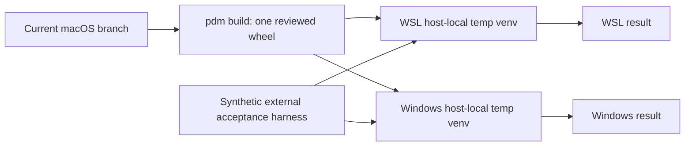

# Acceptance Environment Preflight

Status: preflight and final automatic acceptance completed on 2026-07-28.
Volatile host versions were rechecked by the installed-wheel harness. Only
hands-on terminal experience remains.

## Current macOS Source Authority

- Workspace: current macOS source worktree
- Inspected HEAD: `b2be9b221988de4666061aad81f34ff4d5a8fcae`
- PDM environment: Python 3.12.10, PDM 2.27.0
- Baseline: `pdm run test` passed all 143 tests
- Current Codex state shape exposes the required `id`, `rollout_path`, `cwd`,
  `title`, `first_user_message`, lifecycle, recency, and time candidates.
- Initial privacy-safe aggregate: 732 rows across 31 workspace values; 568
  active and 164 archived. A later schema-only audit observed 739 rows (575
  active, 164 archived); a final type-only check observed 743 (575 active, 168
  archived), demonstrating that live counts are volatile. Missing and very
  large recognition values exist, so bounds and explicit missing states are
  real requirements rather than synthetic theory.
- A structurally sampled current rollout was approximately 97.6 MB and 40,986
  lines. It included messages, reasoning, tool calls/results, context,
  compaction, agent/turn events, and substantial UI/rate-limit noise.

No recognition or transcript value was copied into Git.

## Remote Host Facts

Both names are reachable through the user's existing SSH authority.

| Host | Observed runtime | Installed SVC | Privacy-safe Codex state |
| --- | --- | --- | --- |
| `wsl.win-ws.localhost` | WSL2 Linux, `python3` 3.13.5; no `python` alias or PDM; `venv`, ensurepip 25.1.1, and pip 25.1.1 available | 10.0.1 CLI works from its user-local installation | 457 rows: 328 active, 129 archived; required ID/path/CWD/title/first-message/lifecycle fields exist |
| `win-ws.localhost` | Windows 10.0.19045, Python 3.14.0, PDM 2.28.0; `venv`, ensurepip 25.2, and pip 26.1.2 available | 10.0.1 `svc.exe` and module entry work | Initial 1,785 rows; later schema audit 1,786: 592 active, 1,194 archived |

The state probes selected only schema names and aggregate counts. They did not
return thread IDs, CWDs, titles, messages, rollout paths, or content.

Across the later macOS/WSL/Windows schema audit:

- `archived`, `created_at`, `recency_at_ms`, `updated_at_ms`, and `updated_at`
  were declared `INTEGER`
- every observed runtime value of those fields was SQLite integer;
  `archived` was only `0|1`, the `_ms` fields were 13 digits, and `updated_at`
  was 10 digits
- there were no null/non-text/blank/over-512/duplicate IDs and no
  null/non-text/blank rollout paths

These observations support the narrow v1 authority; fixtures still cover every
absent/invalid case because a future or old local schema can differ.

## Stale Shared-Worktree Hazard

`/mnt/f/CODING/svc` in WSL and `F:\CODING\svc` in Windows are the same physical
worktree. It was clean at preflight but at
`4e06dd910a6739b521766b7e6bde59e9375e3c51`, an older pre-v10/minimal checkout
with different metadata and only 19 tests.

Consequences:

- it is not an acceptance source for this task
- a pass there would not validate the current contracts
- WSL and Windows mutation tests there would race one another
- the missing WSL PDM and missing Windows repo console script are properties of
  that stale checkout, not SVC product defects

Do not pull, switch, install into, or otherwise mutate that shared worktree as
part of this task.

## Fresh-Wheel Acceptance Topology



Run WSL and Windows serially:

1. finish macOS targeted/full tests and build one wheel from the reviewed
   source state
2. compute the wheel SHA-256 and pass it as the expected digest to the
   acceptance harness
3. copy the wheel plus the standard-library acceptance harness to a host-local
   staging directory; either pre-populate a binary wheelhouse offline or
   explicitly run the host base Python's `pip download --only-binary=:all:`
   there before product execution
4. invoke the harness with the host base Python. It verifies the SVC wheel
   SHA-256, rejects non-wheel/link entries in the supplied wheelhouse, creates
   its own host-temp venv, and installs with `pip --no-index --find-links`;
   product acceptance itself performs no network resolution and never imports
   the source tree
5. in a `finally` path remove only the harness-created exact temporary
   directory, then assert it is absent
6. repeat on Windows with a host-local `%TEMP%` venv and the same wheel/digest/
   harness
7. perform a final interactive smoke in a real terminal; SSH/headless success
   alone cannot prove alternate-screen keyboard ergonomics

The harness must import/execute the installed wheel rather than the shared
source tree. Its `--slice` value is exactly one of `inventory`, `bundle`,
`analysis`, `ui`, or `all`; Slice 1 invokes `inventory`. Required inputs are
`--wheel`, `--expected-sha256`, and `--wheelhouse`. It creates only synthetic
SQLite/JSONL/schema-v2 bundle fixtures plus a minimal schema-v1 rejection
sentinel and asserts machine output; rejection tests prove that no native,
index, or task member is opened. It must not serialize either host's real
thread recognition data. It emits one bounded JSON result containing harness
version, wheel SHA-256, platform/Python/SVC and installed-dependency versions,
named case statuses, cleanup status, and no fixture value. Exit codes are 2 for
arguments, 3 for Python/venv/ensurepip precondition, 4 for
wheel/digest/wheelhouse validation, 5 for isolated install, 6 for a case
failure, and 7 for failed cleanup.

The harness is invoked from the base interpreter but all installed-wheel cases
run through its exact child interpreter:

```text
WSL base:      python3 <stage>/accept_agent_thread.py ...
WSL child:     <harness-temp>/venv/bin/python
Windows base:  python <stage>\accept_agent_thread.py ...
Windows child: <harness-temp>\venv\Scripts\python.exe
```

Environment preparation may resolve dependencies explicitly:

```text
python3 -m pip download --only-binary=:all: \
  --dest <stage>/wheelhouse <stage>/<svc-wheel>       # WSL
python -m pip download --only-binary=:all: ^
  --dest <stage>\wheelhouse <stage>\<svc-wheel>       # Windows cmd
```

An offline prebuilt wheelhouse is equivalent. The harness always installs as:

```text
<child-python> -m pip install --no-index \
  --find-links <stage>/wheelhouse <stage>/<svc-wheel>
```

The caller removes its external staging directory after collecting the bounded
result. Independently, the harness records its own `tempfile.mkdtemp` path,
removes only that exact path in `finally`, and asserts absence before success;
this works even though Windows cannot delete the currently running staged
script.

The owner is repository tooling at `tools/accept_agent_thread.py`; its
trigger is an explicit post-build acceptance invocation with
`--wheel`, `--expected-sha256`, `--wheelhouse`, and `--slice`; its consumers are
SVC maintainers and release automation; and its verification is a repository
unit test with fake executables plus the real three-host runs. It is not
packaged as a public CLI and has no authority over real provider state.

## Per-Slice Remote Scope

| Slice | Remote proof |
| --- | --- |
| 1 | Safe list help/JSON, all three lifecycle filters, unknown/missing/unsafe rows, filter-before-limit, and no sensitive output |
| 2 | Exact ZIP members/schema, deterministic normalized records, schema-v1 rejection before non-manifest access, no-overwrite/private file behavior, and path/reparse cases |
| 3 | Agent JSON schema/determinism/loss propagation with provider home absent |
| 4 | Installed Textual import plus headless Pilot flows at fixed sizes; final real-terminal keyboard/alternate-screen smoke |
| 5 | Repeat the full black-box matrix using the release-candidate wheel |

Remote live-state checks remain optional read-only smoke tests. Synthetic
fixtures are acceptance authority because they are reproducible, non-sensitive,
and cover malformed/race boundaries that real state cannot safely provide on
demand. This file is volatile task evidence, not durable host truth; every
acceptance run recollects its environment record.

## Final Candidate Acceptance

The integrated pre-publication candidate was assembled over `origin/main`
`4ca4629054` with the tag-bound release pipeline and the completed pytest,
type-safety, and test-topology slices. Release planning reported
`10.0.2 → 11.0.0` with `major` impact. The final wheel was
`sustainable_vibe_coding-11.0.0-py3-none-any.whl`, SHA-256:

```text
f57fbe6a212a37ae49a8736f648667f0e42b6e56375c346546cebeae828af507
```

| Host | Base Python | Installed SVC/Textual | Harness result | Cleanup |
| --- | --- | --- | --- | --- |
| macOS source authority | 3.12.10 | 11.0.0 / 8.2.8 | inventory, bundle, analysis, UI passed | internal passed; caller staging absent |
| `wsl.win-ws.localhost` | 3.13.5 | 11.0.0 / 8.2.8 | inventory, bundle, analysis, UI passed | internal passed; caller staging absent |
| `win-ws.localhost` | 3.14.0 | 11.0.0 / 8.2.8 | inventory, bundle, analysis, UI passed | internal passed; caller staging absent |

All three isolated installs also reported Pydantic 2.13.4, filelock 3.32.0,
platformdirs 4.11.0, and only the declared Textual dependency closure. WSL and
Windows ran serially. Their shared `F:`/`/mnt/f` worktree was not used or
mutated.

Local gates passed 224 pytest items, Ruff, mypy, Import Linter, zizmor, release
check, monolith, sdist/wheel build, CLI help smokes, exact `METADATA`
dependency inspection, full `RECORD` hash/size verification,
catalog/migration discovery, privacy probes, the eight-case private aggregate,
and final read-only review. Wheel inspection found no quality/test dependency,
task packet, test fixture, native JSONL, schema-v1 compatibility module, or
removed `task_packets` module.

### Human-only residual

Run the installed candidate in a real macOS terminal and Windows Terminal, then
judge only properties that headless Pilot and SSH cannot establish:

1. active/archived switching and workspace-tree density are readable
2. title plus first-user-message preview identifies similar threads quickly
3. expansion, filtering, selection, timeline levels, significant jumps, and
   analysis-view switching feel coherent on the keyboard
4. overview/tool/context/task/terminal/loss views are useful for improving SVC
5. narrow/resize behavior remains legible, and `Escape`/`q` restores the
   original screen and cursor state

No further automatic gate, implementation change, commit, tag, push,
publication, changelog consumption, or packet deletion is implied by this
manual acceptance.
