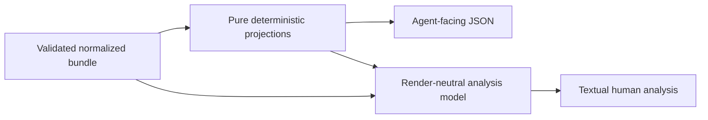

# Agent-Thread Analysis v1

Status: Slice 0 frozen task-local contract. `analysis` is the capability;
`analyze` is its CLI verb.

## Outcome and Authority

Analysis helps a maintainer understand how a thread unfolded and identify
evidence relevant to improving SVC. It is not a styled transcript, automatic
quality score, or model-generated causal verdict.

The pipeline is:



The normalized trajectory remains authority. Analysis may reference but never
rewrite/correct it. Both human and JSON paths run without the provider home,
native transcript, network, browser server, or external model.

Direct local analysis first produces the same normalized trajectory
ephemerally. Bundle input must already be schema v2; schema-v1 archives are
rejected before any native member is opened. No analysis path has a separate
provider parser.

## V1 Analysis Result

`analyze --json` emits the exact bounded object frozen in
[`analysis-schema.md`](analysis-schema.md). Its derivation is frozen in
[`analysis-algorithms.md`](analysis-algorithms.md). The root is:

```text
format = svc-agent-thread-analysis
schema_version = 1
bundle_id
analyzer { name, version, method=deterministic-v1 }
result_status = ready | partial
dimensions {}
metrics {}
findings []
unknowns []
lossiness {}
```

Each finding has:

- stable analysis-local ID
- dimension
- stable finding code
- `kind=observed|deterministic|heuristic`
- `confidence=high|medium`
- one or more `{bundle_id, record_id, record_index}` evidence refs
- bounded structural details without message/tool content duplication

Findings are capped at 256/25 per dimension and ordered by the frozen algorithm.
Unavailable evidence is a separate bounded `Unknown` object with cause/code,
not a finding with invented evidence. Analyzer version and method are always
explicit. V1 does not call an LLM; any heuristic is a documented local rule and
cannot claim causality.

Evidence kinds mean:

- `observed`: a direct normalized record/manifest fact
- `deterministic`: an exact relationship or aggregate derived from such facts
- `heuristic`: a documented local signal that admits competing interpretations
- unknowns state that required evidence is unavailable, contradictory, or
  intersected by relevant loss

Observed and deterministic findings use high confidence; the frozen v1
heuristics use medium confidence. A finding/unknown has at most 32 evidence
refs.

The analysis result propagates bundle capability, result status, and lossiness.
A dropped/truncated record can never leave a finding pointing to a nonexistent
record. `analysis.json` is never a member of the canonical bundle.

## Question-to-Projection Contract

| Analysis question | V1 projection | Evidence rule | When unknown |
| --- | --- | --- | --- |
| What work was pursued? | `task_evidence` | First and ordered later user-turn refs plus explicit relative task refs; no generated summary | No usable user record |
| Where did the human change direction or authorize action? | `interaction_transitions` | Every later user-turn boundary, adjacent action refs, and structured approval; free text gets no semantic label | Only free-text interpretation could distinguish a correction/authorization |
| Which decisions or constraints shaped execution? | `constraint_evidence` | Explicit context records/changes, task refs, structured approvals, and turn attributes; no causal claim | Only free text is available |
| What happened to tools? | `tool_outcomes` | Canonical call/result IDs, structured success/error, pending/orphan, retry signature, and truncation state | Tool linkage unavailable |
| Did work loop, stall, or recover? | `loop_candidates` | Exact repeated tool signatures within explicit turn/lane; thresholds are 2 for retry and 3 for loop/stall, with error-then-success recovery | Explicit turn linkage is absent for the calls that would need comparison |
| What parent/concurrent work is evidenced? | `lanes` | Explicit actor/parent/lane/concurrency fields only | Provider capability absent/opaque |
| How did captured work end? | `terminal_coverage` | Last structured turn/agent completion, abort, start, or error under the frozen priority rule; source/stream limits and unknown-record loss conservatively mark tail completeness unproven | No terminal/start evidence or ambiguous/conflicting terminal evidence; a resolved status under tail-destructive loss remains provisional/partial |
| Which SVC mechanisms are observable? | `svc_signals` | Explicit relative task refs and frozen tool-argument SVC/test/build command patterns | Only semantic free-text interpretation is possible |
| Did prompts/tools/context change? | `context_changes` | Context fingerprint comparison and selected structured attributes | Context capability unavailable |
| How much evidence was lost? | `coverage` | Manifest capabilities, statuses, bounds, counts, and diagnostics | Manifest invalid, which rejects analysis |

Human or external-Agent interpretation may turn these projections into a
summary. SVC v1 does not label a task successful, claim that SVC helped/hurt, or
infer authorization/causality without explicit evidence.

## Deterministic Metrics

The compact result includes bounded counts/summaries for:

- records by type/role and time coverage
- turns, compactions, explicit actors/lanes, and terminal events
- tools by name, success/error/unknown, pending/orphan, retry signature, and
  truncated-result count
- context fingerprint changes
- explicit task references and SVC signals
- source/result status, capabilities, and every loss class

It does not include raw message excerpts, tool arguments/results, reasoning, or
absolute paths. An Agent that needs semantic content consumes the normalized
bundle under its own sensitive-data authority.

The canonical compact/sorted-key UTF-8 JSON result is capped at 2 MiB with the
per-class bounds in `analysis-schema.md`. When a derived cap is reached,
deterministic retention applies, `result_status` becomes `partial`, and
analysis-local loss counts identify the omitted class. Core format, analyzer,
bundle, status, dimensions, and loss fields are never omitted to meet the byte
cap; failure to encode those fields rejects output.

## Human Analysis TUI

Textual `>=8.2.8,<9` renders from a render-neutral model produced from the
validated bundle and pure projections. UI widgets never read provider
state/source files directly and never become record/selection authority.

The v1 surface includes:

- non-authoritative workspace-path/project-like thread selector when no
  input/selector was supplied
- overview with source/result/loss/capability status
- chronological timeline grouped at overview, turn, and record resolution
- step-type filters and significant-event jumps
- paired tool calls/results with pending/orphan/error/truncation markers
- explicit parent/concurrency lanes when available
- context fingerprint changes
- task refs, terminal coverage, and SVC signals
- bounded record detail
- visible `unknown`, partial, dropped, and truncated states

Keyboard interaction must work without color and with ASCII fallbacks. Tests
cover 80×24, 120×40, narrow resize, duplicate titles, missing fields, stable
selection, and filter races. The app uses the alternate terminal screen and
does not persist title/message/workspace or trajectory content.

## CLI Behavior

- `analyze` with no input/selector requires a TTY, opens the active-thread
  navigator, then analyzes the selected thread ephemerally.
- `--archive-state` controls the interactive selector and defaults to `active`.
- `--input` accepts only an exact schema-v2 normalized bundle.
- `--thread-id` and `--source` perform explicit ephemeral normalization before
  analysis.
- Input/thread/source selectors are mutually exclusive. `--archive-state` is
  rejected with an explicit selector, and `--codex-home` is rejected with
  `--input`.
- `--json` requires an explicit input/selector, emits the schema-v1 result, and
  never imports/starts Textual.
- Without `--json`, an explicit input/selector still requires a TTY and opens
  the Textual analysis surface; non-TTY callers must choose `--json`.
- Invalid bundle/schema/member paths fail before rendering.

## Fixture Matrix

| Projection | Required synthetic fixture families |
| --- | --- |
| `task_evidence` | `AN-Q1-task-normal`, `AN-Q1-task-missing` |
| `interaction_transitions` | `AN-Q2-user-boundary-structured-approval`, `AN-Q2-text-only-correction-unavailable` |
| `constraint_evidence` | `AN-Q3-constraints-decisions`, `AN-Q3-text-only` |
| `tool_outcomes` | `AN-Q4-tools-success-error-retry-orphan-pending` |
| `loop_candidates` | `AN-Q5-loop-stall-recovery`, `AN-Q5-no-turn-linkage` |
| `lanes` | `AN-Q6-explicit-parent-lane`, `AN-Q6-absent` |
| `terminal_coverage` | `AN-Q7-terminal-complete-error-abort-open-unknown` |
| `svc_signals` | `AN-Q8-svc-signals`, `AN-Q8-none` |
| `context_changes` | `AN-Q9-context-change`, `AN-Q9-unsupported` |
| `coverage` | `AN-Q10-lossiness-noise-truncation-bound-partial` |

Every fixture asserts dimension status, kind, confidence, evidence refs,
unknowns, bounded size, and schema validity.

## Deferred

- Automatic multi-thread/cohort synthesis.
- Embedded Agent/LLM interpretation.
- Static HTML or local/hosted browser dashboard.
- Authoritative causal, productivity, success, or quality scoring.
- Live proxy/interception analysis.
