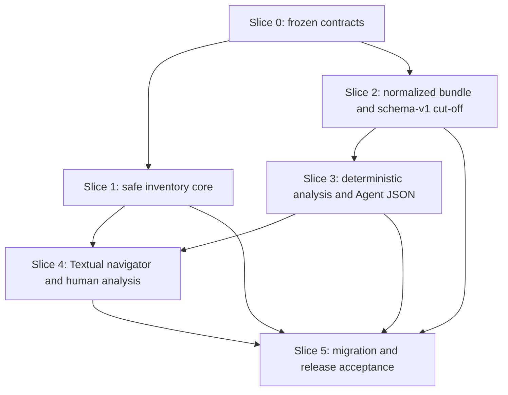

# Delivery Plan and Impact Handshake

Status: Slices 0–5 and every automatic acceptance gate are complete. Only
hands-on terminal readability, navigation feel, alternate-screen restoration,
and usefulness judgment remain.

## Dependency Flow

Inventory and collection share identity/safety vocabulary but do not need one
another at runtime. Textual waits for both the sensitive inventory consumer and
the render-neutral analysis model; this avoids using widgets as data authority.

## Slices

### Slice 0 — Product and Contract Freeze — Complete

- verified the released CLI, provider, archive, tests, durable owners, and
  Behavioral SemVer rule
- inspected privacy-safe current Codex schema/size aggregates on macOS, WSL,
  and Windows
- researched Letta trajectory, the actual ccxray project, and current Textual
- froze command grammar, inventory semantics, bundle/trajectory schema,
  deterministic analysis, cut-off, bounds, UI dependency, and acceptance
- rehearsed module topology and known failures before implementation

Exit: this poly-file packet is internally consistent and Slice 1 has an exact
Impact Handshake.

### Slice 1 — Safe Inventory Core — Complete

- split archive lifecycle from rollout availability internally
- add `--archive-state active|archived|all`, default `all`
- filter exact lifecycle before ordering, row validation, and safe `--limit`
- remove path-based archive inference and keep the schema-v1 safe projection
- do not select CWD/title/first-message or add Textual
- update the canonical list behavior in `src/index.md` first and synchronize its
  README projection in the same slice

Exit: targeted provider/CLI fixtures and macOS/WSL/Windows fresh-wheel smoke
prove a safe, bounded, honest inventory.

### Slice 2 — Normalized Bundle and Schema-v1 Cut-off — Complete

- replace raw capture/index/task copying with streaming normalized records
- publish the exact schema-v2 two-member ZIP and manifest
- own trajectory/manifest validation as executable runtime schemas plus tests
- implement loss, bounds, diagnostics, source/result status, and atomic safety
- reject schema-v1 archives before opening their native/index/task members; add
  no reader, converter, or re-export selector
- update the canonical observability purpose/export contract before its runtime
  realization and synchronize README

Exit: provider-shape, boundary, race, privacy, schema-v1 rejection, and package
fixtures pass; private cases yield only aggregate behavior/coverage results.

### Slice 3 — Deterministic Analysis and Agent JSON — Complete

- validate bundles and build pure indexes/projections
- implement the ten frozen analysis dimensions and metrics
- expose bounded schema-v1 Agent-facing JSON through an executable result schema
- support normalized schema-v2 and direct ephemeral inputs without Textual
- add the non-interactive analysis contract to canonical truth before runtime

Exit: `AN-Q1` through `AN-Q10` pass without provider state, native input,
network, or an external model.

### Slice 4 — Textual Navigator and Human Analysis — Complete

- add Textual `>=8.2.8,<9` as a normal runtime dependency
- materialize the separately bounded sensitive Codex projection
- build the render-neutral project/workspace tree and selection state
- integrate overview/timeline/tool/lane/context/task/terminal/loss analysis
- keep safe list and JSON paths free of Textual startup/import requirements
- add the interactive behavior to canonical truth before runtime

Exit: Pilot tests cover large/missing/duplicate/racy inventories and the human
analysis scenarios; installed-wheel TUI acceptance passes on all three systems.

### Slice 5 — Migration and Release Acceptance — Complete

- audit that every prior slice's `src/index.md` and README projection matches
  implemented truth; fix only diagnosed drift
- add the packaged MAJOR cut-off/recollection guide and release metadata/fragment
- admit no Product/Unit TDD or Deployment surface without implementation proof
- run full tests, monolith/build/package inspection, private aggregates, and
  serialized fresh-wheel cross-platform acceptance

Exit: documented behavior equals tested behavior and the candidate is ready for
a separately authorized commit/release workflow.

## Slice 1 Impact Handshake

- **Address and Object**:
  - `svc_cli/telemetry/agent_threads.py`: provider-neutral archive lifecycle,
    source availability, inventory query/result, and released safe projection.
    Add `ArchiveState`, `SourceAvailability`, `ThreadInventoryQuery`,
    `ThreadInventoryItem`, and `ThreadInventoryListing`; retain
    `ThreadDescriptor.as_dict()` as the schema-v1 projection; replace
    `ThreadProvider.list_metadata` with `list_inventory`
  - `svc_cli/telemetry/providers/codex_rollout.py`: exact `archived` authority,
    recency mapping, safe rollout availability, ordering/filtering, and
    metadata-only SQLite projection. `_metadata_rows` uses new
    `_archive_state` and `_inventory_source_availability` helpers. The current
    `_source_state` behavior remains isolated to `resolve`/current raw export and is
    not reused for inventory. The new availability helper consumes only the
    SQL-bounded ID/path projection and performs lexical component `lstat`,
    reparse/no-follow open, and descriptor-identity checks; it must not call
    the symlink-following export `_resolve_path`
  - `svc_cli/telemetry/service.py`: change `list_agent_threads` to accept and
    validate archive state, call `list_inventory`, and project
    `ThreadInventoryItem` to the unchanged schema-v1 keys
  - `svc_cli/cli.py`: add the `list --archive-state` choice/default and pass it
    through; do not add `analyze` yet
  - `src/index.md` and `README.md`: canonical and projected public list grammar,
    archive filter, lifecycle/availability truth, and compatibility note
  - `tests/test_telemetry_codex_rollout.py` and
    `tests/test_telemetry_cli.py`: lifecycle/availability/filter/order/privacy
    and large-inventory contract cases
  - `tests/test_telemetry_archive.py`: regression assertion that
    `ResolvedThread.source_state` and the schema-v1 raw manifest are unchanged
  - `tools/accept_agent_thread.py` and
    `tests/test_accept_agent_thread.py`: a standard-library black-box
    `--slice inventory` harness that verifies one expected wheel digest plus a
    binary-only external wheelhouse, creates/cleans only its own temp
    venv/fixtures, installs with `--no-index`, and emits bounded JSON
- **State Diff**:
  - overloaded `source_state` and path-name archive guessing **→** separate
    internal `archive_state` and `source_availability`
  - no lifecycle selector **→**
    `--archive-state active|archived|all` with `all` as the released default
  - limit over a mixed inventory **→** exact lifecycle filter first, then safe
    row validation and the 1–100 returned-result limit
  - safe query may inspect only ID/path/time/archive columns **→** it continues
    to exclude CWD/title/first-message/preview/body/tool/reasoning columns
    while SQL bounds ID/path to one code point beyond their 512/4,096 limits
  - schema-v1 `source_state` becomes the frozen compatibility projection;
    missing/unavailable/unknown are honest and an archived-missing row remains
    eligible for the archived filter
  - `ResolvedThread.source_state`, `_source_state` fallback behavior, and the
    current schema-v1 raw export manifest remain unchanged until Slice 2
    replaces that export. This is implementation sequencing, not a target
    compatibility promise
  - canonical public list truth gains the same filter and semantics before the
    runtime change; README remains a synchronized projection
- **Blast Radius**: the provider protocol (`list_metadata → list_inventory`),
  provider fakes/direct tests, list service signature, Codex SQLite
  query/mapping, list CLI help/JSON values/order, tests that assumed a missing
  archive column meant active, safe-list consumers that treated `source_state`
  as a closed enum, canonical list prose, and the new repository acceptance
  harness. Export selection, `ResolvedThread`, `_source_state` released fallback,
  raw archive publication, task-packet copying, dependencies, Textual,
  analysis, non-list durable docs, migration, and release metadata are
  explicitly outside Slice 1.
- **Invariants**: query-only stable state snapshot; no rollout body read; no
  private recognition-column selection; no path-derived lifecycle; unknown
  lifecycle appears only in `all`; unsafe rows consume no result slot and leak
  no value; no unbounded SQLite text enters Python; in-home symlinks/reparse
  points remain unsafe rather than becoming their regular targets; exact thread
  selection/export behavior is unchanged; no
  source/repository/output mutation or product-command network access.
  Explicit acceptance preparation may create/remove its host-local staging
  directory and resolve declared dependency wheels (or use an offline
  wheelhouse); the harness may create/remove only its exact temp directory/venv
  on Sir-authorized hosts.
- **Verification**: `INV-01` through `INV-06`, including oversized ID/path and
  in-home final/parent symlink or Windows reparse fixtures, existing
  export/archive regression tests covering the still-current raw export state,
  harness tests,
  canonical/projection text assertions, `pdm run test`,
  `pdm run build-monolith`, CLI help/smoke, then one SHA-256-bound wheel
  installed into host-local temporary venvs on WSL and Windows and exercised
  serially through the exact base/child interpreter contract in
  `acceptance-environments.md` against synthetic state fixtures with cleanup
  asserted.

Slice 1 automatic evidence is complete: the full local suite, build,
monolith/package checks, and the same SHA-256-bound wheel passed the inventory
acceptance harness on macOS, WSL, and Windows. The remaining ancestor-directory
TOCTOU hardening is not representable portably with the Python standard-library
path API and is outside the frozen Slice 1 boundary.

## Slice 2 Impact Handshake

- **Address and Object**:
  - `src/index.md` and `README.md`: replace audit/raw-archive language with the
    normalized collect contract, exact two-member artifact, declared loss,
    partial-result semantics, and schema-v1 cut-off
  - `svc_cli/telemetry/agent_threads.py`: split inventory and trajectory
    capabilities; replace `ResolvedThread`, raw `SourceArtifact`, capture
    evidence, and `stream_capture` authority with a descriptor-bound normalized
    source selection/result contract
  - `svc_cli/telemetry/trajectory.py`: own executable schema-v2 record and
    manifest validation, bounds, canonical JSONL, deterministic identity,
    diagnostics/loss accounting, safe bundle reading, and private atomic
    two-member ZIP publication
  - `svc_cli/telemetry/providers/codex_rollout.py`: keep SQLite inventory/source
    selection and descriptor safety; route selected rollout records into the
    Codex normalizer
  - `svc_cli/telemetry/providers/codex_trajectory.py`: own the bounded
    provider-native field-path translation into the seven exact normalized
    record types, opaque reference synthesis, tool linkage, capability
    evidence, and source-race result
  - `svc_cli/telemetry/archive.py`: narrow the old archive entry point to the
    new normalized bundle operation, with no raw-copy/index/task-discovery path
  - `svc_cli/telemetry/service.py` and `svc_cli/cli.py`: project normalized
    export results and stable errors while retaining explicit selection,
    containment, no-overwrite, and sensitive acknowledgement
  - provider, archive, service, CLI, package, and black-box acceptance tests:
    replace schema-v1 raw fixtures with exact schema-v2, loss/bound/race/privacy
    fixtures and extend the fresh-wheel harness with a `bundle` slice
- **State Diff**:
  - provider-native byte archive plus structural index and copied task packet
    **→** normalized trajectory with exactly `manifest.json` and
    `trajectory.jsonl`
  - hard failure for any source mutation **→** descriptor-bound initial-prefix
    collection that reports `stable|grew|changed|displaced` and publishes a
    valid `ready|partial` result when evidence remains trustworthy
  - implicit preservation of envelope/UI/large tool data **→** structural
    dropping/truncation with exact loss counters and bounded non-leaking
    diagnostics
  - schema-v1 archive implementation reuse **→** bounded root-manifest
    recognition followed immediately by
    `unsupported-agent-thread-bundle-schema`, before any native/index/task
    member access
  - exporter/runtime-version-dependent identity **→** canonical record and
    manifest metadata hashes whose identity excludes timestamps and exporter
    version
- **Blast Radius**: the trajectory side of the provider protocol, Codex source
  resolution, export JSON/plain output, archive module and all old raw archive
  tests, task-packet attachment code that becomes unreferenced, package
  contents, canonical public export truth, and the acceptance harness.
  Safe `list`, sensitive navigator inventory, analysis projections, Textual,
  migration metadata, provider dynamic discovery, network use, a raw/debug
  mode, and a second production provider remain outside Slice 2.
- **Invariants**: explicit local selector and `--include-sensitive`; output
  containment/no overwrite/private mode/atomic replace; no provider/repository
  mutation or network; no source symlink/reparse following; source 256 MiB,
  native line 4 MiB, depth 64, 50,000 normalized records, trajectory 32 MiB,
  manifest 1 MiB, and bundle 64 MiB bounds; content truncated before long-lived
  normalized objects; diagnostics contain codes/counts/positions but no source
  values; exact schemas reject extra keys, duplicate keys, non-finite numbers,
  unsafe ZIP names, duplicate members, bad compression, or member-size drift;
  no artifact on unsafe/unopenable/incompatible input; no legacy reader,
  converter, re-export selector, native member, old index, task attachment, or
  derived analysis member.
- **Verification**: frozen trajectory/manifest vectors, one synthetic
  provider-neutral normalizer fixture, representative Codex structural shapes,
  reordered/missing/unknown events, unresolved tool results, oversized/deep
  input, every loss/diagnostic cap, append/change/displacement races, deterministic
  byte/identity tests, archive permissions/containment/no-overwrite/cleanup,
  hostile ZIP fixtures, proof that a schema-v1 manifest is the only opened
  member, absence of private values in errors, full local suite/build/package,
  privacy-safe aggregate behavior over eight existing private cases, and one
  digest-bound fresh wheel on macOS/WSL/Windows.

## Slice 3 Impact Handshake

- **Address and Object**:
  - `src/index.md` and `README.md`: add deterministic analysis purpose, direct
    ephemeral flow, explicit bundle flow, non-interactive JSON contract, and
    the ten analysis dimensions
  - `svc_cli/telemetry/analysis.py`: own executable schema-v1 Agent JSON,
    validated normalized indexes, deterministic metric/coverage/loss
    projections, and bounded overview/timeline/tool/lane/context/task/terminal
    models without provider or UI authority
  - `svc_cli/telemetry/service.py`: load a validated bundle or normalize an
    explicit provider source ephemerally, then return the exact analysis result
  - `svc_cli/cli.py`: add the explicit `analyze` dispatch and grammar;
    `--json` requires `--input|--thread-id|--source`, bundle input rejects
    provider-home/filter flags, and non-JSON paths defer to Slice 4's TUI
  - analysis, CLI, hostile-input, package, and black-box acceptance tests:
    prove `AN-Q1` through `AN-Q10` and extend the installed-wheel harness with
    an `analysis` slice
- **State Diff**:
  - collected data with no first-party interpretation **→** exact,
    traceable deterministic analysis for ten frozen questions
  - bundle-only use **→** provider-independent schema-v2 analysis plus direct
    thread/source analysis through the identical ephemeral normalizer
  - ad-hoc Python dictionaries **→** strict bounded schema-v1 Agent JSON whose
    findings cite normalized sequence/opaque references
  - Textual-shaped data **→** render-neutral projections consumed equally by
    JSON and the later human surface
- **Blast Radius**: new CLI verb/validation/error codes, service orchestration,
  bundle reader consumers, provider-direct ephemeral flow, JSON/plain dispatch,
  public help/docs, and analysis fixtures. Safe `list`, export artifact bytes,
  provider-native schemas outside their normalizer, Textual widget behavior,
  cross-thread synthesis, model/network calls, caches/databases, and release
  metadata remain outside Slice 3.
- **Invariants**: normalized records are sole analysis authority; bundle input
  needs no provider home/native source; direct input publishes nothing; pure
  deterministic code with no model/network/time-dependent conclusions; exact
  bounded result schema/no extra keys/non-finite values; every finding is
  traceable; missing capabilities, truncation, unresolved links, and partial
  collection lower coverage rather than creating false certainty; JSON path
  does not import or instantiate Textual; schema-v1 cut-off remains before old
  member access.
- **Verification**: executable golden and adversarial schemas; deterministic
  repeated-run equality; all ten `AN-Q` fixtures including overlap,
  call/result ordering, task evidence, terminal states, context pressure,
  concurrency, partial/loss/unknown capability cases; direct-vs-bundle
  equivalence; provider-home deletion after export; CLI flag/TTY matrix; no
  Textual import on JSON; resource caps; full suite/build/package; aggregate
  private-case dimension coverage without content/identifier output; identical
  installed-wheel analysis fixtures on macOS/WSL/Windows.

## Slice 4 Impact Handshake

- **Address and Object**:
  - `src/index.md` and `README.md`: add the explicitly entered sensitive
    navigator, workspace provenance tree, title/first-message recognition,
    archive filter, and human analysis surfaces
  - `pyproject.toml` and `pdm.lock`: add the normal runtime dependency
    `textual>=8.2.8,<9`
  - `svc_cli/telemetry/agent_threads.py` and
    `providers/codex_rollout.py`: add a separate sensitive inventory query and
    bounded item/listing contract; SQLite truncates workspace/title/first
    message before Python materialization and keeps domain identity as
    `(provider_id, thread_id)`
  - `svc_cli/telemetry/navigation.py`: own lexical native-path grouping,
    project/workspace tree nodes, stable selection/filter/loading generations,
    duplicate/missing recognition fallbacks, and render-neutral detail models
  - `svc_cli/telemetry/tui.py`: own the Textual application, lazy tree
    expansion, keyboard bindings, archive switching, status/detail rendering,
    cancellation/generation checks, and the overview/timeline/tool/lane/context/
    task/terminal/loss analysis views
  - `service.py` and `cli.py`: enter Textual only for an explicitly requested
    TTY analysis flow; safe list/JSON remain on pure paths
  - model/Pilot/TTY/package/black-box acceptance tests: cover large, missing,
    duplicate, racy, archived, partial, and narrow-terminal behavior and extend
    the fresh-wheel harness with a `tui` slice
- **State Diff**:
  - full-screen flat safe list **→** explicit sensitive lazy workspace tree
    whose recognition detail shows bounded title and first user message
  - widgets coupled to provider reads **→** render-neutral bounded inventory
    and analysis models with generation-protected asynchronous loading
  - one analysis payload **→** navigable human views over the same deterministic
    analysis authority
- **Blast Radius**: dependency lock/wheel metadata, Codex sensitive SQL
  projection, interactive CLI/TTY behavior, analysis presentation, installed
  package size/import graph, and headless UI tests. Safe list output, Agent
  JSON schema, bundle schema/identity, non-interactive startup, source writes,
  remote/browser/server UI, and external account/proxy integrations remain
  outside Slice 4.
- **Invariants**: explicit `analyze` is the sensitivity acknowledgement;
  sensitive values never enter safe list, logs, cache, exception text, widget
  IDs, or diagnostics; SQL bounds every private field before Python; maximum
  5,000 sensitive rows plus explicit truncation; CWD is lexical provenance and
  is never resolved/walked; navigator defaults active; unavailable sources
  remain recognizable but cannot be analyzed; lazy/cancelled loads cannot
  overwrite newer selection; terminal restoration on success/error/cancel;
  no Textual import/startup for list/export/analyze-json.
- **Verification**: pure path/tree/filter/selection tests for POSIX, drive,
  UNC, relative, missing, duplicate, invalid and oversized values; SQL privacy
  and filter-before-limit fixtures; Textual Pilot keyboard/filter/expansion/
  selection/cancel/error/resize tests; missing/racy source and partial analysis
  views; import isolation; installed-wheel help/list/JSON/TUI startup on
  macOS/WSL/Windows with fixed dimensions and captured terminal restoration;
  final visual ergonomics remains human acceptance.

## Slice 5 Impact Handshake

- **Address and Object**:
  - `src/index.md` and `README.md`: audit and reconcile only diagnosed drift
    between canonical/public truth and implemented Slice 1–4 behavior
  - `src/migrations/11.0.0.md`: packaged MAJOR guide that states schema-v1 is
    cut off, explains recollection from an available provider-local source,
    records the intentionally lossy schema-v2 shape, and gives automation/TUI
    command migration
  - `src/manifest.json`, `pyproject.toml`, and one `changes/*.major.md`
    fragment: prepare the ordinary `10.0.2 → 11.0.0` Behavioral SemVer
    candidate with guide-backed migration policy; remove reliance on the
    consumed one-time exception
  - release/framework/update/CLI/package tests and acceptance evidence: prove
    version, packaged guide, fragment, corpus projection, and candidate wheel
- **State Diff**:
  - 10.0.1 raw-export release truth and consumed version exception **→**
    unreleased 11.0.0 candidate metadata with an ordinary MAJOR guide
  - task-local cut-off knowledge **→** packaged consumer-facing recollection
    instructions
  - per-slice automatic evidence **→** one final candidate digest exercised
    through all acceptance slices
- **Blast Radius**: release planning/version assertions, package metadata,
  corpus catalog/monolith, update/status tests, changelog fragment, README and
  canonical version references. It does not authorize a commit, tag, push,
  changelog consumption, release publication, consumer-repository migration,
  or deletion of this volatile task packet.
- **Invariants**: Behavioral SemVer reports exactly one MAJOR bump; guide path
  is packaged and mechanically discoverable; no schema-v1 compatibility or
  transition promise; no unsupported Product/Unit TDD or Deployment truth is
  added; task packet stays volatile until the task is actually closed; private
  evidence stays outside Git; one built wheel digest is used for all
  cross-platform acceptance; host-local fixtures are serialized and cleaned.
- **Verification**: release planner/check-only path, migration/package lookup,
  version/help/update/status assertions, `pdm run test`,
  `pdm run build-monolith`, `pdm build`, wheel content/metadata inspection,
  `git diff --check`, privacy scan, final reviewer pass, private aggregate
  report, then the same digest-bound wheel through inventory/bundle/analysis/TUI
  automatic acceptance on macOS, WSL, and Windows. Only hands-on terminal
  readability, navigation feel, and usefulness judgment may remain.

Sir's 2026-07-28 instructions authorize these exact Slice 2–5 handshakes as one
continuous implementation run. Implementation and verification do not
authorize a commit, tag, push, release, or task-packet deletion.

## Automatic Acceptance Evidence — Complete

- `pdm run test`: 224/224 pytest items passed after the final privacy and
  diagnostic-bound regression tests; Ruff, mypy, Import Linter, and zizmor
  also passed.
- The eight private cases produced 50,156 source events and 28,545 normalized
  records; all eight sources were stable, all eight normalizations were ready,
  and `unsupported_record` plus every partial source reason were zero. Exact
  aggregate loss, tool, dimension, duration, and memory evidence is in
  [`verification.md`](verification.md).
- Release planning reports `10.0.2 → 11.0.0` with `major` impact. Monolith,
  sdist, and wheel builds pass; the wheel has a valid complete `RECORD`, exact
  declared dependencies including `textual>=8.2.8,<9`, the cataloged
  `migrations/11.0.0.md`, and no task packet, test fixture, native JSONL, or
  removed `task_packets` module.
- The final reviewed wheel SHA-256 is
  `f57fbe6a212a37ae49a8736f648667f0e42b6e56375c346546cebeae828af507`.
  Its installed `inventory`, `bundle`, `analysis`, and `ui` cases pass on
  macOS/Python 3.12.10, WSL/Python 3.13.5, and Windows/Python 3.14.0. Every
  harness reports internal cleanup, caller staging is absent on all hosts, and
  the shared stale worktree was untouched.
- Final read-only review reports no blocking or non-blocking finding after the
  explicit `analyze --source` private-error redaction regression test.

The sole remaining gate is human interaction in real macOS and Windows
terminals. Headless Pilot proves behavior and terminal restoration mechanics;
it cannot decide visual density, recognition usefulness, keyboard feel, or
whether the analysis helps a maintainer improve SVC.
