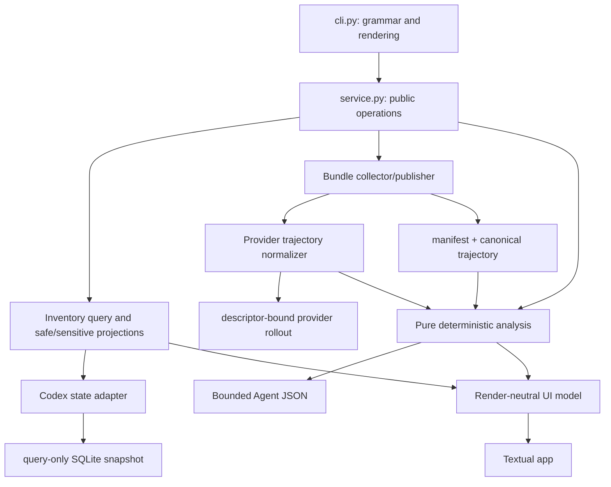
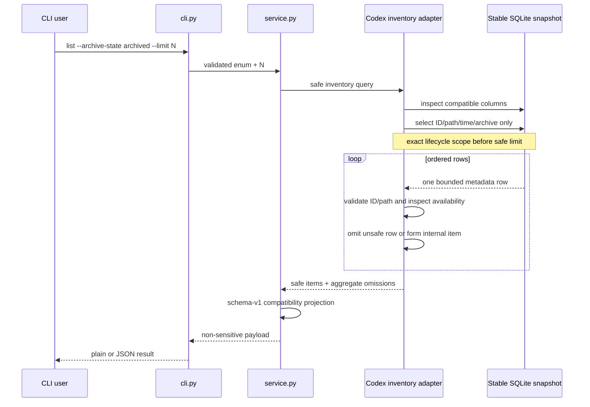

# Implementation Rehearsal

Status: Slice 0 pre-mutation rehearsal. It records recoverable design reasoning
and failure checks, not implementation authority. Approved code and tests will
own the realized structure.

## Evidence Used

The rehearsal used:

- the current CLI/service/provider/archive call paths and telemetry tests
- the current Codex `state_5.sqlite` column shape on macOS, WSL, and Windows
- privacy-safe inventory/rollout size and record-class aggregates
- the frozen inventory, trajectory, analysis, and compatibility contracts
- current Textual packaging, Tree, and headless testing behavior
- the cross-platform preflight in
  [`acceptance-environments.md`](acceptance-environments.md)

No private thread title, prompt, path, tool value, or transcript fragment was
written into this packet.

## Current Fractures

1. `ThreadDescriptor.source_state` currently conflates lifecycle and source
   availability. The Codex adapter can infer archived state from path segments,
   so it can turn missing authority into a confident but false fact.
   The same `_source_state` helper is also used by `resolve` and serialized by
   schema-v1 export, so Slice 1 must not “fix” it globally.
2. The provider interface couples metadata listing to the current raw-capture
   protocol. That implementation shape is the wrong seam for a normalized
   trajectory and an independent analysis reader.
3. `list` applies one limit to a mixed inventory. Adding a post-limit archive
   filter would make archived-only output depend on how many active rows happen
   to precede it.
4. The current export path assumes byte copying, a structural index, task-file
   discovery/copy, and a final source hash check. Reusing it and merely deleting
   members afterward would preserve the wrong authority and resource model.
5. The CLI dispatcher treats every non-`list` subcommand as `export`. `analyze`
   therefore needs an explicit branch rather than another fall-through.
6. The current Codex rollout sampled for preflight can approach 100 MiB and
   41,000 lines. An analysis implementation that parses the full file into
   Python objects before truncation would violate the intended bound even on a
   valid real thread.

## Target Topology

Inventory, normalization, analysis, and rendering are separate deep modules.
The static provider registry may return provider-owned inventory and
normalization capabilities, but Textual widgets never receive provider or
filesystem authority.

The existing all-in-one `ThreadProvider` protocol should not accumulate UI,
analysis, and raw-capture methods. Slice 1 changes only its inventory side.
Slice 2 can split inventory and trajectory capabilities while removing the
obsolete raw-stream contract in the same MAJOR change.

## Slice 1 Sequence

The safe SQL projection must be constructed from discovered column names and
must never use `SELECT *`. Exact `archived` values are integer `0` and `1`;
absent, null, string, or other values normalize to `unknown`. `active` and
`archived` filters accept only their exact value, while `all` includes unknown.

The cursor may scan past unsafe rows so those rows do not spend a safe result
slot. It does not accumulate all selected rows. The existing stable
descriptor-bound state snapshot remains the read authority, including its
Windows ctime exception.

## Rehearsed Failure Cases

| Scenario | Incorrect implementation | Frozen response |
| --- | --- | --- |
| 100 newer active rows precede one archived row with `--limit 20` | Limit then filter returns empty | Filter lifecycle first; archived row remains eligible |
| Archived row has a missing rollout | Treat missing as lifecycle and exclude it | Lifecycle remains archived; safe projection says `missing` |
| `archived` column is absent or malformed | Infer from `sessions/` or `archived_sessions/` | Lifecycle is `unknown`, visible only under `all` |
| Unsafe path rows lead the ordering | Spend the limit or leak their IDs/paths | Omit, continue scanning, emit aggregate warning only |
| Title/message contains multi-megabyte text | Read then slice in widgets | Safe query never selects it; later sensitive query bounds it in SQLite before materialization |
| State DB changes during the query | Read the live DB and mix snapshots | Reuse the current bounded snapshot/retry/failure mechanism |
| Windows read updates ctime | Reject every read-only snapshot | Preserve device/inode/size/mtime authority and ignore read-noisy ctime |
| Rollout grows during normalized collection | Chase append forever or call it complete | Read initial descriptor-bound prefix and publish `grew/partial` |
| Tool result precedes its call | Buffer the entire trajectory | Emit `unresolved`; deterministic analysis may link the same canonical ID |
| Diagnostic limit is exceeded | Drop evidence silently or retain values | Preserve per-code suppressed counts without content |
| A schema-v1 archive is supplied to `analyze --input` | Open native/index/task members before deciding compatibility | Identify a bounded root manifest and fail `unsupported-agent-thread-bundle-schema` before opening any other member |
| `analyze --json` imports Textual | Installed automation now depends on a TTY | JSON path uses pure analysis modules and never starts/imports UI code |
| WSL and Windows tests use `F:` concurrently | Shared fixtures race and lie | Use host-local temp directories and serialize the two environments |

## Likely Realization by Slice

These are routing predictions, not permission to edit:

| Slice | Existing addresses | New address only if it remains a deep owned module |
| --- | --- | --- |
| 1 | `src/index.md`, `README.md`, `agent_threads.py`, `providers/codex_rollout.py`, `service.py`, `cli.py`, existing telemetry tests, repository acceptance harness/test | None required |
| 2 | canonical/README export truth; replace/narrow `archive.py`; remove task-copy use from normal export; Codex rollout mapping | A provider-neutral trajectory/schema module and exact bundle validator |
| 3 | canonical/README analysis truth, `service.py`, `cli.py`, contract tests | One pure analysis module; split projections only if size/independent consumers justify it |
| 4 | canonical/README interactive truth, `service.py`, `cli.py`, package metadata/lock | A render-neutral tree/model module and one Textual app module |
| 5 | `src/manifest.json`, release fragment/tests, final truth audit | One required packaged MAJOR migration guide |

Slice 1 temporarily isolates the released `_source_state` behavior only for the
still-released raw export. After Slice 2, do not preserve obsolete schema-v1
abstractions behind compatibility wrappers or input adapters: schema-v1
archives are rejected at the analysis boundary. Do not create a provider plugin
system, generic event bus, database, cache, local server, or ccxray-style proxy
for v1.

Provider-native Codex field-path translation is adapter/code-test authority,
not a public trajectory extension point. Slice 2 must first freeze its exact
synthetic structural fixtures and then map them into the already frozen record
schema; it may not add passthrough keys when an observed native event does not
fit.

## Resource and Concurrency Model

- SQLite inventory is cursor-streamed. Safe list retains at most 100
  descriptors; the sensitive inventory retains at most 5,000 bounded items and
  an explicit truncation state.
- Provider-local source records are streamed through one normalizer. Content is
  truncated before normalized objects become long-lived.
- The collector writes canonical JSONL and its hash incrementally to a private
  temporary file, then writes the two-member ZIP and atomically publishes it.
- Tool-link state is bounded by the 50,000-record cap. Analysis indexes the
  bounded normalized trajectory, never the unbounded native source.
- Textual loading uses generation tokens/cancellation so a late provider result
  cannot overwrite a newer filter. Domain identity is always
  `(provider_id, thread_id)`, never a widget node ID.

## Review Triggers

Return to Slice 0 instead of improvising if implementation evidence shows:

- an authoritative supported Codex lifecycle source other than exact
  `archived=0|1` is required
- a frozen content bound prevents all ten promised analysis dimensions on the
  private corpus
- a schema-v1 archive cannot be identified and rejected from a bounded root
  manifest before any other member is opened
- Textual cannot pass headless installed-wheel tests on supported Python/hosts
- keeping list schema v1 would force private data exposure or a false lifecycle
  claim
- the schema-v2 bundle needs a third authoritative member

Other implementation defects are solved within their authorized slice and do
not broaden its mutation boundary.
