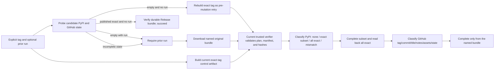

# Target Release Contract

## Definitions

- **Post-cutover main commit**: a commit admitted to `main` after the new
  qualification workflow and repository rules are active.
- **Qualified commit**: a post-cutover main commit whose required checks prove
  source integrity, policy validity, projected-version buildability, package
  correctness, and installed-wheel smoke behavior.
- **Eligible tag**: one unused strict SemVer tag `vX.Y.Z` that points to a
  qualified commit reachable from `main`, is newer than the previous release,
  and is the exact next single bump required by the impact declared since the
  previous release tag. Lightweight and annotated tags are both eligible;
  the exact remote ref must peel to one commit, while annotation metadata and
  signatures carry no release authority.
- **Release completion**: PyPI exposes every expected distribution with exact
  bundle hashes and GitHub exposes an immutable non-draft release with the
  exact title, notes, and manifest-bound assets.
- **Recovery**: continuation of one tag's original bundle after an interrupted
  external mutation while that named bundle still exists and verifies;
  recovery is not a rebuild or a new release.

## State Boundary

This document defines the target state, not current production behavior.
Before Slice 4, `release-pr.yml`, `release-tag.yml`, prepared-source validation,
and the existing Publish workflow remain authoritative. `main`/tag rules, the
publisher environment's tag-ref restriction, and release immutability become
active and verified in Slice 3, before the protected cutover PR merges. Those
rules still require the old checks until the protected cutover PR changes their
implementation without changing their names. The target qualification meaning
and normal topology become active only after the atomic Slice 4 workflow cut.
Neither target claim may be reported as complete earlier.

## Formal Invariants

For every post-cutover main commit `C`:

1. `qualified(C) = true` is enforced before or immediately as `C` enters
   `main`; direct unqualified admission is impossible under repository rules.
2. There exists an eligible version tag `T` such that `publish(T, C)` requires
   no source commit, release branch, release PR, or metadata-preparation merge.
3. Pushing `T` is the release approval and starts the complete normal Publish
   workflow automatically. There is no second normal-path human gate.
4. The version inside wheel and sdist metadata, packaged catalog, release
   bundle, PyPI filenames, and GitHub Release is derived from `T` and agrees
   exactly.
5. A fragment added in the previous-release-tag → candidate-tag history
   determines the exact acceptable bump and contributes release notes.
   Post-cutover fragment paths are append-only and cannot be modified, renamed,
   deleted, or reused.
6. Required PR qualification proves that an admitted change either supplied a
   fragment or explicitly used `release:none`. A tag window containing no new
   fragments is therefore a valid internal-only window and accepts the next
   patch version; `release:none` contributes no release reason and does not opt
   the commit out of release qualification.
7. The exact remote tag ref must peel to one commit on `main`; a non-commit,
   branch-only, deleted, moved, reused, or regressive tag fails before build or
   external mutation. Lightweight and annotated forms have identical release
   meaning.
8. The immediate prior strict tag must be the verified completed legacy
   baseline or an exact-complete target-model release. All normal/recovery
   runs share one repository-wide non-canceling release concurrency group.
9. One build producer owns the final wheel and sdist. Every downstream step
   verifies and consumes the same named bundle; once any PyPI file or GitHub
   draft exists, that release attempt may never rebuild.
10. An incomplete recovery first binds the named prior run to the Publish
   workflow, an allowed trigger, the exact planned commit, a terminal state,
   and its one live artifact. The current run's exact-tag control verifier
   compares the prior bundle with a fresh plan before the bundle is used; only
   the normal-versus-recovery qualification proof may differ.
11. An exact subset of expected PyPI files or draft assets may be completed only
   from that verified original bundle. Unexpected names, hash mismatches,
   expired or deleted original bytes, or ambiguous API state fail closed. PyPI
   must be read back as all-exact after upload before GitHub finalization.
12. A published release is never silently replaced, repaired from a rebuild,
   or inferred from newer `main`; repository release immutability must lock
   its tag and assets.

## Authority Map

| Truth | Authority | Projections / Consumers |
| --- | --- | --- |
| Release source | tagged Git commit reachable from protected `main` | checkout, source archive |
| Release version | strict `vX.Y.Z` tag | dynamic package metadata, catalog, filenames, bundle, release title |
| Commit qualification | required GitHub checks from the trusted Actions app | merge UI, tag precondition |
| Exact Behavioral SemVer bump | append-only fragment additions since the previous release tag | eligible-tag validation, notes grouping |
| Migration obligation | deterministic migration note paired to each MAJOR fragment | packaged corpus, bundle metadata, release notes |
| Artifact identity | checked release-bundle manifest and SHA-256 map | named Actions artifact, PyPI plan, GitHub asset verification, recovery |
| Recovery verifier | fresh exact-tag plan and `tools/release.py` copied into the current run's control artifact | bundle, PyPI, and GitHub-finalization jobs |
| Installation availability | exact PyPI file hashes | finalizer prerequisite |
| Irreversible authorization | authorized protected tag | complete Publish workflow |
| Release completion | immutable published GitHub Release matching the bundle | human release history and release attestation |
| Historical CHANGELOG | frozen history through v11.0.0 | repository readers; never release eligibility |
| Historical cutover baseline | reviewed `v11.0.0` planner constant plus existing tag | first append-only range and one-time legacy completion exception |

`pyproject.toml` declares the mechanism for a dynamic version; it does not
declare a future version. `src/manifest.json` leaves the source model at the
hard cut. `CHANGELOG.md` owns no post-v11 release state.

## Normal Topology

```mermaid
flowchart LR
  PR["Feature or internal PR"] --> Q["Shared release qualification"]
  Q --> M["Protected main"]
  M --> T["Authorized push of vX.Y.Z"]
  T --> L["Acquire repository-wide release writer"]
  L --> V["Validate tag, predecessor completion, main reachability, impact, and qualification"]
  V --> B["Project version and notes; build once"]
  B --> S["Smoke-test exact wheel and seal bundle"]
  S --> A["Retain named bundle for 90 days"]
  A --> P["Verify or complete exact PyPI files"]
  P --> X["Read back all PyPI hashes"]
  X --> G["Create Release with all manifest assets and --verify-tag"]
  G --> I["Verify exact immutable Release"]
```

No normal-path edge may pass through `release/svc`, an automatically created
tag, or `workflow_dispatch`.

## Recovery Topology

The recovery input is a command to continue one known release. It never
selects "latest" or consults mutable `main`. Before any build command, it probes
candidate PyPI and GitHub state. `workflow_dispatch` may omit a prior-run ID
only when both surfaces are confirmed empty, in which case an exact-tag
pre-mutation retry may rebuild, or when the published immutable Release and
PyPI set are exact-complete, in which case its durable manifest-bound assets
are verified and the run exits successfully. Any incomplete candidate state
requires the prior-run ID and only that bundle may be used. Recovery records
the artifact ID and expiry and also verifies that the artifact still exists;
expiry or early deletion blocks an incomplete release rather than rebuilding.
The prior run is not trusted merely because it exposes the right artifact name:
its raw Actions record must be a completed Publish run with an allowed trigger
and the planned head commit. The current control artifact is created from the
exact tag checkout and verifies the recovered bundle before any artifact
provided program could run. Its persisted plan must equal the fresh plan in
every release-semantic field; only the durable qualification proof is allowed
to change between the normal and recovery attempts.

## Resolved Slice 0 Decisions

The signed-off evidence and projection matrix are in
[`slice-0-decisions.md`](slice-0-decisions.md).

### 1. Build-time version projection

Use PDM-Backend's native dynamic SCM version. Pin the backend, restrict matching
to strict release tags, use the release planner's derived environment override
for rehearsals and Publish, and project the backend-resolved metadata version
into the catalog under the backend build directory. Do not use `write_to` or
rewrite the source checkout.

Remove `src/manifest.json`; it may not survive as a stale replica.

### 2. Fragment and CHANGELOG projection

Keep Markdown fragments and make them append-only after cutover. Select only
paths added between the previous and candidate tags. Each MAJOR fragment owns
one same-slug packaged migration note. A window with no added fragment is
patch. Freeze CHANGELOG through v11.0.0 and use deterministic fragment-derived
GitHub Release notes as future human history. No cleanup or bookkeeping PR is
permitted; Towncrier and the empty release dependency group are removed.

### 3. Build proof

Build once after the tag, verify the exact wheel, seal one bundle, use an
Actions artifact with explicit `retention-days: 90` for transport and bounded
recovery, and record its API identity and actual `expires_at`. Complete or
verify the exact PyPI file set, then perform bounded hash readback. Only an
all-exact result may create the immutable GitHub Release with every
manifest-enumerated asset using `--verify-tag`, exact title, and exact notes.
An interrupted CLI-internal draft may be resumed from the same bundle; there
is no persistent normal pre-PyPI draft.

### 4. Release approval and serialization

The protected tag authorizes and starts the whole workflow. Both lightweight
and annotated tags are accepted after their exact remote refs peel to one
commit; tag annotations and signatures are not separate authorities. All
normal and recovery executions share one `svc-publish` concurrency group with
`cancel-in-progress: false`, and a completed predecessor is a precondition to
build. `workflow_dispatch` remains retry/recovery-only and never selects or
creates a new tag.

## Repository Rules

The target external state must:

- require a PR for `main`;
- require the stable qualification checks from GitHub Actions;
- reject force-push and branch deletion;
- make bypass behavior explicit and as narrow as the repository permits;
- prevent update and deletion of matching `v*` tags;
- allow an authorized maintainer to create a new `v*` tag;
- retain the `release` environment as the Trusted Publishing identity, with no
  required reviewer and only the custom deployment policy
  `type: tag, name: v*`;
- enable repository release immutability before the first target-model release.
