# Release Workflow Benchmark

Status: completed on 2026-07-29 from official project repositories, current
workflow definitions, real release runs, release APIs, PyPI metadata, and
platform documentation. Repository settings that are not publicly observable
are reported as unknown rather than inferred.

## Question and Comparison Axes

The proposed SVC sequence was treated as a hypothesis, not a requirement to
justify after the fact. The comparison separates five concerns that are often
collapsed into one "release process":

1. what makes a source commit release-qualified;
2. what event starts a release and where human authorization occurs;
3. which job owns the bytes that are eventually published;
4. in what order PyPI and GitHub Release become irreversible;
5. how an interrupted release resumes without silently changing bytes.

The sample favors Python CLI and packaging tools with current, inspectable
workflows. uv and Ruff are included as modern high-volume examples, but their
native build matrices and multi-registry fan-out are not treated as a suitable
size model for SVC.

## Observed Projects

| Project | Source preparation and trigger | Artifact path | External publication order | Recovery observation |
| --- | --- | --- | --- | --- |
| PyPA packaging guide | tagged push; manual approval is required on the PyPI environment | build once, upload Actions artifact, isolated publisher downloads it | PyPI only; no GitHub Release ordering prescribed | artifacts are described as temporary transport |
| PDM 2.28.0 | release script updates history, commits and tags; tag push starts workflow | one wheel/sdist build; same local dist goes to PyPI, wheel crosses jobs | PyPI → published GitHub Release → native assets | 15-day artifacts; no exact-state resume; later asset upload uses `--clobber` |
| Poetry 2.4.1 | static version/history release commit; publishing a GitHub Release starts workflow | one wheel/sdist build and shared artifact | GitHub Release is already published; GitHub asset and PyPI jobs then run in parallel | no explicit idempotent recovery |
| Hatch 1.17.1 | SCM version; local script pushes tag and opens a prefilled draft | wheel/sdist artifact goes to PyPI; later jobs build platform packages | draft exists first; PyPI → upload all assets to draft; publication is external/manual | real run reached attempt 4 with PyPI success and draft-asset failure; release was later recovered manually |
| pipx 1.16.3 | dispatch mutates changelog and pushes main/tag directly; tag starts workflow | one wheel/sdist build and shared artifact | PyPI → GitHub Release → separately built zipapp | no exact-state resume; duplicate publication is not idempotent |
| tox 4.58.0 | dispatch force-pushes a release commit/tag and creates GitHub Release | one publishable wheel/sdist artifact | GitHub Release creation races the tag workflow; PyPI follows build/test | cleanup can move/delete release state; no safe same-tag resume |
| Towncrier 25.8.0 | manual release branch/PR and GitHub UI release | publishable dist artifact is shared with test and PyPI jobs | GitHub Release/tag → CI/test → PyPI | documented RC recovery creates a new tag; no same-tag resume |
| uv 0.12.0 | version/changelog PR, then explicit release dispatch and a second-person release gate | large matrix aggregated through Actions artifacts and manifests | PyPI → `gh release create` with all assets → downstream publication | failed jobs are rerun; non-idempotent registries are intentionally kept off the completion dependency |
| Ruff 0.16.0 | version/changelog PR, then explicit release dispatch and release gate | large matrix aggregated through Actions artifacts and manifests | PyPI/Wasm → `gh release create` with all assets → downstream publication | failed jobs are rerun; crates publication is intentionally non-blocking |
| Textual 8.2.8 | static version/changelog PR; no repository release workflow | no inspectable automated release artifact path | observed PyPI upload preceded GitHub Release by about two minutes | process and recovery depend on maintainer operations outside the repository |

Stable evidence:

- [PyPA tagged-release workflow guide](https://packaging.python.org/en/latest/guides/publishing-package-distribution-releases-using-github-actions-ci-cd-workflows/)
- [PyPI Trusted Publisher security model](https://docs.pypi.org/trusted-publishers/security-model/)
- [GitHub environment approval behavior](https://docs.github.com/en/actions/how-tos/deploy/configure-and-manage-deployments/manage-environments)
- [PDM 2.28.0 release workflow](https://github.com/pdm-project/pdm/blob/ef0545684d5b9bb391cb1a343e9c5f51fc99caaf/.github/workflows/release.yml)
- [Poetry 2.4.1 release workflow](https://github.com/python-poetry/poetry/blob/811a12dae0fe81f199e3f1b88b8b8be9eed543c2/.github/workflows/release.yaml)
- [Hatch 1.17.1 workflow](https://github.com/pypa/hatch/blob/5dae0595d1dfbaa5268aeeee7d81fde604d097d8/.github/workflows/build-hatch.yml)
  and [release helper](https://github.com/pypa/hatch/blob/5dae0595d1dfbaa5268aeeee7d81fde604d097d8/scripts/release_github.py)
- [pipx 1.16.3 release workflow](https://github.com/pypa/pipx/blob/1.16.3/.github/workflows/release.yml)
- [tox 4.58.0 release workflow](https://github.com/tox-dev/tox/blob/4.58.0/.github/workflows/release.yaml)
- [Towncrier release process](https://github.com/twisted/towncrier/blob/25.8.0/RELEASE.rst)
- [uv current release workflow](https://github.com/astral-sh/uv/blob/aef69cf5c3a5640ed9ad08c2a656034e7f96b559/.github/workflows/release.yml)
- [Ruff current release workflow](https://github.com/astral-sh/ruff/blob/d03c6a0b0b4b917f3aebed1636d1ec6ffe910855/.github/workflows/release.yml)
- [Textual v8.2.8 release source](https://github.com/Textualize/textual/tree/v8.2.8)

## What Is Actually Common

The projects do not establish one industry-standard PyPI/GitHub ordering.
Poetry and Towncrier make the GitHub Release visible first. PDM, pipx, uv, and
Ruff complete PyPI first. Hatch starts with an external draft, then publishes
PyPI, then tries to populate the draft. tox lets release creation and tag CI
overlap.

The stronger common pattern is elsewhere:

- a release artifact class is built once and handed to later jobs rather than
  rebuilt by the registry publisher;
- the PyPI OIDC job is narrow and usually downloads an artifact produced by a
  separate build job;
- an explicit tag, dispatch, release event, or environment gate marks the
  irreversible operator intent;
- release preparation commits remain common, but they primarily serve static
  version and changelog models;
- public recovery logic is generally weaker than SVC's already-demonstrated
  preserved-bundle recovery.

The last point matters: frequency is not evidence that duplicate-version
failures, mutable tags, destructive cleanup, or unbounded rebuild recovery are
good contracts.

## Platform Baseline

GitHub's release API reported `immutable: true` for the latest Hatch, uv, and
Ruff releases, and `false` for the latest PDM, Poetry, pipx, tox, and Towncrier
releases. Release immutability is therefore an emerging control, not a
historical Python-ecosystem default.

GitHub recommends draft → attach all assets → publish when release
immutability is enabled. `gh release create <tag> <assets...>` implements that
sequence internally using separate draft, upload, and publish API calls; a
normal workflow therefore does not need a long-lived draft state before PyPI.
Once published, immutable releases lock their tag and assets and generate a
release attestation. They do not make title/body metadata physically
immutable, so SVC must still compare those fields at final readback:

- [GitHub immutable releases](https://docs.github.com/en/code-security/concepts/supply-chain-security/immutable-releases)
- [`gh release create` immutable-release behavior](https://cli.github.com/manual/gh_release_create#immutable-releases)

Actions artifacts are suitable for job transport and bounded recovery, not
permanent release ownership. Deleting a workflow run also deletes its
artifacts:

- [GitHub workflow artifacts](https://docs.github.com/en/actions/concepts/workflows-and-actions/workflow-artifacts)

Read-only SVC observations on 2026-07-29:

```text
repository immutable releases: disabled
release environment protection rules: none
current svc-release-v11.0.0 artifacts: expire 2026-10-27 (90 days)
repository collaborators with write or greater: xiaoland (admin, ID 37663413) only
```

These are implementation inputs, not target-state claims.

## SVC Fit

SVC is a pure-Python, single-registry CLI/framework with an existing
Behavioral SemVer planner. It does not need the release-preparation source
mutations used to synchronize static versions, nor the cargo-dist build matrix
and multi-registry topology used by uv and Ruff.

The benchmark changes the proposed target as follows:

1. **Keep release-qualified main and a tag trigger.** Dynamic SCM versioning,
   append-only fragments, and protected admission make this simpler than a
   version/changelog release PR. It also matches the PyPA tagged-release
   baseline and the version authority used by PDM, pipx, tox, and Hatch.
2. **Use the protected tag as the sole release approval.** The PyPA guide
   recommends a PyPI-environment approval, and uv/Ruff use deployment gates,
   but their approval precedes workflow-created tags. Adding a rejectable gate
   after SVC's protected authority tag would leave an occupied version with no
   release and make the next fragment/version window ambiguous. For the current
   single-maintainer repository, a valid authorized tag is the irreversible
   release commitment; there is no second human gate.
3. **Publish PyPI before the user-visible GitHub Release.** This matches the
   most comparable automatic Python CLI flows and the modern immutable uv/Ruff
   flows. GitHub Release remains the completion checkpoint, not an early
   announcement of an installation that may not exist.
4. **Do not persist a normal pre-PyPI draft.** Preserve the checked bundle as a
   named Actions artifact with explicit `retention-days: 90` and record its API
   ID plus actual expiry.
   After PyPI is exact, create the immutable GitHub Release with all assets in
   one CLI operation; its internal draft/upload/publish sequence satisfies
   GitHub's immutability guidance without adding a long-lived mutable state.
5. **Make recovery hash-aware, not merely duplicate-tolerant.** No files means
   publish all. An existing exact subset means publish only the missing files
   from the original bundle. All exact means continue. Any unexpected name,
   hash mismatch, or ambiguous API response fails closed.
6. **Serialize the whole repository's release stream.** Normal and recovery
   runs share one non-canceling release concurrency group. A candidate cannot
   build until its immediate prior strict tag is either the declared legacy
   cutover baseline or an exact-complete release. A failed tag must be
   recovered before a newer tag can publish.

## Revised Normal Sequence

```mermaid
flowchart LR
  M["Protected, qualified main"] --> T["Authorized vX.Y.Z tag push"]
  T --> L["Acquire repository-wide release writer"]
  L --> Q["Verify predecessor, exact tag, and commit"]
  Q --> B["Build, smoke, seal, attest once"]
  B --> A["Retain named Actions bundle"]
  A --> P["Verify or complete exact PyPI set"]
  P --> X["Read back all PyPI hashes"]
  X --> G["Create Release with manifest assets and --verify-tag"]
  G --> I["Read back exact immutable release"]
```



`gh release create` may leave a draft if an internal asset upload is
interrupted. That draft is a recovery residue, not a normal pre-PyPI stage.

## Recovery State Model

| Surface | State | Action |
| --- | --- | --- |
| Original bundle | named artifact exists and verifies | continue from the explicitly named run |
| Original bundle | expired, deleted, or missing while external state is incomplete | block automatic recovery; never rebuild and pretend identity |
| PyPI | none | publish the original full distribution set |
| PyPI | exact subset | publish only missing original files |
| PyPI | all exact | continue |
| PyPI | unexpected file, hash mismatch, or ambiguous response | fail closed |
| GitHub Release | absent | create with all verified assets after PyPI is exact |
| GitHub Release | draft with exact tag/commit/title/notes and asset subset | upload missing assets, then publish |
| GitHub Release | published with exact tag/commit/title/notes/assets | idempotent success |
| GitHub Release | mismatched, partial published, or ambiguous | fail closed |

Before any PyPI file or GitHub draft exists, a failed attempt may rebuild from
the exact tag. After incomplete external state exists, recovery must consume
the original named bundle and must complete before its recorded artifact
expiry. It must also verify that the artifact/run was not deleted early. This
is a bounded operational guarantee, not a false promise of permanent Actions
storage.

Once the immutable GitHub Release is exact-complete, its manifest-bound assets
and the exact PyPI files are the durable verification source; an expired
Actions artifact no longer blocks idempotent success.

## Plan Consequences

- Decisions 1 and 2 in `slice-0-decisions.md` remain unchanged.
- Decision 3 is replaced by PyPI-first, one-call immutable GitHub finalization
  with bounded original-bundle recovery.
- Decision 4 makes the protected tag the sole approval and serializes all
  normal/recovery publication across tags.
- Slice 1 gains exact-subset state classification and artifact-expiry handling.
- Slice 3 restricts the `release` environment to `v*` tag refs and enables
  repository release immutability in addition to main/tag rules.
- Slice 4 no longer creates a persistent draft before PyPI.
- Slice 5 must observe cross-tag exclusion, exact-subset recovery behavior,
  artifact expiry metadata, and `immutable: true` on the completed GitHub
  Release.
